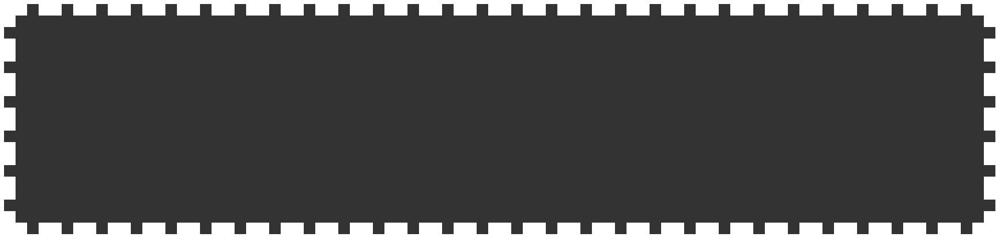
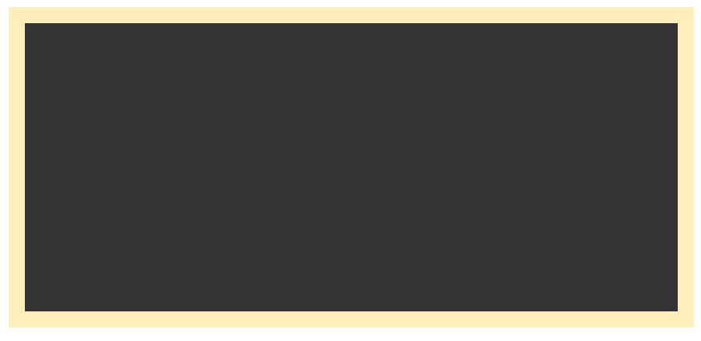
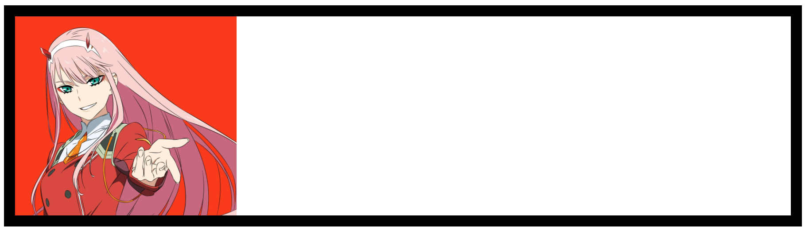
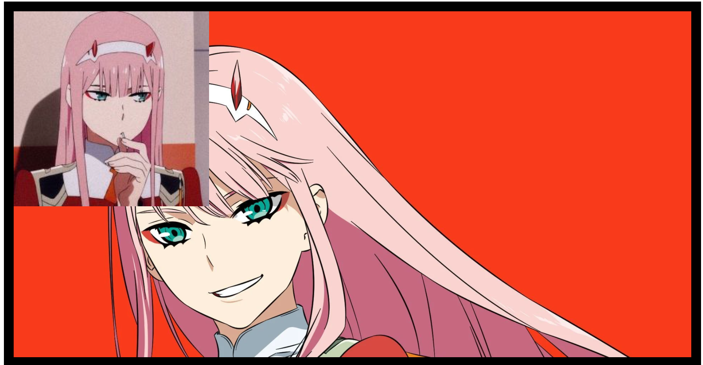
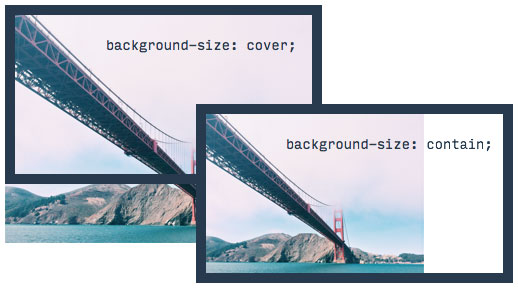
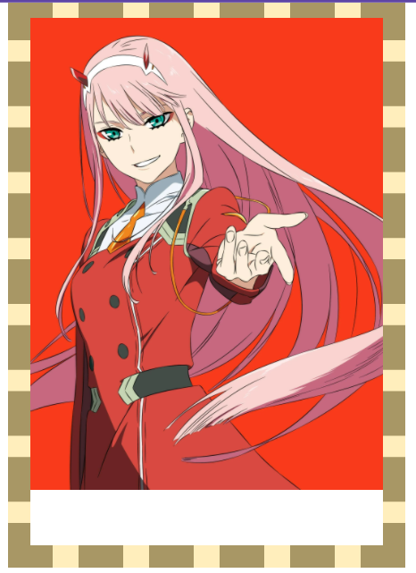
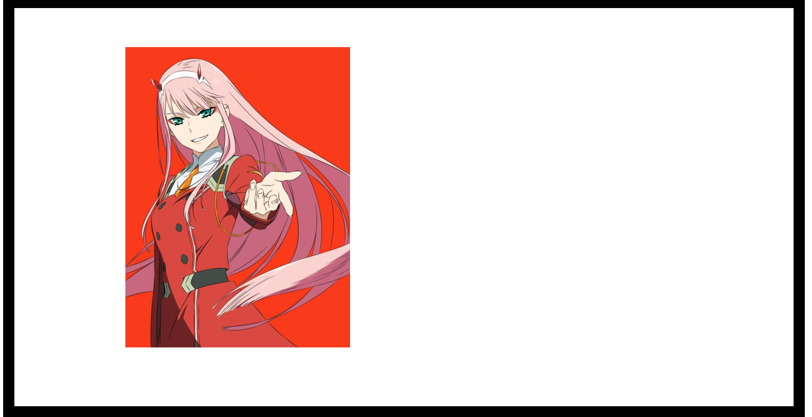
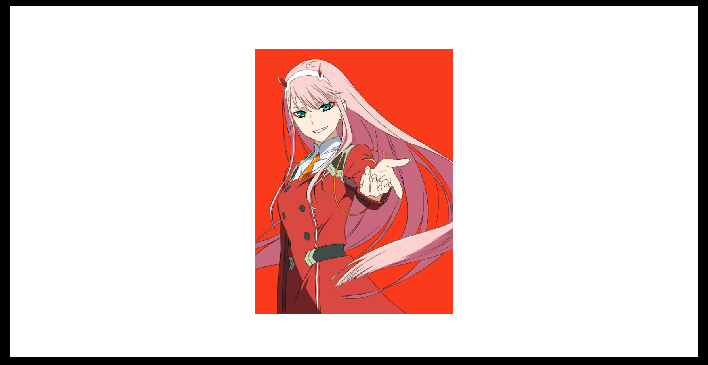
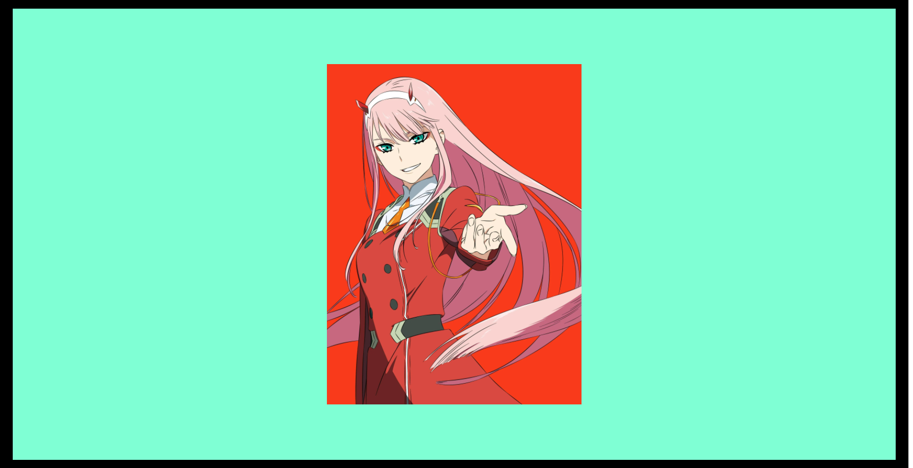

<link rel='stylesheet' href='../main.css'>

<div class="title"> 
    <center><h1 class="bigtitle">CSS Background</h1></center>
</div>

# Table of contents

- [Table of contents](#table-of-contents)
- [📎Clip](#clip)
- [📸Image](#image)
- [🤏Size](#size)
- [🎯Origin](#origin)
- [📌Position](#position)
- [👌Shorthand Form](#shorthand-form)

# [📎Clip](https://developer.mozilla.org/en-US/docs/Web/CSS/background-clip)

Xét đoạn code:

```css
div {
  width: 100%;
  height: 200px;
  padding: 20px;
  border: 10px dashed #fff;
  box-sizing: border-box;
  background-color: #333;
}
```

**Kết quả**:



Thuộc tính `background-clip` quyết định xem màu background sẽ được đổ từ ranh giới nào.


Chẳng hạn ta cho ranh giới từ padding:

```css
div {
  width: 100%;
  height: 200px;
  padding: 20px;
  border: 10px dashed #fff;
  box-sizing: border-box;
  background-color: #333;
  background-clip: padding-box;
}
```

**Kết quả**:



Có thể thấy border không được đổ màu background.

> Thuộc tính `background-clip` có giá trị mặc định là `border-box`.

Để áp dụng màu background cho chữ, cũng có thể sử dụng background-clip như sau:

```css
h1 {
  font-size: 40px;
  background-image: linear-gradient(30deg, aquamarine, aqua);
  background-clip: text; /* Mandatory */
  -webkit-background-clip: text; /* Mandatory */
  color: transparent;
}
```

Kết quả:

<h1 style="
font-size: 40px;
background-image: linear-gradient(30deg, aquamarine, blue);
background-clip: text; 
-webkit-background-clip: text; 
color: transparent;"
>Gradient Text</h1>

# [📸Image](https://developer.mozilla.org/en-US/docs/Web/CSS/background-image)

Để có thể đặt hình ảnh làm nền, ta sử dụng thuộc tính `background-image` với giá trị là url của hình ảnh đặt trong hàm `url()`.

```css
div {
  width: 100%;
  height: 200px;
  padding: 20px;
  border: 10px solid #000;
  box-sizing: border-box;
  background-image: url(https://wallpaperaccess.com/full/4582655.jpg);
}
```

**Kết quả**:


Có thể chỉnh nhỏ kích thước ảnh nền bằng thuộc tính [`background-size`](https://developer.mozilla.org/en-US/docs/Web/CSS/background-size). Nếu có một giá trị thì mặc định gán cho chiều ngang.

```css
div {
  width: 100%;
  height: 200px;
  padding: 20px;
  border: 10px solid #000;
  box-sizing: border-box;
  background-image: url(https://wallpaperaccess.com/full/4582655.jpg);
  background-size: 200px;
}
```

**Kết quả**:


> [`background-size`](https://developer.mozilla.org/en-US/docs/Web/CSS/background-size) nếu sử dụng đơn vị relative thì sẽ so với ranh giới chứa nó, 100% tức là background sẽ fill hết padding (padding thuộc element).


Để hình ảnh không lặp lại, sử dụng thuộc tính [`background-repeat`](https://developer.mozilla.org/en-US/docs/Web/CSS/background-repeat).

```css
div {
  width: 100%;
  height: 200px;
  padding: 20px;
  border: 10px solid #000;
  box-sizing: border-box;
  background-image: url(https://wallpaperaccess.com/full/4582655.jpg);
  background-size: 200px;
  background-repeat: no-repeat;
}
```

**Kết quả**:


Giá trị của [`background-repeat`](https://developer.mozilla.org/en-US/docs/Web/CSS/background-repeat) nếu là `repeat-x` sẽ lặp theo chiều ngang, là `repeat-y` sẽ lặp theo chiều dọc.

Nếu có hai url hình ảnh (phân biệt nhau bởi dấu phẩy) thì hình ảnh sau sẽ chồng lên hình ảnh trước.

```css
div {
  width: 100%;
  height: 100vh;
  padding: 20px;
  border: 10px solid #000;
  box-sizing: border-box;
  background-image: url(https://i.pinimg.com/474x/1f/7a/da/1f7ada5160909a90ac3bb6e63a6fbfa5.jpg),
    url(https://wallpaperaccess.com/full/4582655.jpg);
  background-repeat: no-repeat, no-repeat;
  background-size: 200px, 100%;
}
```



Đồng thời, các giá trị của thuộc tính khác cũng có thể phân biệt nhau bởi dấu phẩy để áp dụng cho từng hình ảnh riêng biệt.

# [🤏Size](https://developer.mozilla.org/en-US/docs/Web/CSS/background-size)

Ngoài các giá trị số thì thuộc tính `background-size` còn các giá trị dạng keyword. Chẳng hạn keyword `contain`. Keyword này sẽ chọn chiều ngang hoặc dọc của hình ảnh và gán giá trị là 100% chiều ngang hoặc dọc của ranh giới chứa nó, sao cho hình ảnh không bị che khuất.



Nói một cách dễ hiểu, nếu `width = 100%` mà hình ảnh bị che khuất một phần, thì nó sẽ canh theo chiều dọc. Tức là cho `height = 100%`.

```css
div {
  width: 100%;
  height: 100vh;
  padding: 20px;
  border: 10px solid #000;
  box-sizing: border-box;
  background-image: url(https://wallpaperaccess.com/full/4582655.jpg);
  background-repeat: no-repeat;
  background-size: contain;
}
```


> Có thể thấy, nếu phóng to hình ảnh sao cho chiều ngang chạm đến hai border trái phải, thì chiều dọc sẽ bị che khuất, nên nó cho chiều dọc có kích thước 100% của ranh giới chứa nó (padding trở vào).

Còn có từ khóa `cover` tương tự `contain`, tuy nhiên nó sẽ chấp nhận luôn việc hình ảnh bị che khuất.

```css
div {
  width: 100%;
  height: 100vh;
  padding: 20px;
  border: 10px solid #000;
  box-sizing: border-box;
  background-image: url(https://wallpaperaccess.com/full/4582655.jpg);
  background-repeat: no-repeat;
  background-size: cover;
}
```


> Mặc dù chiều ngang là 100% của ranh giới chứa nó, nhưng chiều dọc lại bị mất.

Nếu muốn sử dụng thẻ `` thay vì thẻ `<div>`, có thể sử dụng thuộc tính [`object-fit`](https://developer.mozilla.org/en-US/docs/Web/CSS/object-fit) để CSS, hiệu quả tương tự như đoạn code trên.

# [🎯Origin](https://developer.mozilla.org/en-US/docs/Web/CSS/background-origin)

Tương tự thuộc tính `background-clip` đối với `background-color`, thuộc tính `background-origin` quyết định vị trí bắt đầu của hình ảnh.


Ví dụ:

```css
div {
  width: 100%;
  height: 100vh;
  padding: 20px;
  border: 10px dashed #000;
  box-sizing: border-box;
  background-image: url(https://wallpaperaccess.com/full/4582655.jpg);
  background-size: 100%;
  background-repeat: no-repeat;
  background-origin: padding-box;
}
```

**Kết quả**:



> Thuộc tính `background-origin` có giá trị mặc định là `padding-box`.

```css
div {
  width: 100%;
  height: 100vh;
  padding: 20px;
  border: 10px dashed #000;
  box-sizing: border-box;
  background-image: url(https://wallpaperaccess.com/full/4582655.jpg);
  background-size: 100%;
  background-repeat: no-repeat;
  background-origin: border-box;
}
```


# [📌Position](https://developer.mozilla.org/en-US/docs/Web/CSS/background-position)

Để thiết lập ví trí ảnh nền thì dùng thuộc tính `background-position`.

```css
div {
  width: 100%;
  height: 100vh;
  padding: 20px;
  border: 10px solid #000;
  box-sizing: border-box;
  background-image: url(https://wallpaperaccess.com/full/4582655.jpg);
  background-size: 200px;
  background-repeat: no-repeat;
  background-position: 20% 40%;
}
```

Giá trị số đầu tiên là offset tính từ viền trái, kế tiếp là offest tính từ viền phải.



Cũng có thể sử dụng các keyword, chẳng hạn `center, left top, right top, left bottom và right bottom`.


Ví dụ:

```css
div {
  width: 100%;
  height: 100vh;
  padding: 20px;
  border: 10px solid #000;
  box-sizing: border-box;
  background-image: url(https://wallpaperaccess.com/full/4582655.jpg);
  background-size: 200px;
  background-repeat: no-repeat;
  background-position: center;
}
```



Thậm chí còn có thể custom offset kết hợp với keyword, giá trị offset có thể là số âm.

```css
div {
  width: 100%;
  height: 100vh;
  padding: 20px;
  border: 10px solid #000;
  box-sizing: border-box;
  background-image: url(https://wallpaperaccess.com/full/4582655.jpg);
  background-size: 200px;
  background-repeat: no-repeat;
  background-position: top -50px right 40px;
}
```


Đoạn code trên có nghĩa: dịch hình ảnh lên trên 50px, lùi hình ảnh từ viền phải vào 40px.

# [👌Shorthand Form](https://developer.mozilla.org/en-US/docs/Web/CSS/background)

Các thuộc tính của background có thể gom lại chung một thuộc tính `background`, theo thứ tự là **corlor**, **image**, **position**, **reapeat**, và **size**. Nhưng chúng ta nên tách biệt **size** ra để khỏi bị rối.

Đồng thời nên declare `background-color` sau `background` để style này được apply mà ko bị `background-image` đè lên. Minh họa cho dạng rút gọn là:

```css
div {
  width: 100%;
  height: 100vh;
  padding: 20px;
  border: 10px solid #000;
  box-sizing: border-box;
  background: url(https://wallpaperaccess.com/full/4582655.jpg) no-repeat center;
  background-color: aquamarine;
  background-size: 200px;
}
```


