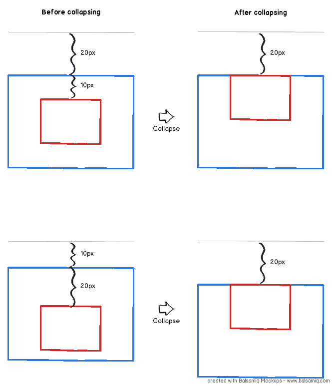
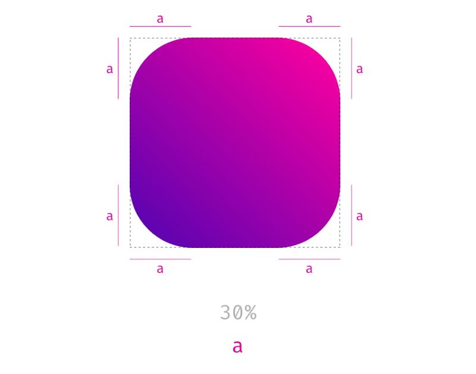
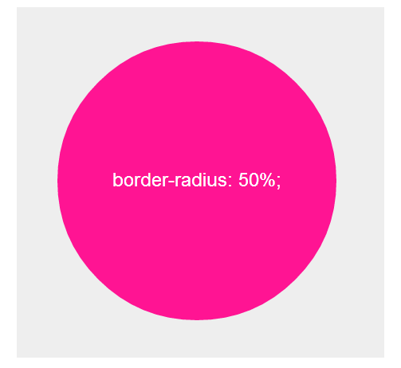

<link rel='stylesheet' href='../main.css'>

<div class="title"> 
    <center><h1 class="bigtitle">CSS Box Model</h1></center>
</div>

# Table of contents

- [Table of contents](#table-of-contents)
- [📦Box Model](#box-model)
  - [🟧Content](#content)
  - [🔳Padding](#padding)
  - [🔲Border](#border)
  - [⏹Margin](#margin)
    - [Vertical margin collapse](#vertical-margin-collapse)
- [🤏Box Sizing](#box-sizing)
- [⭕Border Radius](#border-radius)
  - [🟣Making circle](#making-circle)

# [📦Box Model](https://developer.mozilla.org/en-US/docs/Web/CSS/CSS_Box_Model)

Box Model là cách mà một element thể hiện chính nó trên trang web theo không gian. Một Box Model điển hình sẽ có dạng như thế này.


Như trên hình, box model gồm bốn phần: _content_, _padding_, _border_, _margins_.

## [🟧Content](https://www.w3schools.com/css/css_dimension.asp)

Phần đầu tiên là phần nội dung, nó là phần có màu cam trong hình trên. Kích thước phần content này sẽ được khai báo thông qua `width` và `height`. Chẳng hạn như:

```css
.box {
  width: 89px;
  height: 58px;
}
```

Ngoài ra còn một thuộc tính là `max-width` dùng để set chiều ngang tối đa mà một element có thể có khi tăng chiều ngang cửa sổ.

Tương tự cũng có `min-width`, `max-height` và `min-height`.

## [🔳Padding](https://developer.mozilla.org/en-US/docs/Web/CSS/padding)

Tiếp theo là padding (đệm), đây là phần _thuộc_ element. Khi ta thêm vào thì element sẽ to ra.

Nếu chỉ để một giá trị, giá trị đó sẽ là padding của cả bốn cạnh.

```css
.box {
  padding: 10px;
}
```

Nếu để hai giá trị, hai giá trị đó sẽ được gán cho cặp `top-bottom` (cạnh trên và dưới) và `right-left` (cạnh trái và phải).

```css
.box {
  padding: 0px 10px;
}
```

Nếu để ba giá trị, cạnh còn lại trong cặp sẽ tự động match.

```css
.box {
  padding: 30px 20px 10px; /*top right-left bottom*/
}
```

Đoạn code trên thì `top = 30px`, `right = 20px`, `bottom = 10px` và `left = 20px`.

Còn nếu để đầy đủ bốn giá trị, những giá trị đó sẽ lần lượt được gán cho `top, right, bottom, left`.

```css
.box {
  padding: 30px 20px 30px 20px;
}
```

## [🔲Border](https://developer.mozilla.org/en-US/docs/Web/CSS/border)

Border chính là viền của một box nào đó, nó _thuộc_ element. Khác với padding ở chỗ, border còn cần thêm một vài thông tin trong phần khai báo của chúng thì nó mới xác định rõ.

Ví dụ như ta muốn viền có độ dày 2px, kiểu liền nét và màu đen. Code CSS sẽ là:

```css
.box {
  border: 2px solid #000;
}
```

Đoạn code trên tương đương:

```css
.box {
  border-width: 2px;
  border-style: solid;
  border-color: #000;
}
```

Các kiểu border:


Cũng có thể format cho từng cạnh cụ thể, chẳng hạn cạnh `bottom`.

```css
.box {
  border-bottom-width: 2px;
  border-bottom-style: solid;
  border-bottom-color: #000;
}
```

## [⏹Margin](https://developer.mozilla.org/en-US/docs/Web/CSS/margin)

Phần margin chính là phần để phân biệt các block của các element với nhau, chúng _không thuộc_ một element như padding và border.

Tương tự padding và border, margin cũng có bốn cạnh và có thể thiết lập style cho một hoặc nhiều cạnh.

### Vertical margin collapse

```html
<div class="box1">Box 1</div> <div class="box2">Box 2</div>
```

```css
.box1 {
  margin-bottom: 20px;
}

.box2 {
  margin-top: 10px;
}
```

Giả sử cho box 1 có margin bottom là **20px**, và box 2 có margin top là **10px**. Theo lẽ thường thì cả hai box này cách nhau **30px**. Nhưng không phải, giá trị của nó là **20px**.



Đây gọi là hiện tượng [**Vertical Margin Collapse**](https://vuilaptrinh.com/2020-12-14-quy-luat-cua-margin-collapse/) (chồng lề dọc). Xảy ra khi có hai box giống nhau đứng liền kề, hai viền của hai box ấy sẽ chồng vào nhau, dẫn đến khoảng cách giữa hai box lúc này chỉ có **20px** mà thôi.

Nếu một trong hai có margin lớn hơn, khoảng cách giữa chúng vẫn sẽ là kích thước của margin lớn nhất. Có thể giải quyết hiện tượng này bằng các sử dụng `display: inline-block`.

# [🤏Box Sizing](https://developer.mozilla.org/en-US/docs/Web/CSS/box-sizing)

Cho đoạn code:

```css
div {
  border: 2px solid #fff;
  padding: 16px;
  width: 100px;
  height: 100px;
  color: #000;
}
```

Nếu ta muốn kích thước của content + padding + border là **100x100**, ta cần chỉnh sửa `width` và `height` theo kiểu gán cứng (width = 100 - 2\*16 - 2\*2 = 64 = height).

Để có thể tự động căn chỉnh kích thước content sao cho content + padding + border = **100px**, ta sử dụng thuộc tính `box-sizing` với giá trị `border-box`.

```css
div {
  width: 100px;
  height: 100px;
  color: #000;
  padding: 16px;
  border: 2px solid #fff;
  box-sizing: border-box;
}
```

Nếu muốn quay trở lại ban đầu thì set `box-sizing: content-box`.

# [⭕Border Radius](https://developer.mozilla.org/en-US/docs/Web/CSS/border-radius)

Để bo tròn góc của một box, ta sử dụng property `border-radius` và có value là một số nào đó kèm theo đơn vị. Giá trị của số càng lớn thì góc của box càng bo tròn. Chẳng hạn như:

```css
.box {
  margin: 30px;
  border: 1px solid #000;
  border-radius: 24px; /*24px = 30%*/
  padding: 20px;
  width: 80px;
  height: 80px;
}
```



Cũng có thể bo tròn từng góc:

```css
.box {
  margin: 30px;
  border: 1px solid #000;
  border-radius: 20px 60px 40px 80px;
  padding: 20px;
  width: 80px;
  height: 80px;
}
```


## 🟣Making circle

Để tạo ra một hình tròn, ta set giá trị của `width` và `height` như nhau, sau đó cho `border-radius` bằng nửa giá trị của `width` và `height`. Lưu ý là ta cần xóa đi các khai báo cho margin và padding.

```css
.box {
  background-color: #000;
  border-radius: 40px;
  width: 80px;
  height: 80px;
}
```

**Kết quả**:



Đoạn code sau cũng cho kết quả tương tự:

```css
.box {
  background-color: #000;
  border-radius: 50%;
  width: 80px;
  height: 80px;
}
```
