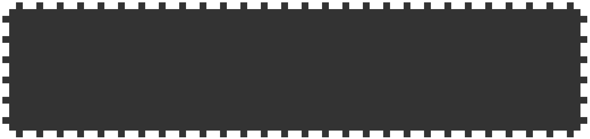
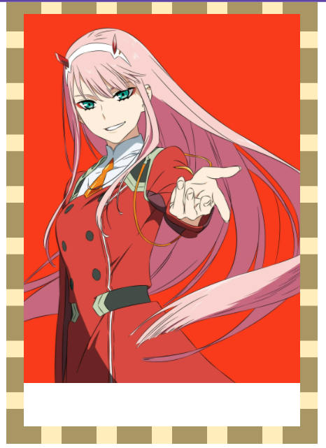
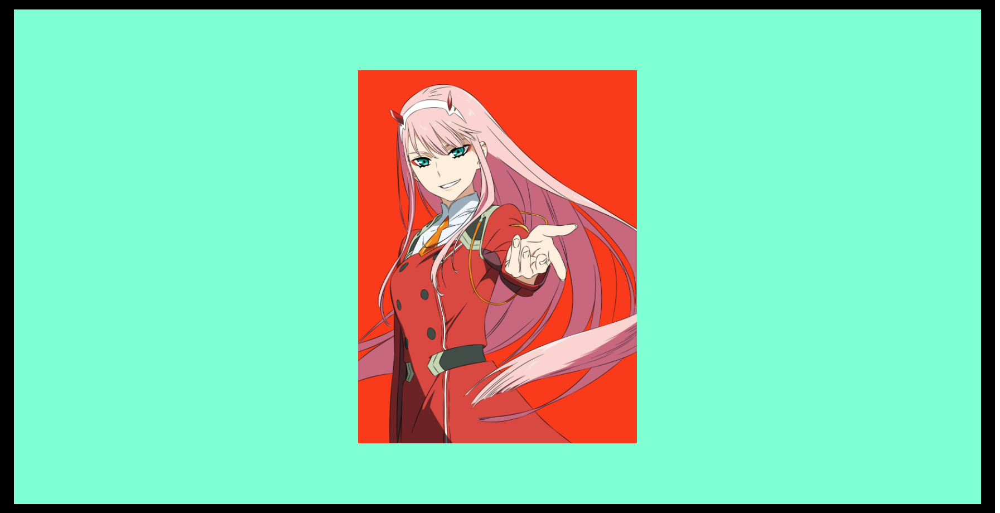

<link rel='stylesheet' href='../../main.css'>

<div class="title"> 
    <center><h1 class="bigtitle">CSS Backgrounds</h1></center>
</div>

# Clip

Xét đoạn code:

```css
div {
  width: 100%;
  height: 200px;
  padding: 20px;
  border: 10px dashed #fff;
  box-sizing: border-box;
  background-color: #333;
}
```

**Kết quả**:



Thuộc tính `background-clip` quyết định xem màu background sẽ được đổ từ ranh giới nào. Chẳng hạn ta cho ranh giới từ padding:

```css
div {
  width: 100%;
  height: 200px;
  padding: 20px;
  border: 10px dashed #fff;
  box-sizing: border-box;
  background-color: #333;
  background-clip: padding-box;
}
```

Thuộc tính `background-clip` có giá trị mặc định là `border-box`.

**Kết quả**:


Có thể thấy border không được đổ màu background.

# Image

Để có thể đặt hình ảnh làm nền, ta sử dụng thuộc tính `background-image` với giá trị là url của hình ảnh đặt trong hàm `url()`.

```css
div {
  width: 100%;
  height: 200px;
  padding: 20px;
  border: 10px solid #000;
  box-sizing: border-box;
  background-image: url(https://wallpaperaccess.com/full/4582655.jpg);
}
```

**Kết quả**:


Có thể chỉnh nhỏ kích thước ảnh nền bằng thuộc tính `background-size`. Nếu có một giá trị thì mặc định gán cho chiều ngang.

```css
div {
  width: 100%;
  height: 200px;
  padding: 20px;
  border: 10px solid #000;
  box-sizing: border-box;
  background-image: url(https://wallpaperaccess.com/full/4582655.jpg);
  background-size: 200px;
}
```

**Kết quả**:


> `background-size` ở đây là kích thước của background so với ranh giới chứa nó, 100% tức là background sẽ fill hết padding.


Để hình ảnh không lặp lại, sử dụng thuộc tính `background-repeat`.

```css
div {
  width: 100%;
  height: 200px;
  padding: 20px;
  border: 10px solid #000;
  box-sizing: border-box;
  background-image: url(https://wallpaperaccess.com/full/4582655.jpg);
  background-size: 200px;
  background-repeat: no-repeat;
}
```

**Kết quả**:


Giá trị của `background-repeat` nếu là `repeat-x` sẽ lặp theo chiều ngang, là `repeat-y` sẽ lặp theo chiều dọc.

Nếu có hai url hình ảnh (phân biệt nhau bởi dấu phẩy) thì hình ảnh sau sẽ chồng lên hình ảnh trước.

```css
div {
  width: 100%;
  height: 100vh;
  padding: 20px;
  border: 10px solid #000;
  box-sizing: border-box;
  background-image: url(https://i.pinimg.com/474x/1f/7a/da/1f7ada5160909a90ac3bb6e63a6fbfa5.jpg),
    url(https://wallpaperaccess.com/full/4582655.jpg);
  background-repeat: no-repeat, no-repeat;
  background-size: 200px, 100%;
}
```


Đồng thời, các giá trị của thuộc tính khác cũng có thể phân biệt nhau bởi dấu phẩy để áp dụng cho từng hình ảnh riêng biệt.

# Size

Ngoài các giá trị số thì thuộc tính `background-size` còn các giá trị dạng keyword. Chẳng hạn keyword `contain`. Keyword này sẽ chọn chiều ngang hoặc dọc của hình ảnh và gán giá trị là 100% chiều ngang hoặc dọc của ranh giới chứa nó, sao cho hình ảnh không bị che khuất.

Nói một cách dễ hiểu, nếu `width = 100%` mà hình ảnh bị che khuất một phần, thì nó sẽ canh theo chiều dọc. Tức là cho `height = 100%`.

```css
div {
  width: 100%;
  height: 100vh;
  padding: 20px;
  border: 10px solid #000;
  box-sizing: border-box;
  background-image: url(https://wallpaperaccess.com/full/4582655.jpg);
  background-repeat: no-repeat;
  background-size: contain;
}
```


> Có thể thấy, nếu phóng to hình ảnh sao cho chiều ngang chạm đến border, thì chiều dọc sẽ bị che khuất, nên nó cho chiều dọc có kích thước 100% của ranh giới chứa nó (padding trở vào).

Còn có từ khóa `cover` tương tự `contain`, tuy nhiên nó sẽ chấp nhận luôn việc hình ảnh bị che khuất.

```css
div {
  width: 100%;
  height: 100vh;
  padding: 20px;
  border: 10px solid #000;
  box-sizing: border-box;
  background-image: url(https://wallpaperaccess.com/full/4582655.jpg);
  background-repeat: no-repeat;
  background-size: cover;
}
```


> Mặc dù chiều ngang là 100% của ranh giới chứa nó, nhưng chiều dọc lại bị mất.

# Origin

Tương tự thuộc tính `background-clip` đối với `background-color`, thuộc tính `background-origin` quyết định ranh giới của hình ảnh. Thuộc tính `background-origin` có giá trị mặc định là `padding-box`.

```css
div {
  width: 100%;
  height: 100vh;
  padding: 20px;
  border: 10px dashed #000;
  box-sizing: border-box;
  background-image: url(https://wallpaperaccess.com/full/4582655.jpg);
  background-size: 100%;
  background-repeat: no-repeat;
  background-origin: padding-box;
}
```

**Kết quả**:



```css
div {
  width: 100%;
  height: 100vh;
  padding: 20px;
  border: 10px dashed #000;
  box-sizing: border-box;
  background-image: url(https://wallpaperaccess.com/full/4582655.jpg);
  background-size: 100%;
  background-repeat: no-repeat;
  background-origin: border-box;
}
```


# Position

Để thiết lập ví trí ảnh nền thì dùng thuộc tính `background-position`.

```css
div {
  width: 100%;
  height: 100vh;
  padding: 20px;
  border: 10px solid #000;
  box-sizing: border-box;
  background-image: url(https://wallpaperaccess.com/full/4582655.jpg);
  background-size: 200px;
  background-repeat: no-repeat;
  background-position: 20% 40%;
}
```

Giá trị số đầu tiên là offset tính từ viền trái, kế tiếp là offest tính từ viền phải.


Cũng có thể sử dụng các keyword, chẳng hạn `center, top left, top right, bottom left và bottom right`.

```css
div {
  width: 100%;
  height: 100vh;
  padding: 20px;
  border: 10px solid #000;
  box-sizing: border-box;
  background-image: url(https://wallpaperaccess.com/full/4582655.jpg);
  background-size: 200px;
  background-repeat: no-repeat;
  background-position: center;
}
```


Thậm chí còn có thể custom offset kết hợp với keyword, giá trị offset có thể là số âm.

```css
div {
  width: 100%;
  height: 100vh;
  padding: 20px;
  border: 10px solid #000;
  box-sizing: border-box;
  background-image: url(https://wallpaperaccess.com/full/4582655.jpg);
  background-size: 200px;
  background-repeat: no-repeat;
  background-position: top -50px right 40px;
}
```


Đoạn code trên có nghĩa: dịch hình ảnh lên trên 50px, lùi hình ảnh từ viền phải vào 40px.

# Shorthand

Các thuộc tính của background có thể gom lại chung một thuộc tính `background`, theo thứ tự là **url**, **reapeat**, **position** và **size**. Nhưng chúng ta nên tách biệt **size** ra để khỏi bị rối. Đồng thời luôn declare color sau background để style này được apply mà ko bị background đè lên. Minh họa cho dạng rút gọn là:

```css
div {
  width: 100%;
  height: 100vh;
  padding: 20px;
  border: 10px solid #000;
  box-sizing: border-box;
  background: url(https://wallpaperaccess.com/full/4582655.jpg) no-repeat center;
  background-color: aquamarine;
  background-size: 200px;
}
```


