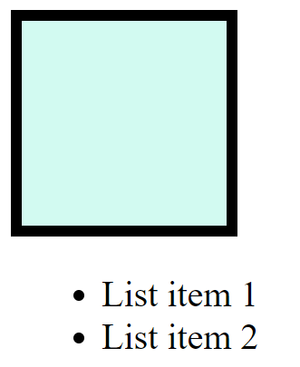
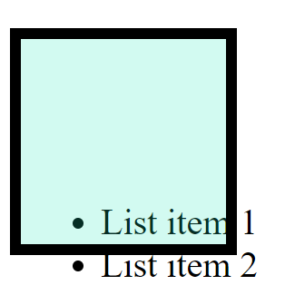
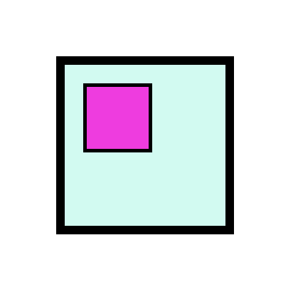

<link rel='stylesheet' href='../../../main.css'>

<div class="title"> 
    <center><h1 class="bigtitle">CSS Position</h1></center>
</div>

- [Relative](#relative)
- [Absolute](#absolute)
- [Fixed](#fixed)
- [Sticky](#sticky)

Thuộc tính `position` có các giá trị `relative,absolute, fixed, sticky` để thiết lập vị trí cho element. Tham khảo một cách trực quan tại [đây](https://developer.mozilla.org/en-US/docs/Web/CSS/position).

# Relative

Một element có `position: relative` sẽ có vị trí không phụ thuộc vào đối tượng nào khác. Tức là nếu chúng ta di chuyển xung quanh, thì nó sẽ lấy vị trí ban đầu của nó làm gốc tọa độ. Chúng ta dùng các thuộc tính `top, right, bottom, left` để di chuyển element, và chúng chỉ hoạt động khi có `position`.

Ban đầu:



```css
div {
  width: 100px;
  height: 100px;
  padding: 10px;
  border: 5px solid #000;
  box-sizing: border-box;
  background-color: rgb(28, 231, 187, 0.2);
  background-size: 200px; /*offset from the top margin*/
}
```

**Kết quả**:



# Absolute

Element có `position: absolute` sẽ phụ thuộc vào thẻ cha gần nhất có thuộc tính `position` (giống cách mà đơn vị `em` hoạt động). Dùng khi có một đối tượng phụ thuộc vào đối tượng khác.

Giả sử cho đoạn code:

```html
<!DOCTYPE html>
<html lang="en">
  <head>
    <title>Document</title>
    <link rel="stylesheet" href="style.css" />
  </head>

  <body>
    <div id="box1">
      <div>
        <div id="box-child"></div>
      </div>
    </div>
  </body>

  <script src="main.js"></script>
</html>
```

```css
#box1 {
  width: 100px;
  height: 100px;
  padding: 10px;
  border: 5px solid #000;
  box-sizing: border-box;
  background-color: rgba(28, 231, 187, 0.2);
  background-size: 200px;
  position: relative;
  left: 30px;
  top: 30px;
}

#box-child {
  width: 50%;
  height: 50%;
  border: 2px solid #000;
  background-color: rgb(238, 60, 223);
  /* position: absolute; */
  /* right: 5px; */
}
```

Ban đầu:



```css
#box-child {
  width: 50%;
  height: 50%;
  border: 2px solid #000;
  background-color: rgb(238, 60, 223);
  position: absolute;
  right: 5px;
}
```

Kết quả:


# Fixed

Dùng để cố định vị trí của element trên cửa sổ trình duyệt, cú pháp là `position: fixed`. Điều hướng dùng `top, right, bottom, left` tương tự `relative` và `absolute`.

# Sticky

Đây là một tính năng đang được thử nghiệm, nó khá giống fixed. Tuy nhiên, điều kiện kích hoạt là khi trang web được kéo lên đến một vị trí nào đó, thì element mới trở thành fixed ở vị trí đó.


```css
#box1 {
  margin-top: 30px;
  width: 100px;
  height: 100px;
  padding: 10px;
  border: 5px solid #000;
  box-sizing: border-box;
  background-color: rgba(28, 231, 187, 0.2);
  background-size: 200px;
  position: sticky;
  top: 10px;
}
```

Đoạn code trên có ý nghĩa, khi cuộn chuột làm element trượt đến vị trí 10px tính từ margin-top, element sẽ trở thành fixed. Còn nếu nó đang ở vị trí lớn hơn 10px tính từ margin-top, nó vẫn sẽ bị trượt đi.
