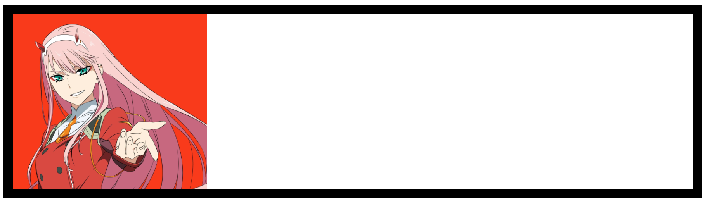

<link rel='stylesheet' href='../../main.css'>

<div class="title"> 
    <center><h1 class="bigtitle">CSS Backgrounds</h1></center>
</div>

# Clip

Xét đoạn code:

```css
div {
  width: 100%;
  height: 200px;
  padding: 20px;
  border: 10px dashed #fff;
  box-sizing: border-box;
  background-color: #333;
}
```

**Kết quả**:


Thuộc tính `background-clip` quyết định xem màu background sẽ được đổ từ ranh giới nào. Chẳng hạn ta cho ranh giới từ padding:

```css
div {
  width: 100%;
  height: 200px;
  padding: 20px;
  border: 10px dashed #fff;
  box-sizing: border-box;
  background-color: #333;
  background-clip: padding-box;
}
```

**Kết quả**:


Có thể thấy border không được đổ màu background.

# Image

Để có thể đặt hình ảnh làm nền, ta sử dụng thuộc tính `background-image` với giá trị là url của hình ảnh đặt trong hàm `url()`.

```css
div {
  width: 100%;
  height: 200px;
  padding: 20px;
  border: 10px solid #fff;
  box-sizing: border-box;
  background-image: url(https://wallpaperaccess.com/full/4582655.jpg);
}
```

**Kết quả**:


Có thể chỉnh nhỏ kích thước ảnh nền bằng thuộc tính `background-size`. Nếu có một giá trị thì mặc định gán cho chiều ngang.

```css
div {
  width: 100%;
  height: 200px;
  padding: 20px;
  border: 10px solid #fff;
  box-sizing: border-box;
  background-image: url(https://wallpaperaccess.com/full/4582655.jpg);
  background-size: 200px;
}
```

**Kết quả**:


Để hình ảnh không lặp lại, sử dụng thuộc tính `background-repeat`.

```css
div {
  width: 100%;
  height: 200px;
  padding: 20px;
  border: 10px solid #fff;
  box-sizing: border-box;
  background-image: url(https://wallpaperaccess.com/full/4582655.jpg);
  background-size: 200px;
  background-repeat: no-repeat;
}
```

**Kết quả**:


Giá trị của `background-repeat` nếu là `repeat-x` sẽ lặp theo chiều ngang, là `repeat-y` sẽ lặp theo chiều dọc.

Nếu có hai url hình ảnh (phân biệt nhau bởi dấu phẩy) thì hình ảnh sau sẽ chồng lên hình ảnh trước.

```css
div {
  width: 100%;
  height: 100vh;
  padding: 20px;
  border: 10px solid #fff;
  box-sizing: border-box;
  background-image: url(https://i.pinimg.com/474x/1f/7a/da/1f7ada5160909a90ac3bb6e63a6fbfa5.jpg),
    url(https://wallpaperaccess.com/full/4582655.jpg);
  background-repeat: no-repeat;
}
```


Đồng thời, các giá trị của thuộc tính khác cũng có thể phân biệt nhau bởi dấu phẩy để áp dụng cho từng hình ảnh riêng biệt.

# Size

Ngoài các giá trị số thì thuộc tính `background-size` còn các giá trị dạng keyword. Chẳng hạn keyword `contain`. Keyword này sẽ chọn chiều ngang hoặc dọc của hình ảnh và gán giá trị là 100% chiều ngang hoặc dọc của cửa sổ. Sao cho hình ảnh không bị che khuất.

Nói một cách dễ hiểu, nếu width = 100vw mà hình ảnh bị che khuất một phần, thì nó sẽ canh theo chiều dọc. Tức là cho height = 100vh.

```css
div {
  width: 100%;
  height: 100vh;
  padding: 20px;
  border: 10px solid #fff;
  box-sizing: border-box;
  background-image: url(https://wallpaperaccess.com/full/4582655.jpg);
  background-repeat: no-repeat;
  background-size: contain;
}
```


Còn có từ khóa `cover` tương tự `contain`, tuy nhiên nó sẽ chấp nhận luôn việc hình ảnh bị che khuất.

```css
div {
  width: 100%;
  height: 100vh;
  padding: 20px;
  border: 10px solid #fff;
  box-sizing: border-box;
  background-image: url(https://wallpaperaccess.com/full/4582655.jpg);
  background-repeat: no-repeat;
  background-size: cover;
}
```


