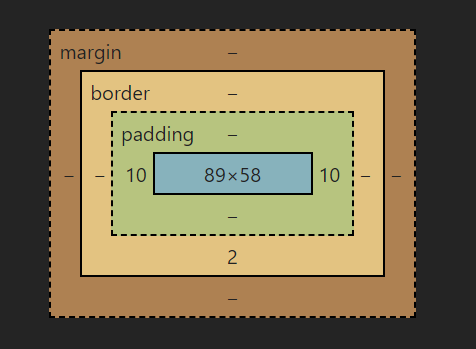
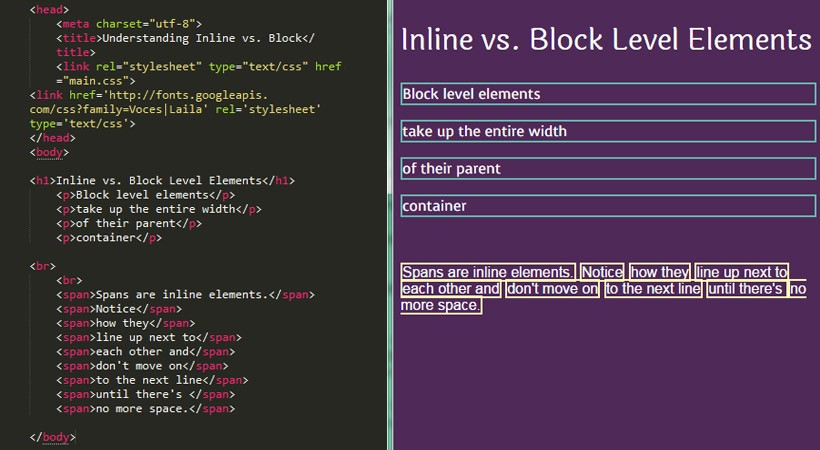

<link rel='stylesheet' href='../../main.css'>

<div class="title"> 
    <center><h1 class="bigtitle">CSS Box Model</h1></center>
</div>

# Box Model

Box Model là cách mà một element thể hiện chính nó trên trang web theo không gian. Một Box Model điển hình sẽ có dạng như thế này.



Như trên hình, box model gồm bốn phần: _content_, _padding_, _border_, _margins_.

## Content

Phần đầu tiên là phần nội dung, nó sẽ nằm bên trong một khung nhỏ màu da trời. Kích thước phần content này sẽ được khai báo thông qua `width` và `height`. Chẳng hạn như:

```css
.box {
  width: 89px;
  height: 58px;
}
```

## Padding

Tiếp theo là padding (đệm), đây là phần _thuộc_ element.

Nếu để hai giá trị, hai giá trị đó sẽ được gán cho cặp `top-bottom` (cạnh trên và dưới) và `right-left` (cạnh trái và phải).

```css
.box {
  padding: 0px 10px;
}
```

Nếu chỉ để một giá trị, giá trị đó sẽ là padding của cả bốn cạnh.

```css
.box {
  padding: 10px;
}
```

Nếu để đầy đủ bốn giá trị, những giá trị đó sẽ lần lượt được gán cho `top, right, bottom, left`.

```css
.box {
  padding: 30px 20px 30px 20px;
}
```

Còn nếu để ba giá trị, cạnh còn lại trong cặp sẽ tự động match.

```css
.box {
  padding: 30px 20px 10px;
}
```

Đoạn code trên thì `top = 30px`, `right = 20px`, `bottom = 10px` và `left = 20px`.

## Border

Border chính là viền của một Box nào đó, nó _thuộc_ element. Khác với padding ở chỗ, border còn cần thêm một vài thông tin trong phần khai báo của chúng thì nó mới xác định rõ.

Ví dụ như ta muốn viền của là đường liền nét, độ dày 1px và có màu đen. Code CSS sẽ là:

```css
.box {
  border: 2px solid #000;
}
```

Đoạn code trên tương đương:

```css
.box {
  border-width: 2px;
  border-style: solid;
  border-color: #000;
}
```

Cũng có thể format cho từng cạnh cụ thể, chẳng hạn cạnh `bottom`.

```css
.box {
  border-bottom-width: 2px;
  border-bottom-style: solid;
  border-bottom-color: #000;
}
```

## Margin

Phần margin chính là phần để phân biệt các block của các element với nhau, chúng không thuộc một element như padding và border.

Tương tự padding và border, margin cũng có bốn cạnh và có thể thiết lập style cho một hoặc nhiều cạnh.

## Vertical margin collapse

```html
<div class="box">Box 1</div>
<div class="box">Box 2</div>
```

```css
.box {
  margin: 30px 20px;
}
```

Ta biết box 1 có margin bottom là 30px, và box 2 có margin top là 30px. Theo lẽ thường thì cả hai box này cách nhau 60px. Nhưng không phải, giá trị của nó là 30px.

Đây gọi là hiện tượng **Vertical Margin Collapse** (chồng lề dọc). Xảy ra khi có hai box giống nhau đứng liền kề, hai viền của hai box ấy sẽ chồng vào nhau, dẫn đến khoảng cách giữa hai box lúc này chỉ có 30px mà thôi.

Nếu một trong hai có margin lớn hơn, khoảng cách giữa chúng vẫn sẽ là kích thước của margin lớn nhất.

# Block element

`<div>` là một **block element**, khi apply style cho nó, kích thước của nó sẽ chiếm trọn một dòng/hàng trên trang Web.

Ngoài ra còn có **inline element**, các element không chiếm trọn một dòng mà chỉ sử dụng phần diện tích vừa đủ để bao quanh content bên trong đó mà thôi.

Các block element và inline element tham khảo ở [đây](https://www.w3schools.com/html/html_blocks.asp).

Ảnh dưới đây sẽ minh họa cho điều này:



## display: block

Nếu muốn một **inline element** trở thành dạng **block element**, ta chỉ cần thêm property `display` và có giá trị là `block`.

```css
a {
  margin: 10px;
  border: 1px solid #000;
  padding: 30px 20px;
  display: block;
}
```

## display: inline-block

Để biến một **inline element** thành một **block element dạng inline** (không xảy ra chồng lề dọc), chúng ta sử dụng `display: inline-block`:

```css
a {
  margin: 50px;
  border: 1px solid #000;
  padding: 30px 20px;
  display: inline-block;
}
```

Cách này cũng có thể áp dụng cho block element.
