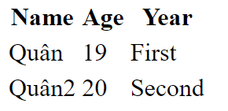

<link rel='stylesheet' href='../main.css'>

<div class="title">
    <center><h1 class="bigtitle">HTML</h1></center>
</div>

# What is html?

HTML là viết tắt của **Hyper Text Markup Language**. Nó không phải là ngôn ngữ lập trình mà chỉ là ngôn ngữ đánh dấu.

Nhiệm vụ của nó sẽ đánh dấu từng phần của văn bản, đại loại như dán nhãn các dòng chữ trong văn bản để các ngôn ngữ lập trình nhận diện và xử lý.

Đồng thời nó giúp phân chia các đoạn văn bản nhằm xây dựng nên cấu trúc trang web.

## Tag - element

Chúng ta xây dựng và điều khiển các trang HTML bằng các **tag**, là các thẻ mà mang một một chức năng cụ thể.

Tag kết hợp với **content** (nội dung) và **attribute** (thuộc tính) để tạo thành một **element**.

**Ví dụ**:

```html
<h1>heading</h1>
```

Ở ví dụ trên, có thể thấy một element bao gồm một **opening tag**, content và một **closing tag**. Content và attribute không phải là thành phần bắt buộc của một element.

```html
<openingTag>content</closingTag>
```

Một số tag không có opening tag hoặc closing tag hay thậm chí không có content, chúng được gọi là **single tag** (tag đơn).

Chẳng hạn tag `<br>` là một single tag.

## Attributes

Attribute dùng để cung cấp thêm thuộc tính và thông tin cho tag.

Một số attribute chỉ tồn tại ở vài tag nhất định, trong khi số khác lại có ở mọi tag (ta gọi chúng là **global attributes**). Chẳng hạn attribute `class` có ở mọi tag.

Attribute nằm trong opening tag, cú pháp của nó là:

```html
<tagName attribute="value">content</tagName>
```

**Ví dụ**:

```html
<div class="commentBox">This is a box</div>
```

Có thể sử dụng nhiều attribute, phân biệt nhau bởi dấu cách:

```html
<div class="commentBox" title="Box">This is a box</div>
```

## Nested tags

Các tag có thể lồng nhau:

```html
<body>
  <div class="commentBox">This is a box</div>
</body>
```

# Web page structure

Chúng ta sẽ bắt đầu xây dựng một trang Web bằng cách tạo ra một file có tên là **index.html**.

Sở dĩ chọn tên index vì nó là file chỉ mục, lúc mà web browser quét qua toàn bộ các trang web thì nó sẽ tìm **index.html** và xem như là homepage (trang chủ) của web site.

Một dòng code mà mọi file HTML đều có là:

```html
<!DOCTYPE html>
```

Dòng này có chức năng nói với web browser rằng: “Ê, tao là tài liệu HTML đây, dưới đây tao sẽ trình bày một đống ngôn ngữ siêu văn bản đó! Hãy duyệt tao dưới dạng HTML nha”.

Cấu trúc đơn giản là:

```html
<!DOCTYPE html>
<html lang="en">
  <head>
    <title>Document</title>
  </head>

  <body>
    <div id="box">BOX</div>
  </body>
</html>
```

Có thể thấy, một file HTML gồm duy nhất một thẻ `<html>` chứa thẻ `<head>` và thẻ `<body>`.

Thẻ `<head>` dùng để mô tả các thông tin ngoài lề của trang web như tiêu đề, keyword tìm kiếm, ... Những thông tin này sẽ không hiển thị lên trang web.

Thẻ `<body>` dùng để hiển thị nội dung chính của trang web.

# Comments in HTML

Comment trong html có cú pháp:

```html
<!-- -->
```

# Useful tags

## Heading

HTML có các thẻ `<h1>` đến `<h6>` dùng để đánh dấu tiêu đề đoạn văn bản. Định dạng của các thẻ headings được thể hiện qua hình sau:

**Ví dụ**:

```html
<h1>Heading 1</h1>
<h2>Heading 2</h2>
<h3>Heading 3</h3>
<h4>Heading 4</h4>
<h5>Heading 5</h5>
<h6>Heading 6</h6>
```

**Kết quả**:

<h1>Heading 1</h1>
<h2 style=" all: revert;">Heading 2</h2>
<h3>Heading 3</h3>
<h4>Heading 4</h4>
<h5>Heading 5</h5>
<h6>Heading 6</h6>

## Paragraph

Thẻ `<p>` dùng để đánh dấu đoạn văn bản.

**Ví dụ**:

```html
<p>
  Lorem Ipsum is simply dummy text of the printing and typesetting industry.
  Lorem Ipsum has been the industry's standard dummy text ever since the 1500s,
  when an unknown printer took a galley of type and scrambled it to make a type
  specimen book.
</p>
```

**Kết quả**:

<p>
  Lorem Ipsum is simply dummy text of the printing and typesetting industry.
  Lorem Ipsum has been the industry's standard dummy text ever since the 1500s,
  when an unknown printer took a galley of type and scrambled it to make a type
  specimen book.
</p>

## Image

Thẻ `` là một thẻ đơn không chứa nội dung dùng để đánh dấu hình ảnh. Nó thường đi kèm với attribute `src="imageLink"` có value là đường dẫn của hình ảnh.

Ngoài ra, thẻ `` còn một thuộc tính là `<alt="content">` dùng để chứa nội dung mô tả hình ảnh phòng hờ trường hợp không hiển thị được hình ảnh.

**Ví dụ**:

```html

```

## Anchor

Thẻ `<a>` là một thẻ để đánh dấu link (liên kết), liên kết có thể là một trang web khác hoặc thậm chí là một section trong cùng trang web.

**Ví dụ**:

```html
<a href="https://www.google.com/">This is a link</a>
```

**Kết quả**:

<a href="https://www.google.com/">This is a link</a>

## List

Thẻ `<ul>` dùng để đánh dấu một danh sách không có thứ tự (unordered list - không đánh số). Bên trong thẻ `<ul>` có thẻ `<li>` dùng để đánh dấu các list item.

Ngoài ra còn có thẻ `<ol>` dùng để đánh dấu danh sách có thứ tự (ordered list - có đánh số), thẻ này cũng chứa các thẻ `<li>`.

**Ví dụ**:

```html
<ul>
  <li>List item 1</li>
  <li>List item 2</li>
  <li>List item 3</li>
</ul>
```

**Kết quả**:

<ul>
  <li>List item 1</li>
  <li>List item 2</li>
  <li>List item 3</li>
</ul>

## Table

Thẻ `<table>` dùng để đánh dấu bảng, bên trong đó chứa thẻ `<thead>` dùng để chứa các tiêu đề và thẻ `tbody` để chứa các ô nội dung.

Cấu trúc của bảng như sau:

```html
<table>
  <thead>
    <th>Name</th>
    <th>Age</th>
    <th>Year</th>
  </thead>
  <tbody>
    <tr>
      <td>Quân</td>
      <td>19</td>
      <td>First</td>
    </tr>
    <tr>
      <td>Quân2</td>
      <td>20</td>
      <td>Second</td>
    </tr>
  </tbody>
</table>
```

**Kết quả**:


## Input

Thẻ `<input>` dùng để đánh dấu ô nhập dữ liệu:

Ví dụ:

```html
<input></input>
<input type = "checkbox"></input>
<input type = "radio"></input>
```

Kết quả:

<input ></input>
<input type = "checkbox"></input>
<input type = "radio"></input>

## Button

Thẻ `<button>` dùng để đánh dấu nút:

Ví dụ:

```html
<button>This is a button</button>
```

Kết quả:

<button>This is a button</button>

## Division

Thẻ `<div>` dùng để đánh dấu một khối bao quanh các thẻ khác. Mục đích của nó là để phân chia các thành phần các nhau của trang web.

## Break

Thẻ `<br>` dùng để xuống dòng văn bản trong HTML.
