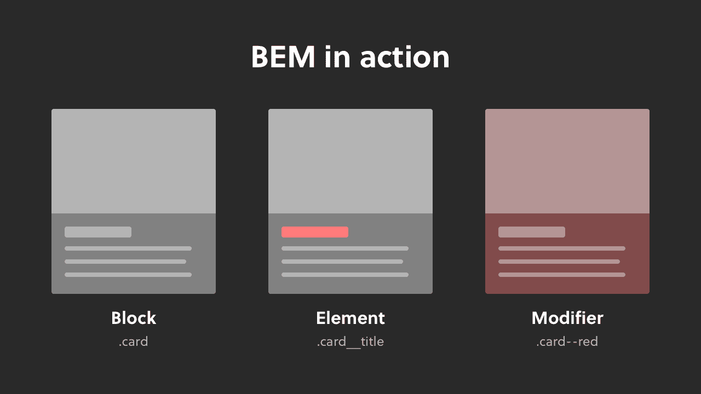
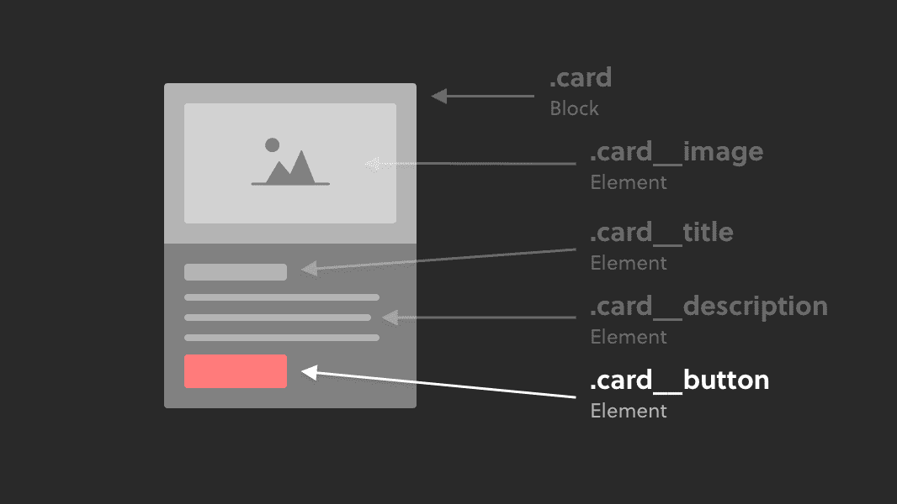

<link rel='stylesheet' href='../../../main.css'>

<div class="title"> 
    <center><h1 class="bigtitle">CSS BEM</h1></center>
</div>

# Table of contents

- [Table of contents](#table-of-contents)
- [Meaning](#meaning)
- [Syntax & Example](#syntax--example)
- [BEM Cheat Sheet](#bem-cheat-sheet)
- [Nested Block](#nested-block)

> BEM là cách đặt tên class theo một quy chuẩn, như coding convention. BEM giúp thống nhất các kiểu đặt tên class và tránh trùng selector dẫn đến CSS đè lên nhau.

Điểm mạnh:

- Rõ ràng, dễ tái sử dụng.
- Tính module của class, không sợ CSS trùng nhau.

Điểm yếu của BEM là tên class dài và xấu.

Nên sử dụng BEM khi:

- Dự án lớn, số lượng pages nhiều hoặc số lượng components nhiều.
- Dự án nhiều thành viên.

# Meaning

BEM là viết tắt của Block Element Modifier, như tên gọi thì nó gồm ba phần tử:

- **Block**: một container chứa một hoặc nhiều thẻ con.
- **Element**: các thẻ con chứa trong một container.
- **Modifier**: mô tả trạng thái của một block hoặc element để bổ sung ý nghĩa cho chúng.



# Syntax & Example

Cú pháp của ba phần tử là:

1. **Block**: bao gồm một hoặc nhiều từ cô đọng ý nghĩa, nếu có nhiều từ thì cách nhau bởi dấu `-`. Tên class tất nhiên là phải viết thường.

```html
<div class="yugioh"></div>
```

2. **Element**: bắt đầu bởi tên class của block, theo sau là `__` rồi đến tên của element. Tương tự block thì nó cần phải cô đọng và viết thường.

```html
<div class="yugioh">
  <h3 class="yugioh__name"></h3>
  
  <p class="yugioh__effect"></p>
  <p class="yugioh__stat"></p>
</div>
```

3. **Modifier**: cũng bắt đầu bởi tên block hoặc element, theo sau là `--` và tên của modifier. \
   Thông thường thì modifier có hai dạng, dạng đầu là kiểu boolean, chẳng hạn `block--large`. Dạng thứ hai là cặp key-value, chẳng hạn `block--text-red`.



- Chẳng hạn một card Yugioh có thể là dạng [Link](https://yugioh.fandom.com/wiki/Link_Monster) và có màu nền là màu xanh, và ta cần CSS khác với quái thú thông thường. \
- Quái thú dạng Link này cũng sẽ không có chỉ số phòng thủ.

```html
<div class="yugioh yugioh--bg-blue">
  <h3 class="yugioh__name"></h3>
  
  <p class="yugioh__effect"></p>
  <p class="yugioh__stat yugioh__stat--atk-none"></p>
</div>
```

Do đó ta viết thêm hai modifier là `yugioh--bg-blue` và `yugioh__stat--atk-none`.

# [BEM Cheat Sheet](https://9elements.com/bem-cheat-sheet/#page-navigation)

# Nested Block

Nếu các block lồng nhau, ta nên đặt tên class thế nào? Có hai trường hợp xảy ra:

- Block đó có tên class được tái sử dụng nhiều nơi.
- Block đó có tên class không tái sử dụng ở nhiều nơi.

**Trường hợp đầu tiên**, xét ví dụ sau:

```html
<div class="yugioh yugioh--bg-blue">
  <article class="yugioh__description">
    <p class="yugioh__description__material"> </p>
    <p class="yugioh__description__effect"> </p>
  </article>
</div>
```

Không phải chỉ thẻ Yugioh mới có `description`, nếu ta đặt là `yugioh__description` mà các loại thẻ khác cũng sử dụng selector này, sẽ dẫn đến việc vi phạm tính đóng gói của selector.

Do đó, ta đặt thẳng là `description`, xem nó như là một block khác.

```html
<div class="yugioh yugioh--bg-blue">
  <article class="description">
    <p class="description__material"> </p>
    <p class="description__effect"> </p>
  </article>
</div>
```

**Trường hợp thứ hai**, nếu block lồng bên trong chỉ tồn tại trong một block cụ thể và có element của riêng nó, ta chỉ việc thay dấu `__` thành dấu `-` giữa hai tên block.

Xét ví dụ sau:

```html
<div class="yugioh yugioh--bg-blue">
  <article class="yugioh__effects">
    <p class="yugioh__effects__material"> </p>
    <p class="yugioh__effects__effect1"> </p>
    <p class="yugioh__effects__effect2"> </p>
  </article>
</div>
```

Có thể thấy thẻ Yugioh đặc biệt sử dụng material để triệu hồi, block `effect` của Yugioh chỉ tồn tại trong block `yugioh`. Ta sử dụng dấu `-`:

```html
<div class="yugioh yugioh--bg-blue">
  <article class="yugioh-effects">
    <p class="yugioh-effects__material"> </p>
    <p class="yugioh-effects__effect1"> </p>
    <p class="yugioh-effects__effect2"> </p>
  </article>
</div>
```
