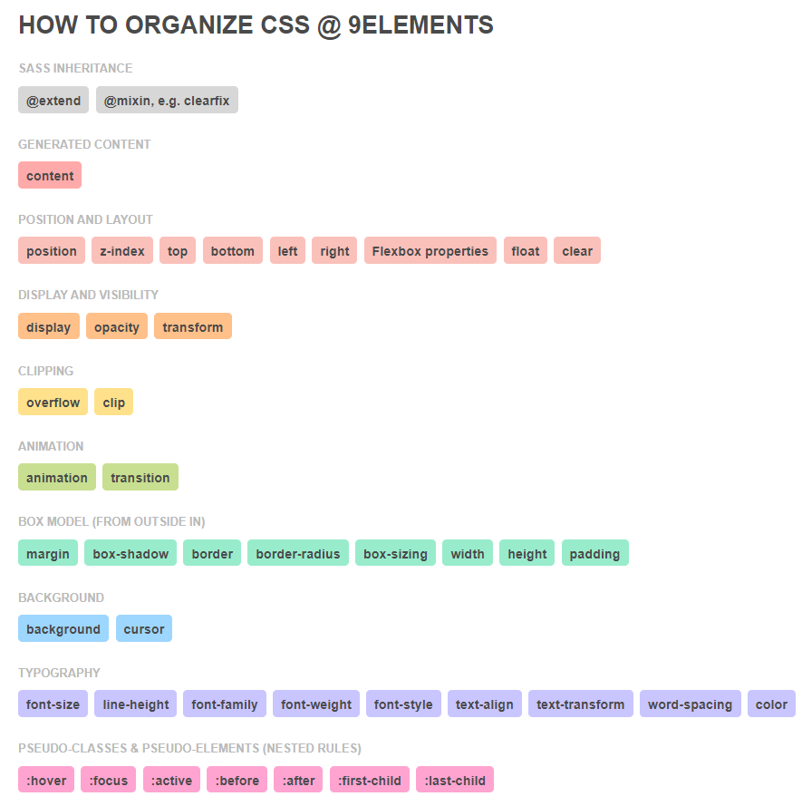
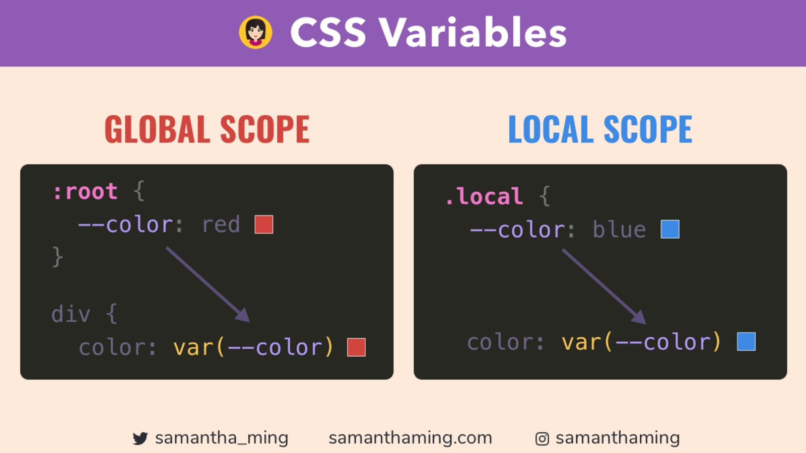

<link rel='stylesheet' href='../../../main.css'>

<div class="title">
    <center><h1 class="bigtitle">CSS</h1></center>
</div>

# Table of contents

- [Table of contents](#table-of-contents)
- [What is CSS?](#what-is-css)
- [CSS in HTML](#css-in-html)
- [CSS Rules](#css-rules)
- [CSS Comments](#css-comments)
- [CSS Units](#css-units)
  - [Absolute](#absolute)
  - [Relative](#relative)
- [CSS Properties Order](#css-properties-order)
- [CSS Pseudo Classes](#css-pseudo-classes)
- [CSS Pseudo Elements](#css-pseudo-elements)
- [CSS Variables](#css-variables)
- [CSS Functions](#css-functions)
  - [calc(expression))](#calcexpression)
  - [attr(attributeName))](#attrattributename)
  - [linear-gradient(direction, startColor, endColor))](#linear-gradientdirection-startcolor-endcolor)

# What is CSS?

CSS là viết tắt của **Cascading Style Sheet**, bao gồm **các quy luật** dùng để áp dụng style cho các element của HTML. Mỗi quy luật sẽ chọn một hoặc nhiều element để định dạng style cho nó.


# [CSS in HTML](https://www.w3schools.com/css/css_howto.asp)

Để thêm CSS vào tập tin HTML, có ba cách: **inline**, **internal**, **external**.

1. **Inline**: thêm vào thông qua attribute `style`.

```html
<h1 style="color:red;">Heading</h1>
```

2. **Internal**: thêm vào thông qua thẻ `<style>`.

```html
<style>
  h1 {
    color: red;
  }
</style>
```

3. **External**: thêm vào bằng cách liên kết đến file CSS bên ngoài bằng thẻ `<link>`.

```html
<!--html-->
<link rel="stylesheet" href="main.css" />
```

```css
/*css*/
h1 {
  color: red;
}
```

# [CSS Rules](https://www.w3schools.com/css/css_syntax.asp)

Một quy luật bao gồm một **property** (thuộc tính) kèm theo một giá trị, cách nhau bởi dấu `:`. Các giá trị phân biệt nhau bởi khoảng trắng. Các property phân biệt nhau bởi dấu `;`.

```css
selector {
  property: value1 value2;
}
```

Minh họa:


# CSS Comments

Comment trong CSS có cú pháp:

```css
/* This is a comment */
```

# [CSS Units](https://www.w3schools.com/css/css_units.asp)

CSS có hai đơn vị là **absolute** (tuyệt đối) và **relative** (tương đối). [Use cases](https://yurilee.hashnode.dev/css-units-are-confusing-af) của các loại đơn vị.


## Absolute

Các đơn vị tuyệt đối là các đơn vị không bị thay đổi khi phần tử chứa nó bị thay đổi (chẳng hạn như kéo dãn cửa sổ trình duyệt).

Đơn vị tuyệt đối sử dụng nhiều là `px` (pixel).

## Relative

Các đơn vị tương đối này phụ thuộc vào các phần tử chứa nó. Khi cửa sổ trình duyệt kéo dãn thì nó sẽ có kích thước thay đổi theo.

**Percent**

`%`, có kích thước phụ thuộc theo tỉ lệ % vào thẻ chứa nó.

**Rem**

`rem`, có kích thước phụ thuộc vào thẻ `<html>`. Ví dụ:

```css
html {
  font-size: 40px;
}
p {
  font-size: 1rem;
}
```

- Giá trị `font-size` của thẻ `<p>` là **40px**, **2rem** sẽ là **80px**.

- Nếu `font-size` của thẻ `<html>` là **20px**, thì thẻ **1rem** của `<p>` cũng là **20px**.

**Em**

`em`, có kích thuộc phụ thuộc vào thẻ gần nhất chứa nó mà có thuộc tính được liệt kê.

```html
<body>
  <div>
    <h1></h1>
  </div>
</body>
```

```css
body {
  font-size: 20px;
}
div {
}
h1 {
  font-size: 1em;
}
```

Đoạn code trên, `<h1>` sẽ phụ thuộc vào thẻ `<body>` vì nó có chứa `font-size`, mặc dù `<body>` không phải là thẻ cha gần `<h1>` nhất.

**Viewport**

`vw` phụ thuộc vào chiều ngang cửa sổ trình duyệt. Giá trị **1vw** tương đương **1%** chiều ngang trình duyệt.

`vh` phụ thuộc vào chiều dọc cửa sổ trình duyệt. Giá trị **100vh** tương đương **100%** chiều dọc trình duyệt.

# [CSS Properties Order](https://9elements.com/css-rule-order/)

Thứ tự của các thuộc tính nên được viết theo thứ tự sau:



# [CSS Pseudo Classes](https://developer.mozilla.org/en-US/docs/Web/CSS/Pseudo-classes)

Lớp giả được sử dụng trong selector

Ngoài ra nó còn dùng để định nghĩa một trạng thái nào đó của element (hover, visited, ...).

1. `:root`: tham chiếu đến thẻ `<html>`, thường dùng để khai báo biến toàn cục.

```css
:root {
  --globalColor: red;
}
```

2. `:hover`: các thuộc tính chỉ kích hoạt khi **trỏ chuột** vào element.

```css
p:hover {
  font-size: 20px;
}
```

3. `:active`: các thuộc tính kích hoạt khi **bấm và giữ chuột**.
4. `:visited`: kích hoạt khi đường **link đã được bấm vào**.

# [CSS Pseudo Elements](https://developer.mozilla.org/en-US/docs/Web/CSS/Pseudo-elements)

Dùng CSS ta cũng có thể tạo được element, bằng cách sử dụng pseudo elements.

1. `::before`: thêm phần tử giả vào trước các phần tử con của element bất kỳ. Thuộc tính `content` là bắt buộc.

```html
<div>
  <p>This is paragraph</p>
</div>
```

```css
div::before {
  content: "";
  width: 100px;
  height: 200px;
  background-color: red;
}
```

Đoạn code HTML tương đương:

```html
<div>
  :before
  <p>This is paragraph</p>
</div>
```

Tương tự đối với phần tử giả `::after`, nó sẽ thêm một element phía sau các phần tử con của một element.

2. `::first-letter`, biến chữ cái đầu trong content của một element thành một element. Thường dùng để phóng to chữ cái đầu của đoạn văn trong các bài báo. Ngoài ra còn có `::first-line`.

3. `::selection`, kích hoạt CSS khi bôi đen đoạn văn bản.

> [Những thứ hay ho có thể sử dụng pseudo element](https://css-tricks.com/pseudo-element-roundup/#aa-create-full-browser-width-bars).

# [CSS Variables](https://www.freecodecamp.org/news/everything-you-need-to-know-about-css-variables-c74d922ea855/)

Có thể đặt biến trong CSS bằng cách sử dụng pseudo class. Gọi hàm `var(varName)` và truyền vào tên biến nhằm lấy giá trị của nó.



Ví dụ:

```css
:root {
  --variable: red; /*global*/
}
h1 {
  color: var(--variable);
}
```

Biến ở `root` là biến **global**, biến định nghĩa bên trong CSS rule là **local**, các biến local có thể truy cập bởi phần tử con của nó:

```css
h1 {
  --mycolor: orange; /*local*/
  color: var(--mycolor);
}
```

# [CSS Functions](https://www.w3schools.com/cssref/css_functions.asp)

## [calc(expression)](https://developer.mozilla.org/en-US/docs/Web/CSS/calc())

Hàm `calc()` dùng để tính toán. Chẳng hạn:

```css
h1 {
  font-size: calc(50% + 20px);
}
```

## [attr(attributeName)](https://developer.mozilla.org/en-US/docs/Web/CSS/attr())

Hàm `attr()` dùng để lấy giá trị của attribute trong một element, thường sử dụng kèm với pseudo class:

```html
<a href="http://example.com">Example</a>
```

```css
a:after {
  content: "(" attr(href) ")";
}
```

Đoạn code CSS làm đoạn code HTML trở thành:

```html
<a href="http://example.com">Example(http://example.com)</a>
```

Trong trường hợp không phải thẻ `<a>`, ta không cần cặp dấu `"()"`.

## [linear-gradient(direction, startColor, endColor)](https://developer.mozilla.org/en-US/docs/Web/CSS/gradient/linear-gradient())

Hàm này dùng để tạo ra một hình ảnh có dạng gradient.


Tham số đầu tiên là direction của gradient, có thể là `to left` (từ phải qua trái), `to right` (trái qua phải), `to bottom` (trên xuống dưới), ... Thậm chí direction có thể là `45deg` (nghiêng 45 độ). Hai tham số sau là **màu bắt đầu** và **màu kết thúc** theo direction.
