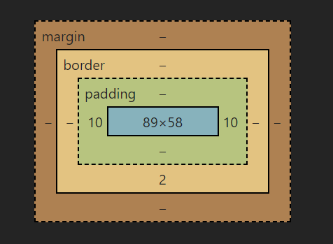
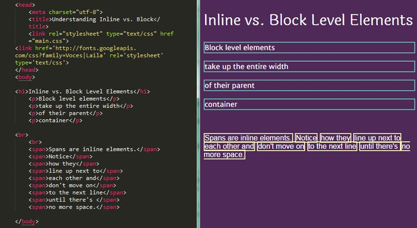
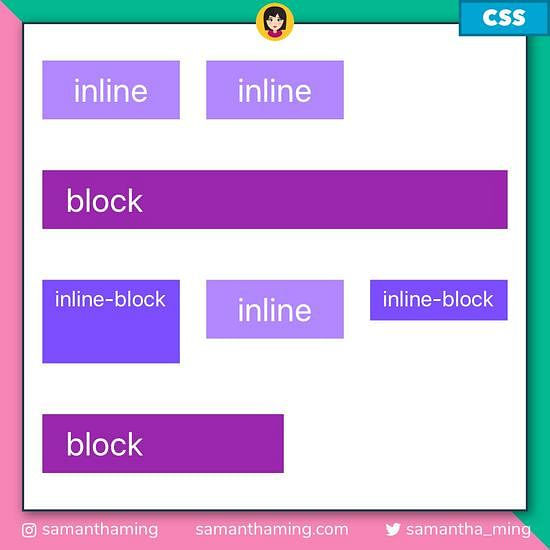

<link rel='stylesheet' href='../../../main.css'>

<div class="title"> 
    <center><h1 class="bigtitle">CSS Block & Inline Elements</h1></center>
</div>

Có hai loại hiển thị phần tử phổ biến là **inline element** và **block element**.



# Inline Elements

> **Inline element** không chiếm trọn một dòng mà chỉ sử dụng phần diện tích vừa đủ để bao quanh content bên trong đó mà thôi.



Ví dụ:

```css
.inline-element {
  display: inline;
  width: 1000px; /* ❌ won't have any effect */
  height: 1000px; /* ❌ won't have any effect */
}
```

> Inline element không thể set được kích thước (width/height).

Một số inline element thường gặp là:

- `a`
- `button`
- `img`
- `span`.

Các thẻ format có thuộc tính của inline element:

- `em`
- `strong`
- `i`
- `small`

# Block Elements

> **Block element** là các phần tử luôn bắt đầu ở một dòng mới. Đồng thời chúng có kích thước chiếm trọn một dòng. Block element có thể set được kích thước.


Một số block element phổ biến là:

- `div`
- `h1`
- `p`
- `li`
- `section`

# Inline-block Elements

> **Inline-block element** là kết hợp giữa inline và block, nó không bắt đầu trên một dòng mới nhưng có thể set được kích thước. Do đó nó có chiều rộng bằng chiều rộng của thẻ chứa nó.


Ví dụ:

```css
.inline-block-element {
  display: inline-block;
  width: 1000px; /* ✅  yes, it will work */
  height: 1000px; /* ✅  yes, it will work */
}
```

Giải thích một cách dễ hiểu inline, block và inlineblock ở trang của [Samanthaming](https://www.samanthaming.com/pictorials/css-inline-vs-inlineblock-vs-block/#explained-in-non-dev-terms).

**Minh họa các loại element:**



# Display Property

## display: block

Nếu muốn một inline element trở thành dạng block element, ta chỉ cần thêm property `display` và có giá trị là `block`.

```css
a {
  margin: 10px;
  border: 1px solid #000;
  padding: 30px 20px;
  display: block;
}
```

## display: inline-block

Để biến một inline element thành một block element dạng inline (không xảy ra chồng lề dọc - vertical margin collapse), chúng ta sử dụng `display: inline-block`.

```css
a {
  margin: 50px;
  border: 1px solid #000;
  padding: 30px 20px;
  display: inline-block;
}
```

Giá trị này cũng có thể áp dụng cho block element.
