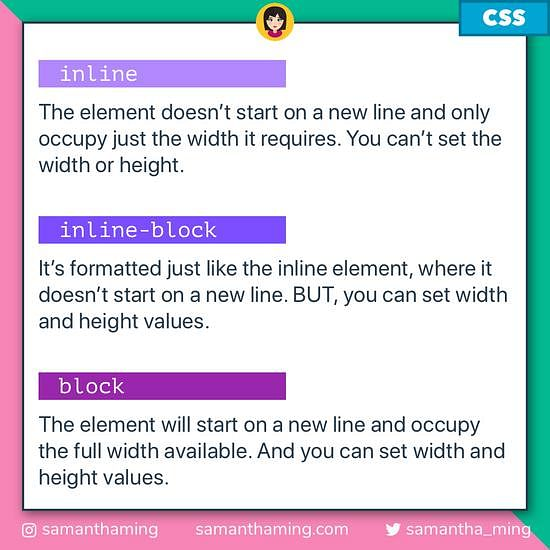
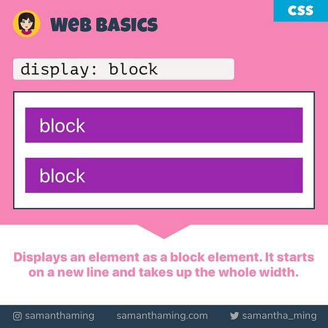

<link rel='stylesheet' href='../../../main.css'>

<div class="title"> 
    <center><h1 class="bigtitle">CSS Box Model</h1></center>
</div>

- [Box Model](#box-model)
  - [Content](#content)
  - [Padding](#padding)
  - [Border](#border)
  - [Margin](#margin)
  - [Vertical margin collapse](#vertical-margin-collapse)
- [Box-sizing](#box-sizing)
- [Rounded corners](#rounded-corners)
  - [Border-radius](#border-radius)
  - [Making circle](#making-circle)

# Box Model

Box Model là cách mà một element thể hiện chính nó trên trang web theo không gian. Một Box Model điển hình sẽ có dạng như thế này.



Như trên hình, box model gồm bốn phần: _content_, _padding_, _border_, _margins_.

## Content

Phần đầu tiên là phần nội dung, nó sẽ nằm bên trong một khung nhỏ màu da trời. Kích thước phần content này sẽ được khai báo thông qua `width` và `height`. Chẳng hạn như:

```css
.box {
  width: 89px;
  height: 58px;
}
```

## Padding

Tiếp theo là padding (đệm), đây là phần _thuộc_ element.

Nếu để hai giá trị, hai giá trị đó sẽ được gán cho cặp `top-bottom` (cạnh trên và dưới) và `right-left` (cạnh trái và phải).

```css
.box {
  padding: 0px 10px;
}
```

Nếu chỉ để một giá trị, giá trị đó sẽ là padding của cả bốn cạnh.

```css
.box {
  padding: 10px;
}
```

Nếu để đầy đủ bốn giá trị, những giá trị đó sẽ lần lượt được gán cho `top, right, bottom, left`.

```css
.box {
  padding: 30px 20px 30px 20px;
}
```

Còn nếu để ba giá trị, cạnh còn lại trong cặp sẽ tự động match.

```css
.box {
  padding: 30px 20px 10px;
}
```

Đoạn code trên thì `top = 30px`, `right = 20px`, `bottom = 10px` và `left = 20px`.

## Border

Border chính là viền của một box nào đó, nó _thuộc_ element. Khác với padding ở chỗ, border còn cần thêm một vài thông tin trong phần khai báo của chúng thì nó mới xác định rõ.

Ví dụ như ta muốn viền của là đường liền nét, độ dày 1px và có màu đen. Code CSS sẽ là:

```css
.box {
  border: 2px solid #000;
}
```

Đoạn code trên tương đương:

```css
.box {
  border-width: 2px;
  border-style: solid;
  border-color: #000;
}
```

Cũng có thể format cho từng cạnh cụ thể, chẳng hạn cạnh `bottom`.

```css
.box {
  border-bottom-width: 2px;
  border-bottom-style: solid;
  border-bottom-color: #000;
}
```

## Margin

Phần margin chính là phần để phân biệt các block của các element với nhau, chúng không thuộc một element như padding và border.

Tương tự padding và border, margin cũng có bốn cạnh và có thể thiết lập style cho một hoặc nhiều cạnh.

## Vertical margin collapse

```html
<div class="box">Box 1</div>
<div class="box">Box 2</div>
```

```css
.box {
  margin: 30px 20px;
}
```

Ta biết box 1 có margin bottom là 30px, và box 2 có margin top là 30px. Theo lẽ thường thì cả hai box này cách nhau 60px. Nhưng không phải, giá trị của nó là 30px.

Đây gọi là hiện tượng **Vertical Margin Collapse** (chồng lề dọc). Xảy ra khi có hai box giống nhau đứng liền kề, hai viền của hai box ấy sẽ chồng vào nhau, dẫn đến khoảng cách giữa hai box lúc này chỉ có 30px mà thôi.

Nếu một trong hai có margin lớn hơn, khoảng cách giữa chúng vẫn sẽ là kích thước của margin lớn nhất.


# Box-sizing

Cho đoạn code:

```css
div {
  width: 100px;
  height: 100px;
  color: #000;
  padding: 16px;
  border: 2px solid #fff;
}
```

Nếu ta muốn kích thước của content + padding + border là **100x100**, ta cần chỉnh sửa `width` và `height` theo kiểu gán cứng (width = 100 - 2\*16 - 2\*2 = 64 = height).

Để có thể tự động căn chỉnh kích thước content sao cho content + padding + border = 100px, ta sử dụng thuộc tính `box-sizing` với giá trị `border-box`.

```css
div {
  width: 100px;
  height: 100px;
  color: #000;
  padding: 16px;
  border: 2px solid #fff;
  box-sizing: border-box;
}
```

Nếu muốn quay trở lại ban đầu thì set `box-sizing: content-box`.

# Rounded corners

## Border-radius

Để bo tròn góc của một box, ta sử dụng property `border-radius` và có value là một số nào đó kèm theo đơn vị. Giá trị của số càng lớn thì góc của box càng bo tròn. Chẳng hạn như:

```css
.box {
  margin: 30px;
  padding: 20px;
  border: 1px solid #000;
  border-radius: 10px;
  width: 80px;
  height: 50px;
}
```

Cũng có thể bo tròn từng góc:

```css
.box {
  margin: 30px;
  padding: 20px;
  border: 1px solid #000;
  border-radius: 40px 20px 10px 5px;
  width: 80px;
  height: 50px;
}
```

## Making circle

Để tạo ra một hình tròn, ta set giá trị của `width` và `height` như nhau, sau đó cho `border-radius` bằng nửa giá trị của `width` và `height`. Lưu ý là ta cần xóa đi các khai báo cho margin và padding.

```css
.box {
  background-color: #000;
  border-radius: 40px;
  width: 80px;
  height: 80px;
}
```

**Kết quả**:


