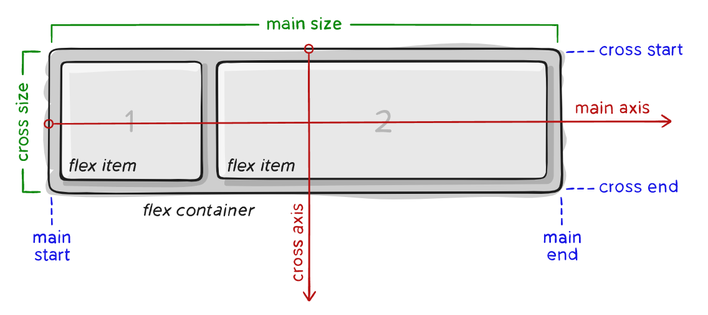
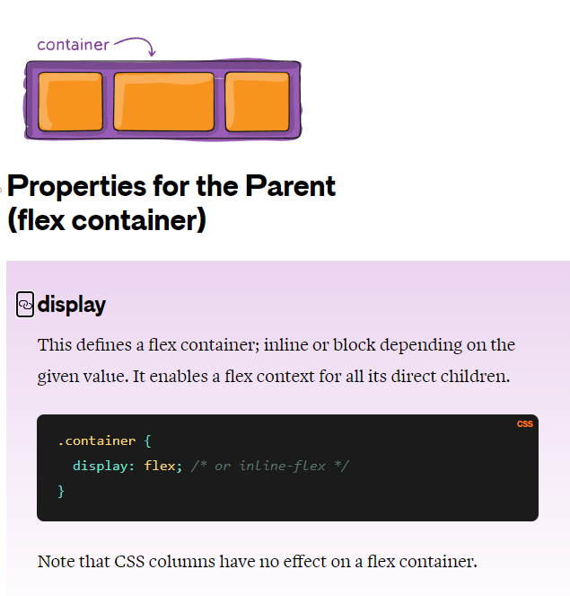
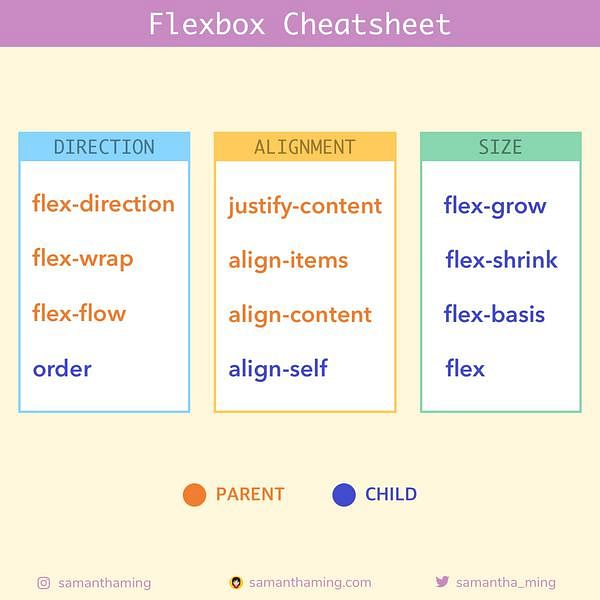
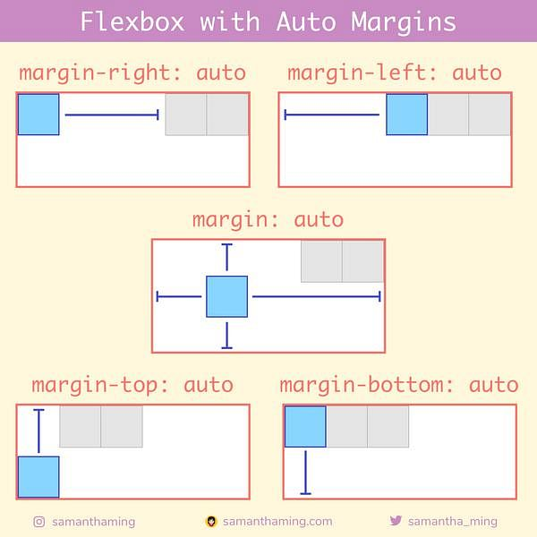
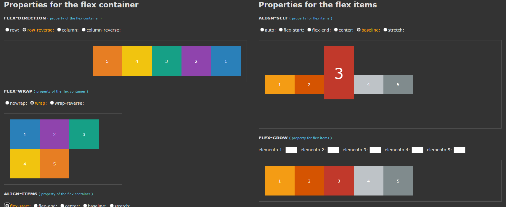
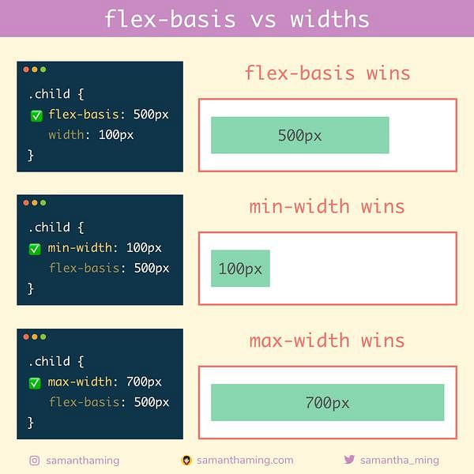

<link rel='stylesheet' href='../../../main.css'>

<div class="title"> 
    <center><h1 class="bigtitle">CSS Flexbox</h1></center>
</div>

# Table of contents

- [Table of contents](#table-of-contents)
- [✨Flexbox Model](#flexbox-model)
- [🎇Flexbox Properties](#flexbox-properties)
- [🎆Flexbox with Auto Margin](#flexbox-with-auto-margin)
- [🎉Flexbox Tools](#flexbox-tools)
- [🎊Aside](#aside)

# [✨Flexbox Model](https://css-tricks.com/snippets/css/a-guide-to-flexbox/)



- Main size và cross size lần lượt song song với main axis và cross axis.
- Flex items phải là các thẻ con trực tiếp của container.

# [🎇Flexbox Properties](https://www.samanthaming.com/flexbox30/)

- [flex-flow](https://developer.mozilla.org/en-US/docs/Web/CSS/flex-flow) là shorthand form của `flex-direction` và `flex-wrap`.

- [flex](https://developer.mozilla.org/en-US/docs/Web/CSS/flex) là shorthand form của `flex-grow`, `flex-shrink` và `flex-basis`.



> Phân loại theo mục đích sử dụng



# [🎆Flexbox with Auto Margin](https://www.samanthaming.com/flexbox30/31-flexbox-with-auto-margins/)



# 🎉Flexbox Tools

[Flexbox Playground](https://codepen.io/enxaneta/full/adLPwv)

[Flexbox Froggy (Game)](https://flexboxfroggy.com/#vi)

[Flexbox Zombies (Game)](https://mastery.games/flexboxzombies/)

# 🎊Aside

- Chiều của các loại `flex-direction`:
  
  <br>
- Độ ưu tiên giữa `flex-basis` và `width`:
  
  <br>
- `align-content` khác `align-items` ở chỗ nó áp dụng cho nhiều dòng.

- `flex: 1` tương đương với:

```css
.container {
  flex-grow: 1;
  flex-shrink: 1;
  flex-basis: 0%;
}
```
