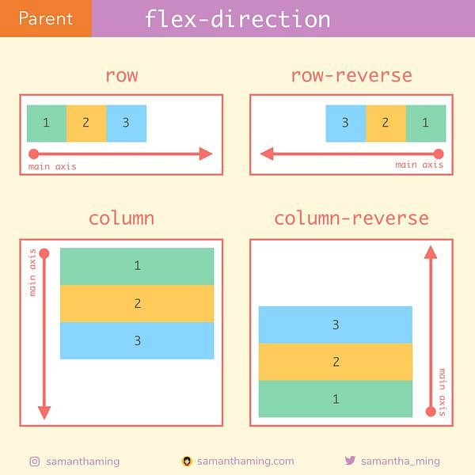

<link rel='stylesheet' href='../../../main.css'>

 
    
<h1 class="bigtitle">CSS Flexbox</h1>

# Flexbox

[Tổng hợp kiến thức](https://css-tricks.com/snippets/css/a-guide-to-flexbox/)

# Flexbox Model

- Main size và cross size lần lượt song song với main axis và cross axis.
- Flex items phải là các thẻ con trực tiếp của container.

# Flexbox Properties

[Tổng hợp các thuộc tính](https://css-tricks.com/snippets/css/a-guide-to-flexbox/#aa-display)

[Flexbox Preview](https://codepen.io/enxaneta/full/adLPwv)

## Practice with Games

[Flexbox Froggy](https://flexboxfroggy.com/#vi)

[Flexbox Zombies](https://mastery.games/flexboxzombies/)

## Details

- `align-content` khác `align-items` ở chỗ nó áp dụng cho nhiều dòng.
- Chiều main-axis của `flex-direction` đối với từng giá trị:
  
