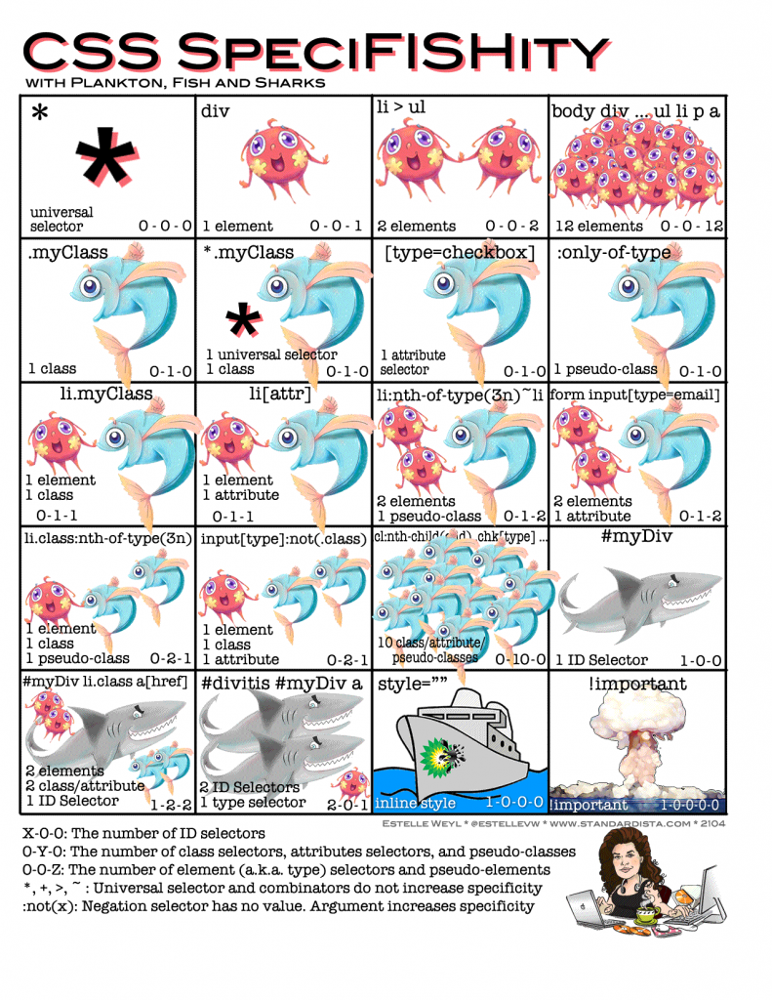

<link rel='stylesheet' href='../../../main.css'>

<div class="title"> 
    <center><h1 class="bigtitle">CSS Selectors</h1></center>
</div>

# Table of contents

- [Table of contents](#table-of-contents)
- [Id and Class](#id-and-class)
  - [Id](#id)
  - [Class](#class)
- [Useful selectors](#useful-selectors)
- [Selector Specificity](#selector-specificity)
- [Conflicts & Cascade](#conflicts--cascade)
- [Inheritance](#inheritance)
- [OOCSS](#oocss)

CSS Selector là cách mà chúng ta dùng để chọn ra các element nhằm format style cho chúng.

Luyện tập CSS thông qua trò chơi [CSS Diner](https://flukeout.github.io/).

# Id and Class

Để cung cấp khả năng chọn những element đặc thù, ta đánh dấu cho chúng bằng **Id** và **Class**.

## Id

Id dùng để đánh dấu duy nhất một element. Nói cách khác, các id nằm ở các **element khác nhau không thể có cùng giá trị**.

Chẳng hạn ta có nhiều thẻ `<h1>`. Và ta chỉ cần tô màu đỏ cho heading đầu tiên, thì ta phải đặt id cho nó:

```html
<h1 id="first-heading">Heading</h1>
<h1>Heading</h1>
<h1>Heading</h1>
<h1>Heading</h1>
```

Để chọn id, dùng ký tự `#`.

```css
#first-heading {
  color: red;
}
```

Kết quả:

<h1 id="first-heading" style ="color:red">Heading</h1>
<h1>Heading</h1>
<h1>Heading</h1>
<h1>Heading</h1>

## Class

Class để gom các element có cùng lớp chức năng lại với nhau, các class nằm ở các **element khác nhau có thể có cùng giá trị**.

Chẳng hạn ta muốn mọi thẻ `<h2>` đều có màu cam, ta sẽ đặt class cho chúng:

```html
<h2 class="heading2">Heading</h2>
<h2 class="heading2">Heading</h2>
<h2 class="heading2">Heading</h2>
<h2 class="heading2">Heading</h2>
```

Để chọn class, dùng ký tự `.`.

```css
.heading2 {
  color: orange;
}
```

Kết quả:

<h2 class="heading2" style="color:orange">Heading</h2>
<h2 class="heading2" style="color:orange">Heading</h2>
<h2 class="heading2" style="color:orange">Heading</h2>
<h2 class="heading2" style="color:orange">Heading</h2>

# [Useful selectors](https://developer.mozilla.org/en-US/docs/Web/CSS/CSS_Selectors)

Các selector thông dụng là:


Ngoài ra còn có Pseudo Classes:

- `:first-child` và `:last-child` - Tag đầu và cuối trong số các tag con
- `:first-of-type` và `:last-of-type` - Tag đầu và cuối trong số các tag cùng loại
- `:nth-child(n)` - tag con thứ n, n có thể là **"even"**, **"odd"** hoặc thậm chí là biểu thức: **"2n + 1"**.
- `:nth-of-type(n)` - tag con thứ n trong số các tag con cùng loại.

# [Selector Specificity](https://www.w3schools.com/css/css_specificity.asp)

Độ ưu tiên của các selector được thể hiện bằng hình ảnh dưới:



# [Conflicts & Cascade](https://developer.mozilla.org/en-US/docs/Learn/CSS/Building_blocks/Cascade_and_inheritance#the_cascade)

Nếu hai selector trùng nhau thì bộ quy luật sau sẽ ghi đè lên bộ quy luật trước.

Chẳng hạn ta có

```html
<!--html;-->
<h1>Heading 1</h1>
```

```css
h1 {
  color: red;
}
h1 {
  color: orange;
}
```

Thì kết quả sẽ là

<h1 style="color:orange" style = "color:red">Heading 1</h1>

Đây cũng chính là cách mà CSS vận hành (các styles và selectors được chồng lên nhau).

# [Inheritance](https://developer.mozilla.org/en-US/docs/Learn/CSS/Building_blocks/Cascade_and_inheritance#inheritance)

Nếu một element cha mang một quy luật CSS nào đó, thì các element con chứa bên trong nó sẽ được kế thừa.

```html
<div>
  This is a box
  <p>Paragraph</p>
</div>
```

```css
div {
  color: red;
}
```

Kết quả:

<div style ="color:red">
    This is a box
    <p>Paragraph</p>
</div>

**Sự khác biệt giữa Cascade và Inheritance:**

- Inheritance xảy ra khi element con kế thừa một property từ element cha.
- Cascade xảy ra khi một element được áp dụng một quy luật nào đó hai lần.

Giả sử `<h1>` là element con của `<div>`:

```css
div {
  color: red;
}

h1 {
  color: red;
}
```

Rule của `<h1>` sẽ ưu tiên hơn rule của `<div>`, do tính ưu tiên của selector so với inheritance.

# [OOCSS](https://palmyran.com/buoc-dau-tim-hieu-ve-oocss/)

> [Detail Document](https://www.smashingmagazine.com/2011/12/an-introduction-to-object-oriented-css-oocss/)

Chẳng hạn ta có thuộc tính `color: #fff;` lặp đi lặp lại nhiều lần trên các thẻ khác nhau, và mỗi selector ta buộc phải viết riêng chứ không gom nhóm lại được:

```css
.content__heading {
  margin: 10px;
  font-size: 24px;
  font-weight: 400;
  color: #fff;
}
.content__sub-heading {
  margin: 15px;
  font-weight: bold;
  color: #fff;
}
.content__description {
  flex-direction: column;
  justify-content: flex-end;
  padding: 32px 16px;
  color: #fff;
}
```

Để giải quyết vấn đề trùng lặp rule, ta tạo ra một CSS rule mới:

```css
.text-white {
  color: #fff;
}
```

Thẻ nào muốn có text màu trắng thì thêm class `text-white` vào:

```html
<h1 class="content__heading text-white">Heading</h1>
<h2 class="content__sub-heading text-white">Sub Heading</h2>
<p class="content__description text-white">Description</p>
```

Lưu ý việc này đánh đổi giữa giảm số lượng thuộc tính trong CSS bằng việc tăng class của HTML.

Nếu các selector chọn nhiều phần tử (chẳng hạn selector là thẻ `<h1>`), thì không nên sử dụng. Vì lúc đó ta cần viết rất nhiều class ở HTML trong khi viết ở CSS thì chỉ cần một dòng.
