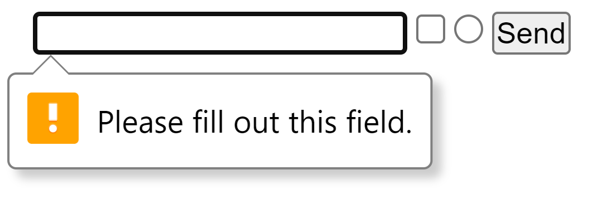
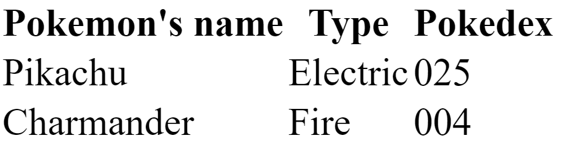

<link rel='stylesheet' href='../../main.css'>

<div class="title">
    <center><h1 class="bigtitle">HTML Useful Tags</h1></center>
</div>

- [Anchor](#anchor)
- [Break](#break)
- [Button](#button)
- [Division](#division)
- [Form](#form)
- [Heading](#heading)
- [Image](#image)
- [Input](#input)
- [List](#list)
- [Paragraph](#paragraph)
- [Table](#table)

# Anchor

Thẻ `<a>` là một thẻ để đánh dấu link (liên kết), liên kết có thể là một trang web khác hoặc thậm chí là một section trong cùng trang web.

**Ví dụ**:

```html
<a href="https://www.google.com/">This is a link to Google</a>
```

**Kết quả**:

<a href="https://www.google.com/">This is a link to Google</a>

# Break

Thẻ `<br>` dùng để xuống dòng văn bản trong HTML.

# Button

Thẻ `<button>` dùng để đánh dấu nút.

**Ví dụ**:

```html
<button>This is a button</button>
```

**Kết quả**:

<button>This is a button</button>

# Division

Thẻ `<div>` dùng để đánh dấu một khối bao quanh các thẻ khác. Mục đích của nó là để phân chia các thành phần các nhau của trang web.

# Form

Thẻ `<form>>` dùng để đánh dấu một form nhập dữ liệu, gồm nhiều thẻ `<input>`.

**Ví dụ**

```html
<form>
  <input required></input>
  <input type="checkbox"></input>
  <input type="radio"></input>
  <input type="submit" value="Send"></input>
</form>
```

Các thẻ `<input>` nếu có thuộc tính `required` và để trống, khi bấm nút submit sẽ có thông báo:



# Heading

HTML có các thẻ `<h1>` đến `<h6>` dùng để đánh dấu tiêu đề đoạn văn bản.

**Ví dụ**:

```html
<h1>Heading 1</h1>
<h2>Heading 2</h2>
<h3>Heading 3</h3>
<h4>Heading 4</h4>
<h5>Heading 5</h5>
<h6>Heading 6</h6>
```

**Kết quả**:

<h1>Heading 1</h1>
<h2 style=" all: revert;">Heading 2</h2>
<h3>Heading 3</h3>
<h4>Heading 4</h4>
<h5>Heading 5</h5>
<h6>Heading 6</h6>

# Image

Thẻ `` là một thẻ đơn không chứa nội dung dùng để đánh dấu hình ảnh. Nó thường đi kèm với ba thuộc tính:

- `src="imageLink/imageFileLink"`: dùng để khai báo đường dẫn hình ảnh.
- `alt="description"`: dùng để mô tả nội dung hình ảnh khi hình ảnh bị hỏng.
- `title`: dùng để hiển thị caption cho hình ảnh khi hover chuột vào.

**Ví dụ**:

```html

```

**Kết quả**


# Input

Thẻ `<input>` dùng để đánh dấu ô nhập dữ liệu.

**Ví dụ**:

```html
<input></input>
<input type = "checkbox"></input>
<input type = "radio"></input>
<input type = "submit" value="Send"></input>
```

**Kết quả**:

<input></input>
<input type = "checkbox"></input>
<input type = "radio"></input>
<input type = "submit" value="Send"></input>

# List

Thẻ `<ul>` dùng để đánh dấu một danh sách không có thứ tự (unordered list - không đánh số). Bên trong thẻ `<ul>` có thẻ `<li>` dùng để đánh dấu các list item.

Ngoài ra còn có thẻ `<ol>` dùng để đánh dấu danh sách có thứ tự (ordered list - có đánh số), thẻ này cũng chứa các thẻ `<li>`.

**Ví dụ**:

```html
<ul>
  <li>List item 1</li>
  <li>List item 2</li>
  <li>List item 3</li>
</ul>
```

**Kết quả**:

<ul>
  <li>List item 1</li>
  <li>List item 2</li>
  <li>List item 3</li>
</ul>

# Paragraph

Thẻ `<p>` dùng để đánh dấu đoạn văn bản.

**Ví dụ**:

```html
<p>
  Lorem Ipsum is simply dummy text of the printing and typesetting industry.
  Lorem Ipsum has been the industry's standard dummy text ever since the 1500s,
  when an unknown printer took a galley of type and scrambled it to make a type
  specimen book.
</p>
```

**Kết quả**:

<p>
  Lorem Ipsum is simply dummy text of the printing and typesetting industry.
  Lorem Ipsum has been the industry's standard dummy text ever since the 1500s,
  when an unknown printer took a galley of type and scrambled it to make a type
  specimen book.
</p>

# Table

Thẻ `<table>` dùng để đánh dấu bảng, bên trong đó chứa thẻ `<thead>` dùng để chứa các tiêu đề và thẻ `<tbody>` để chứa các ô nội dung.

Cấu trúc của bảng như sau:

```html
<table>
  <thead>
    <th>Name</th>
    <th>Type</th>
    <th>Pokedex</th>
  </thead>
  <tbody>
    <tr>
      <td>Pikachu</td>
      <td>Electric</td>
      <td>025</td>
    </tr>
    <tr>
      <td>Charmander</td>
      <td>Fire</td>
      <td>004</td>
    </tr>
  </tbody>
</table>
```

**Kết quả**:


