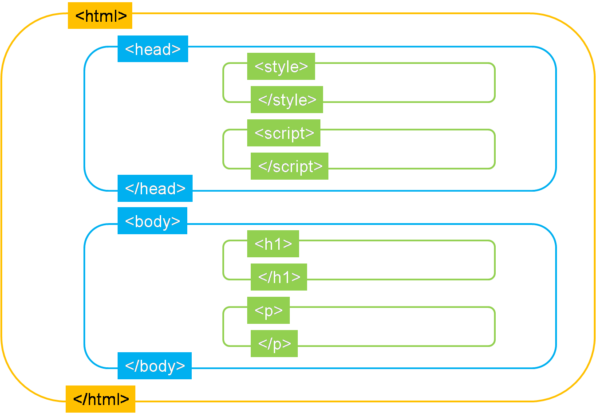

<link rel='stylesheet' href='../main.css'>

<div class="title">
    <center><h1 class="bigtitle">HTML</h1></center>
</div>

# Table of contents

- [Table of contents](#table-of-contents)
- [🔥What is HTML?](#what-is-html)
- [🧱Elements](#elements)
- [🔎Attributes](#attributes)
- [🏢Web page structure](#web-page-structure)
- [💬Comments](#comments)

# 🔥What is HTML?

HTML là viết tắt của **Hyper Text Markup Language**. Nó không phải là ngôn ngữ lập trình mà chỉ là ngôn ngữ đánh dấu (siêu văn bản). Nhiệm vụ của nó sẽ đánh dấu từng phần của văn bản, những phần được đánh dấu này sẽ được CSS và JS xử lý.


Đồng thời, HTML giúp phân chia các phần trong văn bản nhằm xây dựng nên cấu trúc trang web.

# [🧱Elements](https://www.w3schools.com/html/html_elements.asp)

Cú pháp của một element:


**Content** và **attribute** không phải là thành phần bắt buộc của một element.

Một số tag không có opening tag hoặc closing tag hay thậm chí không có content, chúng được gọi là **single tag** (tag đơn). Chẳng hạn tag `<br>` là một single tag.

# [🔎Attributes](https://www.w3schools.com/html/html_attributes.asp)

Cú pháp của attribute trong một tag là:


Một số attribute chỉ tồn tại ở vài tag nhất định, trong khi số khác lại có ở mọi tag (ta gọi chúng là **global attributes**). Chẳng hạn attribute `class` có ở mọi tag.

> Có thể sử dụng nhiều attribute trong một tag hoặc một attribute có thể có nhiều giá trị, được phân biệt nhau bởi dấu cách:

```html
<div class="class1 class2" title="Box">This is a box</div>
```

# 🏢Web page structure

Chúng ta sẽ bắt đầu xây dựng một trang web bằng cách tạo ra một file có tên là **index.html**.

Sở dĩ chọn tên index vì nó là file chỉ mục, lúc mà web browser quét qua toàn bộ các trang web thì nó sẽ tìm **index.html** và xem như là homepage (trang chủ) của web site.

Một dòng code mà mọi file HTML đều có là:

```html
<!DOCTYPE html>
```

Dòng này có chức năng nói với web browser rằng: “Ê, tao là tài liệu HTML đây, dưới đây tao sẽ trình bày một đống ngôn ngữ siêu văn bản đó! Hãy duyệt tao dưới dạng HTML nha”.

Ví dụ một file HTML đơn giản:

```html
<!DOCTYPE html>
<html lang="en">
  <head>
    <title>Document</title>
  </head>

  <body>
    <div id="box">BOX</div>
  </body>
</html>
```

Minh họa:


Có thể thấy, một file HTML gồm duy nhất một thẻ `<html>` chứa thẻ `<head>` và thẻ `<body>`.

1. Thẻ `<head>` dùng để mô tả các thông tin ngoài lề của trang web như tiêu đề, keyword tìm kiếm, ... Những thông tin này sẽ không hiển thị lên trang web.\
   Ngoài ra, trong thẻ `<head>` còn chứa các thẻ liên kết đến các file CSS và JS.

2. Thẻ `<body>` dùng để hiển thị nội dung chính của trang web.

# 💬Comments

Comment trong html có cú pháp:

```html
<!-- -->
```
