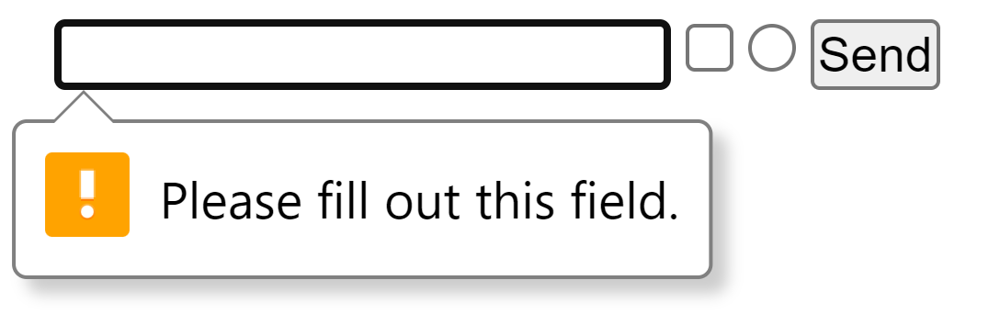

<link rel='stylesheet' href='../main.css'>

<div class="title">
    <center><h1 class="bigtitle">HTML Useful Tags</h1></center>
</div>

# Table of contents

-   [Table of contents](#table-of-contents)
-   [🔗Anchor](#anchor)
-   [💥Break](#break)
-   [🔘Button](#button)
-   [📦Division](#division)
-   [📋Form](#form)
-   [🚩Heading](#heading)
-   [📷Image](#image)
-   [📥Input](#input)
-   [📜List](#list)
-   [📄Paragraph](#paragraph)
-   [🧮Table](#table)

# [🔗Anchor](https://www.w3schools.com/html/html_links.asp)

Thẻ `<a>` là một thẻ để đánh dấu link (liên kết), liên kết có thể là một trang web khác hoặc thậm chí là một section trong cùng trang web (bookmark).

Ví dụ:

```html
<a href="https://www.google.com/">This is a link to Google</a>
```

Kết quả:

<a href="https://www.google.com/">This is a link to Google</a>

> Thẻ anchor nên hạn chế chứa các thẻ con dạng block hoặc các section lớn, vì có thể gây ra lỗi.

# [💥Break](https://www.w3schools.com/tags/tag_br.asp)

Thẻ `<br>` dùng để xuống dòng văn bản trong HTML.

# [🔘Button](https://www.w3schools.com/tags/tag_button.asp)

Thẻ `<button>` dùng để đánh dấu nút.

Ví dụ:

```html
<button>This is a button</button>
```

Kết quả:

<button>This is a button</button>

# [📦Division](https://www.w3schools.com/tags/tag_div.asp)

Thẻ `<div>` dùng để đánh dấu một khối bao quanh các thẻ khác. Mục đích của nó là để phân chia các thành phần các nhau của trang web.

# [📋Form](https://www.w3schools.com/html/html_forms.asp)

Thẻ `<form>` dùng để đánh dấu một form nhập dữ liệu, gồm nhiều thẻ [input](#input).

Ví dụ

```html
<form>
  <input required></input>
  <input type="submit" value="Send"></input>
</form>
```

<form>
  <input required></input>
  <input type="submit" value="Send"></input>
</form>

Các thẻ `<input>` nếu có thuộc tính `required` và để trống, khi bấm nút submit sẽ có thông báo:



# [🚩Heading](https://www.w3schools.com/html/html_headings.asp)

HTML có các thẻ `<h1>` đến `<h6>` dùng để đánh dấu tiêu đề đoạn văn bản.

Ví dụ:

```html
<h1>Heading 1</h1>
<h2>Heading 2</h2>
<h3>Heading 3</h3>
<h4>Heading 4</h4>
<h5>Heading 5</h5>
<h6>Heading 6</h6>
```

Kết quả:

<h1>Heading 1</h1>
<h2 style=" all: revert;">Heading 2</h2>
<h3>Heading 3</h3>
<h4>Heading 4</h4>
<h5>Heading 5</h5>
<h6>Heading 6</h6>

# [📷Image](https://www.w3schools.com/html/html_images.asp)

Thẻ `` là một thẻ đơn không chứa nội dung dùng để đánh dấu hình ảnh. Nó thường đi kèm với ba thuộc tính:

-   `src="imageLink/imageFileLink"`: dùng để khai báo đường dẫn hình ảnh.
-   `alt="description"`: dùng để mô tả nội dung hình ảnh khi hình ảnh bị hỏng.
-   `title`: dùng để hiển thị caption cho hình ảnh khi hover chuột vào.

Ví dụ:

```html

```

Kết quả


Ngoài ra, ta có thể dùng thuộc tính `onerror` với cú pháp sau:

```html

```

Giá trị `backup url` là đường dẫn đến ảnh dự phòng nếu ảnh chính bị hỏng link hoặc không hiển thị được.

Ảnh backup thường có dạng:


Đối với thẻ `div` có dùng ảnh nền, nên khai báo nhiều url làm giá trị của thuộc tính `background-image`. Mục đích là để thay thế ảnh dự phòng nếu ảnh chính bị lỗi, đối với thẻ `div`.

```css
.div {
    background-image: url("url1"), url("url2"), url("url3");
}
```

# [📥Input](https://www.w3schools.com/tags/tag_input.asp)

Thẻ `<input>` dùng để đánh dấu ô nhập dữ liệu.

Ví dụ:

```html
<input></input>
<input type = "checkbox"></input>
<input type = "radio"></input>
<input type = "submit" value="Send"></input>
```

Kết quả:

<input></input>
<input type = "checkbox"></input>
<input type = "radio"></input>
<input type = "submit" value="Send"></input>

# [📜List](https://www.w3schools.com/html/html_lists.asp)

Thẻ `<ul>` dùng để đánh dấu một danh sách không có thứ tự (unordered list - không đánh số). Bên trong thẻ `<ul>` có thẻ `<li>` dùng để đánh dấu các list item.

Ngoài ra còn có thẻ `<ol>` dùng để đánh dấu danh sách có thứ tự (ordered list - có đánh số), thẻ này cũng chứa các thẻ `<li>`.

Ví dụ:

```html
<ul>
    <li>List item 1</li>
    <li>List item 2</li>
    <li>List item 3</li>
</ul>
```

Kết quả:

<ul>
  <li>List item 1</li>
  <li>List item 2</li>
  <li>List item 3</li>
</ul>

# [📄Paragraph](https://www.w3schools.com/html/html_paragraphs.asp)

Thẻ `<p>` dùng để đánh dấu đoạn văn bản.

Ví dụ:

```html
<p>
    Lorem Ipsum is simply dummy text of the printing and typesetting industry.
    Lorem Ipsum has been the industry's standard dummy text ever since the
    1500s, when an unknown printer took a galley of type and scrambled it to
    make a type specimen book.
</p>
```

Kết quả:

<p>
  Lorem Ipsum is simply dummy text of the printing and typesetting industry.
  Lorem Ipsum has been the industry's standard dummy text ever since the 1500s,
  when an unknown printer took a galley of type and scrambled it to make a type
  specimen book.
</p>

# [🧮Table](https://www.w3schools.com/html/html_tables.asp)

Thẻ `<table>` dùng để đánh dấu bảng, bên trong đó chứa thẻ `<thead>` dùng để chứa các tiêu đề và thẻ `<tbody>` để chứa các ô nội dung.

Cấu trúc của bảng như sau:

```html
<table>
    <thead>
        <th>Name</th>
        <th>Type</th>
        <th>Pokedex</th>
    </thead>
    <tbody>
        <tr>
            <td>Pikachu</td>
            <td>Electric</td>
            <td>025</td>
        </tr>
        <tr>
            <td>Charmander</td>
            <td>Fire</td>
            <td>004</td>
        </tr>
    </tbody>
</table>
```

Kết quả:

<table>
  <thead>
    <th>Name</th>
    <th>Type</th>
    <th>Pokedex</th>
  </thead>
  <tbody>
    <tr>
      <td>Pikachu</td>
      <td>Electric</td>
      <td>025</td>
    </tr>
    <tr>
      <td>Charmander</td>
      <td>Fire</td>
      <td>004</td>
    </tr>
  </tbody>
</table>
