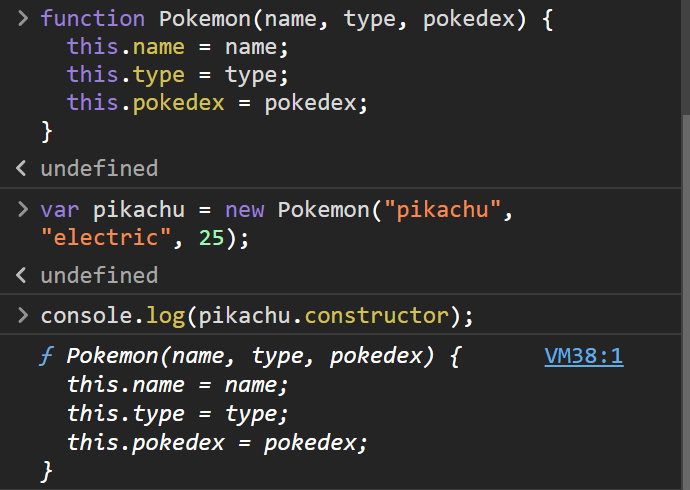

<link rel='stylesheet' href='../../../main.css'>

<div class="title">
    <center><h1 class="bigtitle">Scopes and Objects</h1></center>
</div>

# Table of contents

- [Table of contents](#table-of-contents)
- [🚗Object](#object)
  - [🙋‍♂️Creating](#️creating)
    - [this Keyword](#this-keyword)
    - [Object Constructor](#object-constructor)
    - [ES6 Creating](#es6-creating)
  - [🙅‍♀️Deleting](#️deleting)
  - [�‍♂️Modifying](#️modifying)
    - [Object Prototype](#object-prototype)
- [🚌Built-in Object](#built-in-object)
    - [Object.assign](#objectassign)
    - [Object.keys](#objectkeys)
    - [Object.values](#objectvalues)
    - [Object.entries](#objectentries)
    - [Object.prototype.hasOwnProperty(key)](#objectprototypehasownpropertykey)

# [🚗Object](https://www.w3schools.com/js/js_objects.asp)

> [Mozilla Document](https://developer.mozilla.org/en-US/docs/Web/JavaScript/Guide/Working_with_Objects)

> [Programiz Document](https://www.programiz.com/javascript/object)

Mọi thứ có thể là đối tượng, và đối tượng có nhiều thuộc tính hoặc phương thức. Các thuộc tính không được bảo toàn thứ tự.

## [🙋‍♂️Creating](https://developer.mozilla.org/en-US/docs/Web/JavaScript/Guide/Working_with_Objects#creating_new_objects)

> [Programiz Document](https://www.programiz.com/javascript/constructor-function)

Để tạo ra một object rỗng:

```js
const person = {};
```

Thuộc tính trong object xem như một biến, và ta không cần dùng `var`, `let` hay `const` để khai báo chúng. Giá trị của một thuộc tính theo sau dấu `:`.

```js
const person = {
  name: "Quân",
  age: 20,
  skills: ["HTML", "CSS", "JavaScript"],
  isMarried: false,

  getFullName: function () {
    return `${this.firstName}${this.lastName}`;
  },
};
```

Kiểu dữ liệu của thuộc tính có thể là chuỗi, số, mảng, boolean, object, thậm chí là một cặp key - value như map hoặc dictionary.

Tên thuộc tính có thể có dấu `-` nếu là dạng chuỗi.

```js
const obj = {
  "full-name": "Lê Minh Quân",
  "first-name": "Lê Minh",
  "last-name": "Quân",
};
```

[Phương thức](https://developer.mozilla.org/en-US/docs/Web/JavaScript/Guide/Working_with_Objects#defining_methods) trong object cũng có một tên và dấu `:`, theo sau đó là từ khóa `function`.

Phương thức **không thể là arrow function**. Tồn tại một cách khác ngắn gọn hơn để khai báo phương thức trong object:

```js
const person = {
  name: "Quân",
  age: 20,
  getName() {
    return this.name;
  },
};
console.log(person.getName());
```

### [this Keyword](https://www.w3schools.com/js/js_this.asp)

`this` là một từ khóa dùng để chỉ **chính bản thân object** (tương tự như C++, con trỏ `this` dùng để trỏ đến đối tượng gọi phương thức).

Hai thuộc tính **trùng key** thì sẽ giá trị sẽ bị **ghi đè** (cái sau đè lên cái trước).

Để truy cập vào các thuộc tính của object, ta sử dụng toán tử dấu chấm `.` hoặc dùng dấu `[]` kèm theo tên của thuộc tính tương tự như map hoặc dictionary.

```js
console.log(person.firstName); // "Quân"
console.log(person["firstName"]); // "Quân
```

### [Object Constructor](https://developer.mozilla.org/en-US/docs/Web/JavaScript/Guide/Working_with_Objects#using_a_constructor_function)

Do tính chất **trùng tên** của LỚP ĐỐI TƯỢNG và constructor, ta có thể triển khai một constructor và đặt tên là lớp đối tượng bất kỳ.

```js
function Pokemon(name, type, pokedex) {
  this.name = name;
  this.type = type;
  this.pokedex = pokedex;
  this.getName = function () {
    return `${name}`;
  };
}
```

Với `this` là đối tượng được tạo ra bằng constructor. Sử dụng tương tự constructor thông thường.

```js
const pikachu = new Pokemon("pikachu", "electric", 25);
console.log(pikachu.getName()); // => "pikachu"
```

Phương thức `constructor` gọi từ đối tượng sẽ trả về constructor của lớp đối tượng:

```js
console.log(pikachu.constructor);
```



> Vì không có `this` nên arrow function không được dùng làm constructor.

### ES6 Creating

ES6 hỗ trợ cách tạo object khác, ví dụ ta cần tạo một object theo cách bên dưới:

```js
var name = "Quân";
var age = 20;
const person = {
  name: name,
  age: age,
};
```

Nếu key - value trùng tên, có thể viết:

```js
var name = "Quân";
var age = 20;
const person = {
  name,
  age,
};
```

Thậm chí, **key của object có thể là giá trị của biến**:

```js
var fieldName = "name";
var fieldAge = "age";
const person = {
  [fieldName]: "Quân",
  [fieldAge]: 20,
};
```

Đoạn code trên tương đương với:

```js
var fieldName = "name";
var fieldAge = "age";
const person = {
  name: "Quân",
  age: 20,
};
```

## [🙅‍♀️Deleting](https://developer.mozilla.org/en-US/docs/Web/JavaScript/Guide/Working_with_Objects#deleting_properties)

Để xóa thuộc tính hoặc phương thức của object, ta dùng từ khóa `delete` kèm theo tên thuộc tính hoặc phương thức cần xóa.

## 🤦‍♂️Modifying

> Object là một mutable data type, do đó ta có thể thay đổi giá trị của các thuộc tính bằng reassign.

Ta cũng có thể khai báo một thuộc tính hoặc phương thức **chưa có** trong object và gán giá trị cho nó. Thuộc tính mới này sẽ được **thêm vào object**.

```js
const person = {
  name: "Quân",
  age: 20,
};
person.hair = "curly";
person.getAge = function () {
  return this.age;
};

console.log(person.getAge()); // 20
console.log(person.hair); // "curly"
```

### [Object Prototype](https://developer.mozilla.org/en-US/docs/Web/JavaScript/Guide/Working_with_Objects#defining_properties_for_an_object_type)

> [Programiz Document](https://www.programiz.com/javascript/prototype)

Để thêm một thuộc tính hoặc phương thức vào LỚP ĐỐI TƯỢNG thì ta sử dụng thêm từ khóa `prototype`.

```js
Pokemon.prototype.catchRate = 10;
// (defaultValue)
Pokemon.prototype.getType() = function{
  return this.type;
}
```

Cần phân biệt với việc thêm thuộc tính hoặc phương thức vào ĐỐI TƯỢNG, khi đó chúng ta chỉ cần sử dụng toán tử `.`.

# [🚌Built-in Object](https://developer.mozilla.org/en-US/docs/Web/JavaScript/Reference/Global_Objects/Object)

Cho đối tượng dưới đây

```js
const person = {
  firstName: "Quân",
  age: 250,
  country: "Viet Nam",
  city: "HCM",
  skills: ["HTML", "CSS", "JS"],
  title: "student",
  address: {
    street: "22",
    ward: "Linh Đông",
    city: "HCM",
  },
  getPersonInfo: function () {
    return `I am ${this.firstName} and I live in ${this.city}, ${this.country}. I am ${this.age}.`;
  },
};
```

Tồn tại các method của lớp đối tượng `Object` dựng sẵn:

### [Object.assign](https://developer.mozilla.org/en-US/docs/Web/JavaScript/Reference/Global_Objects/Object/assign)

Sao chép đối tượng mà không thay đổi đối tượng gốc

```js
const copyPerson = Object.assign({}, person);
//{firstName: 'Quân', age: 250, country: 'Viet Nam', city: 'HCM', skills: Array(3), …}
```

### [Object.keys](https://developer.mozilla.org/en-US/docs/Web/JavaScript/Reference/Global_Objects/Object/keys)

Lấy mọi tên thuộc tính hoặc khóa có trong đối tượng.

```js
const keys = Object.keys(copyPerson);
// ['firstName', 'age', 'country', 'city', 'skills', 'title', 'address', 'getPersonInfo']
const address = Object.address(copyPerson.address);
// ['street', 'ward', 'city']
```

### [Object.values](https://developer.mozilla.org/en-US/docs/Web/JavaScript/Reference/Global_Objects/Object/values)

Lấy giá trị của đối tượng và cho vào mảng.

### [Object.entries](https://developer.mozilla.org/en-US/docs/Web/JavaScript/Reference/Global_Objects/Object/entries)

Lấy các cặp key - value và cho vào mảng.

### [Object.prototype.hasOwnProperty(key)](https://developer.mozilla.org/en-US/docs/Web/JavaScript/Reference/Global_Objects/Object/hasOwnProperty)

Kiểm tra thuộc tính `key` có tồn tại trong đối tượng hay không.

Phương thức này gọi từ đối tượng (có chữ prototype) thay vì gọi từ lớp đối tượng (dùng `Object`) như các phương thức static ở trên.
