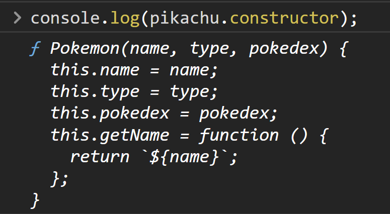

<link rel='stylesheet' href='../../main.css'>

<div class="title">
    <center><h1 class="bigtitle">Objects</h1></center>
</div>

# Table of contents

- [Table of contents](#table-of-contents)
- [References](#references)
  - [Documents](#documents)
  - [Cheat Sheets](#cheat-sheets)
- [🚕Defining an Object](#defining-an-object)
- [👷‍♂️Constructor](#️constructor)
- [💥Deleting](#deleting)
- [💖Built-in Object](#built-in-object)

# References

## Documents

> [Mozilla Document](https://developer.mozilla.org/en-US/docs/Web/JavaScript/Guide/Working_with_Objects)

## Cheat Sheets

> [Codecademy Cheat Sheet](https://www.codecademy.com/learn/introduction-to-javascript/modules/learn-javascript-objects/cheatsheet)

# [🚕Defining an Object](https://developer.mozilla.org/en-US/docs/Web/JavaScript/Guide/Working_with_Objects#creating_new_objects)

**Khai báo thuộc tính:**

```js
const person = {
  // string
  name: "Quân",
  // number
  age: 20,
  // array
  skills: ["HTML", "CSS", "JavaScript"],
  // boolean
  isMarried: false,
  // nested object
  techs: {
    fe: "ReactJS",
    be: "NodeJS",
  },

  // This will replace the first "isMarried" variable.
  isMarried: true,

  // Key can put in the quotes like this.
  "full-name": "Lê Minh Quân",
};

console.log(person.name); // "Quân"
console.log(person["full-name"]); // "Lê Minh Quân" (only use [] for property).
```

**Khai báo phương thức**

```js
const person = {
  name: "Quân",
  age: 20,

  getName: function () {
    return this.name;
  },

  // Shortform
  getName() {
    return this.name;
  },

  // Wrong, method can not be an arrow function!
  getName: () => {
    return this.name;
  },
};

console.log(person.getName()); // "Quân"
```

[`this`](https://www.w3schools.com/js/js_this.asp) là một từ khóa dùng để chỉ **chính bản thân đối tượng** (tương tự như C++, con trỏ `this` dùng để trỏ đến đối tượng gọi phương thức).

Ta cũng có thể khai báo một thuộc tính hoặc phương thức **chưa có** trong đối tượng và gán giá trị cho nó. Thuộc tính mới này sẽ được **thêm vào đối tượng**.

```js
const person = {
  name: "Quân",
  age: 20,
};
person.hair = "curly";
person.getAge = function () {
  return this.age;
};

console.log(person.getAge()); // output: 20
console.log(person.hair); // output: "curly"
```

# [👷‍♂️Constructor](https://developer.mozilla.org/en-US/docs/Web/JavaScript/Guide/Working_with_Objects#using_a_constructor_function)

> [Programiz Document](https://www.programiz.com/javascript/constructor-function)

> Do tính chất **trùng tên** của LỚP ĐỐI TƯỢNG và constructor, ta có thể triển khai một constructor và đặt tên là lớp đối tượng bất kỳ.

```js
function Pokemon(name, type, pokedex) {
  this.name = name;
  this.type = type;
  this.pokedex = pokedex;
  this.getName = function () {
    return `${name}`;
  };
}

// Pokemon plays as a class
const pikachu = new Pokemon("pikachu", "electric", 25);
console.log(pikachu.getName()); // output: "pikachu"
```

Phương thức `constructor` gọi từ đối tượng sẽ trả về code của constructor:

```js
console.log(pikachu.constructor);
```



# [💥Deleting](https://developer.mozilla.org/en-US/docs/Web/JavaScript/Guide/Working_with_Objects#deleting_properties)

Sử dụng từ khóa `delete` kèm theo tên thuộc tính hoặc phương thức.

# [💖Built-in Object](https://dev.to/vincenius/javascript-object-functions-cheat-sheet-48nn)

[Object.assign](https://developer.mozilla.org/en-US/docs/Web/JavaScript/Reference/Global_Objects/Object/assign)

Sao chép đối tượng mà không thay đổi đối tượng gốc

```js
console.log(Object.assign({}, person));
// output: {firstName: 'Quân', age: 250, country: 'Viet Nam', city: 'HCM', skills: Array(3), …}
```

[Object.keys](https://developer.mozilla.org/en-US/docs/Web/JavaScript/Reference/Global_Objects/Object/keys)

Lấy mọi key của thuộc tính/phương thức có trong đối tượng.

```js
console.log(Object.keys(person));
// output: ['firstName', 'age', 'country', 'city', 'skills', 'title', 'address', 'getPersonInfo']
console.log(Object.keys(person.address));
// output: ['street', 'ward', 'city']
```

[Object.values](https://developer.mozilla.org/en-US/docs/Web/JavaScript/Reference/Global_Objects/Object/values)

Lấy giá trị của đối tượng và cho vào mảng.

```js
const object1 = {
  a: "somestring",
  b: 42,
  c: false,
};

console.log(Object.values(object1));
// output: Array ["somestring", 42, false]
```

[Object.entries](https://developer.mozilla.org/en-US/docs/Web/JavaScript/Reference/Global_Objects/Object/entries)

Lấy các cặp key - value và cho vào mảng.

[hasOwnProperty(key)](https://developer.mozilla.org/en-US/docs/Web/JavaScript/Reference/Global_Objects/Object/hasOwnProperty)

Kiểm tra thuộc tính `key` có tồn tại trong đối tượng hay không.

Phương thức này gọi từ đối tượng thay vì gọi từ lớp đối tượng (dùng `Object`) như các phương thức static ở trên.
