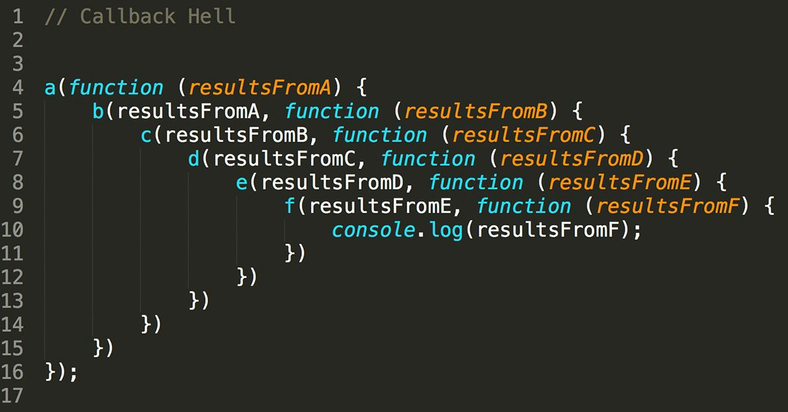

<link rel='stylesheet' href='../../../main.css'>

<div class="title">
    <center><h1 class="bigtitle">Promises</h1></center>
</div>

# Table of contents

- [Table of contents](#table-of-contents)
- [Synchronous & Asynchronous](#synchronous--asynchronous)
  - [Callback Function](#callback-function)
  - [Callback Hell](#callback-hell)
- [Promise](#promise)
  - [Promise States](#promise-states)
  - [Creating Promise](#creating-promise)
  - [Promise Object Methods](#promise-object-methods)
  - [Returning Values](#returning-values)
- [Promise Chain](#promise-chain)
- [Promise Class Methods](#promise-class-methods)
- [Async & Await](#async--await)

# [Synchronous & Asynchronous](https://developer.mozilla.org/en-US/docs/Web/API/XMLHttpRequest/Synchronous_and_Asynchronous_Requests)

**Synchronous** (đồng bộ) là các câu lệnh viết trước thì thực thi trước, viết sau thì thực thi sau. Nói cách khác, sẽ chỉ có một luồng thực thi các đoạn code từ trên xuống dưới.

**Asynchronous** (bất đồng bộ) là các câu lệnh được thực hiện không theo thứ tự code, các câu lệnh được chia đa luồng để thực thi.

Hai phương thức `setTimeout` và `setInteval` là các phương thức bất đồng bộ. Ngoài ra còn các phương thức khác cũng là async như `fetch`, đọc file hoặc request animation.

> Vấn đề nảy sinh là chúng ta không biết khi nào các phương thức này hoàn thành.

Lấy ví dụ phương thức `fetch` dùng để gọi API lấy dữ liệu, tùy tốc độ mạng và nhiều yếu tố mà phương thức này sẽ tốn lượng thời gian khác nhau.

## [Callback Function](https://developer.mozilla.org/en-US/docs/Glossary/Callback_function)

Callback chính là câu trả lời cho vấn đề trên. Xét đoạn code dưới đây:

```js
function httpGetAsync(theUrl, callback) {
  var xmlHttp = XMLHttpRequest();
  xmlHttp.onreadystatechange = function () {
    if (xmlHttp.readyState == 4 && xmlHttp.status == 200) callback(xmlHttp);
  };
  xmlHttp.open("GET", theUrl, true);
  xmlHttp.send(null);
}

httpGetAsync("https//picsum.photo/200/300", function (data) {
  console.log(data);
});
```

Đây là đoạn code mô phỏng việc gọi API picsum để lấy về hình ảnh. Khi có được dữ liệu thì ta sẽ log ra console. Tuy nhiên, việc log ra console phải chờ cho tác vụ lấy dữ liệu từ API hoàn thành. Do đó mà việc lấy API và việc log ra console là hai việc bất đồng bộ (nếu không dùng callback).

Khi dùng callback, chúng ta đảm bảo rằng `console.log(data)` chỉ được thực thi khi nào lấy được dữ liệu, mặc dù thời gian chờ đợi có thể biến động như đã nói ở trên.

Một cách kỹ thuật hơn, callback đảm bảo hàm sẽ không được thực thi trước khi tác vụ nào đó hoàn thành. Nhưng lại được thực thi ngay lập tức sau khi tác vụ đó hoàn thành.

## [Callback Hell](https://viblo.asia/p/callback-hell-trong-javascript-la-gi-va-cach-phong-trach-NbmvbaYKkYO)

> Đến lúc này, vấn đề tiếp theo nảy sinh là các Callback Hell, nghĩa là có quá nhiều callback lồng vào nhau.

Giả sử ta cần lấy liên tiếp ba hình ảnh từ API, điều này sẽ gây ra callback hell.

```js
httpGetAsync("https//picsum.photo/200/300", function (data) {
  console.log(data);
  httpGetAsync("https//picsum.photo/200/300", function (data) {
    console.log(data);
    httpGetAsync("https//picsum.photo/200/300", function (data) {
      console.log(data);
    });
  });
});
```

Hoặc một ví dụ đau đớn hơn:



Lý do dẫn đến Callback Hell là khi ta buộc phải viết các đoạn code mà có các tác vụ phụ thuộc lẫn nhau.

Tác vụ b trong hình trên phải chờ đến khi tác vụ a hoàn thành thì mới được thực thi và thực thi ngay sau đó. Tương tự phải chờ kết quả trả về của tác vụ b thì tác vụ c mới được thực thi (phụ thuộc lẫn nhau).

# [Promise](https://developer.mozilla.org/en-US/docs/Web/JavaScript/Reference/Global_Objects/Promise)

Để thoát khỏi địa ngục callback đó (về cách viết code), chúng ta sẽ sử dụng promise. Tuy nhiên, chỉ khi xảy ra Callback Hell thì mới nên dùng.

Định nghĩa một cách kỹ thuật hơn, promise sinh ra là để xử lý các thao tác bất đồng bộ. Bắt chúng phải "cam kết một lời hứa" nào đó, đảm bảo các hàm callback phải trả về giá trị hoặc ít nhất là thông báo lỗi nếu không thực thi được callback.

## Promise States

Một Promise sẽ ở một trong ba trạng thái:

- `pending`: trạng thái khởi tạo, chưa bị fulfilled hay rejected.
- `fulfilled`: thể hiện rằng operation đã được hoàn thành thành công.
- `rejected`: operation thực thi thất bại.

## [Creating Promise](https://developer.mozilla.org/en-US/docs/Web/JavaScript/Reference/Global_Objects/Promise/Promise)

Các bước khởi tạo:

1. Khởi tạo đối tượng dùng Promise constructor thuộc lớp đối tượng Promise.
2. Tạo **Executor**, executor là tham số của constructor.
3. Executor có hai tham số cũng đều là hàm callback:

- `resolve`: thực hiện khi Promise có trạng thái là fulfilled.
- `reject`: thực hiện khi Promise có trạng thái là rejected.

  Bắt buộc gọi một trong hai callback resolve và reject trong executor.

```js
const promise = new Promise(function (resolve, reject) {
  // Logic processing
  // => resolve(); // When succes
  // => reject(); // When failed
});
```

Executor sẽ được gọi trước cả khi đối tượng `promise` được tạo.

Đoạn code trên sẽ làm promise có trạng thái pending, trạng thái này nếu không chuyển sang hai trạng thái còn lại thì có thể gây ra rò rỉ bộ nhớ.

## [Promise Object Methods](https://developer.mozilla.org/en-US/docs/Web/JavaScript/Reference/Global_Objects/Promise#instance_methods)

Sau khi khởi tạo thành công, chúng ta sẽ nhận được đối tượng có tên `promise`. Đối tượng này sẽ gọi thực hiện các phương thức thông dụng sau:

```js
promise
  .then(function () {}) // when resolve
  .catch(function () {}) // when reject
  .finally(function () {}); // either resolve or reject
```

Cả ba phương thức đều nhận các hàm callback làm đối số.

Nếu như `resolve` được thực thi, tức là operation đã được thực hiện thành công. Thì "lời hứa" `promise` sẽ gọi phương thức `then()` và thực thi.

Nếu như `reject` được thực thi thì `promise` sẽ gọi phương thức `catch`. Nếu không gọi phương thức này sẽ xảy ra lỗi `Uncaught (in promise)`

Và nếu một trong hai `resolve` hoặc `reject` được thực thi thì phương thức `finally` sẽ được gọi.

## Returning Values

Hai hàm callback `resolve` và `reject` có thể trả về giá trị. Giá trị trả về sẽ truyền vào làm tham số của resolve hoặc reject.

```js
const promise = new Promise(function (resolve, reject) {
  if (true) resolve("Success");
  else reject("Error");
});

promise
  .then(function (success) {
    console.log(success);
    // => "Success"
  })
  .catch(function (error) {
    console.log(error);
  })
  .finally(function () {
    console.log("Done");
  });
```

Và giá trị đó cũng truyền vào làm tham số của hàm callback bên trong phương thức `then`, `catch` hoặc `finally`.

# [Promise Chain](https://developer.mozilla.org/en-US/docs/Web/JavaScript/Reference/Global_Objects/Promise#chained_promises)

Ở ba phương thức mà đối tượng promise trên gọi, chúng được thực hiện tuần tự và liền nhau. Vì vậy ta gọi chúng là **chain**. Tức là sau khi thực hiện `then` hoặc `catch` thì mới đến `finally`.

Vận dụng điều này, ta có thể gọi tiếp phương thức `then` sử dụng một hàm callback khác để giải quyết bài toán Callback Hell. Tức là bài toán viết code để thực thi các tác vụ liền nhau và phụ thuộc lẫn nhau.

```js
const promise = new Promise(function (resolve, reject) {
  if (true) resolve();
  else reject("Error");
});

promise
  .then(function () {
    return 1;
  })
  .then(function (data) {
    console.log(data);
    return data + 1;
  })
  .then(function (data) {
    console.log(data);
    return data + 1;
  })
  .then(function (data) {
    console.log(data);
  })
  .catch(function (error) {
    console.log(error);
  })
  .finally(function () {
    console.log("Done");
  });

// => 1
//    2
//    3
```

Dữ liệu trả về của callback trong phương thức `then` đầu tiên sẽ là đối số cho tham số `data` của hàm callback có trong phương thức `then` thứ hai. Cứ như vậy các hàm callback được nối liền nhau hình thành nên **Promise Chain**.

Nếu như giá trị trả về là một promise, thì lời gọi phương thức `then` thứ hai phải chờ cho promise đó thực thì rồi mới tới lượt mình:

```js
const promise = new Promise(function (resolve) {
  resolve();
});

promise
  .then(function () {
    return new Promise(function (resolve) {
      setTimeout(resolve, 1000);
    });
  })
  .then(function (data) {
    console.log(data);
    // => undefined, because resolve does not return anything.
  })
  .catch(function (err) {
    console.log(err);
  })
  .finally(function () {
    console.log("Done");
  });
```

Lý do thì đã nói ở trên, executor được thực hiện **trước khi object promise** được tạo. Do đó phải chờ timeout 1s, rồi resolve được gọi, đến lúc này promise mới được tạo ra.

Sau đó mới trả về được đối tượng promise. Và lời gọi phương thức `then` thứ hai này chính là gọi cho đối tượng promise mới được tạo ra.

```js
promise
  .then(function () {
    return new Promise(function (resolve) {
      setTimeout(function () {
        resolve("Hello");
      }, 1000);
    });
  })
  .then(function (data) {
    console.log(data);
    // => "Hello"
  })
  .catch(function (err) {
    console.log(err);
  })
  .finally(function () {
    console.log("Done");
  });
```

Xét trường hợp khác, giả sử trong các lời gọi phương thức `then`, promise bị rơi vào trạng thái rejected. Lúc này thì nó sẽ nhảy thẳng xuống `catch` và bỏ qua các lời gọi `then` liền kề.

# [Promise Class Methods](https://developer.mozilla.org/en-US/docs/Web/JavaScript/Reference/Global_Objects/Promise#static_methods)

Các phương thức static (gọi từ lớp đối tượng `Promise`) bao gồm:

`Promise.resolve`, `Promise.reject`, `Promise.all`

Giả sử chúng ta muốn sử dụng một promise mà luôn chắc rằng state của nó là fulfilled hoặc rejected. Ta có thể sử dụng hai phương thức đầu:

```js
const fulfilled = Promise.resolve(returnValue);
const rejected = Promise.reject(returnValue);
```

Xét trường hợp nếu chúng ta muốn thực hiện nhiều task, và các đó không phụ thuộc lẫn nhau theo thứ tự. Do đó ta cần chạy chúng song song, tuy nhiên vẫn cần sử dụng kết quả trả về để làm việc gì khác.

Lúc này phương thức `Promise.all` sẽ được sử dụng. Chẳng hạn ta có hai promise không phụ thuộc nhau dưới đây, và ta cần hợp nhất hai mảng trả về lại khi nhận được kết quả.

```js
const promise1 = new Promise(function (resolve) {
  setTimeout(function (resolve) {
    resolve([1]);
  }, 2000);
});

const promise2 = new Promise(function (resolve) {
  setTimeout(function (resolve) {
    resolve([2, 3]);
  }, 5000);
});
```

Hai promise này nếu chạy tuần tự sẽ tốn 7s. Do đó ta sẽ chia ra nhiều luồng công việc để chúng có thể làm việc song song và chỉ tốn 5s.

Sử dụng phương thức `Promise.all`, đối số truyền vào là mảng các promise không quan tâm thứ tự. Giá trị trả về là một promise, do đó có thể sử dụng phương thức `then`.

```js
Promise.all([promise1, promise2]).then(function (result) {
  console.log(result);
  // => [Array(1), Array(2)]
  let a = result[0];
  let b = result[1];

  console.log(a.concat(b));
  // => [1, 2, 3]
});
```

Chú ý rằng, các promise đối số đều phải chạy xong thì phương thức `then` mới được gọi thực thi. Và do có nhiều giá trị trả về, đối số mà result nhận được là mảng các giá trị trả về phụ thuộc vào thứ tự promise truyền vào.

Ngoài ra, nếu như có một trong số các promise reject, `Promise.all` sẽ gọi thực hiện phương thức `catch`. Cụ thể hơn, tất cả các promise khác có thành công hay không thì cũng rơi vào `catch`.

# [Async & Await](https://developer.mozilla.org/en-US/docs/Web/JavaScript/Reference/Statements/async_function)

Bản chất của Async và Await là promise, nhưng nó làm đoạn code khi đọc trông như đồng bộ dù là bất đồng bộ. Đồng thời, nó làm đoạn code trông tao nhã hơn và dễ hiểu hơn.

```js
async function square(n) {
  return n * n;
}

square(2);
// => Promise {<fulfilled>: 4}
//      [[Prototype]]: Promise
//      [[PromiseState]]: "fulfilled"
//      [[PromiseResult]]: 4
```

Từ khóa `async` đứng trước một function ngụ ý rằng function đó sẽ trả về một promise. Trong đoạn code trên, hàm sẽ trả về một promise thay vì trả về giá trị.

Để truy cập **giá trị trả về của promise**, ta sử dụng từ khóa `await`. Xét ví dụ lấy API dùng hàm `fetch`, hàm này trả về một promise:

```js
const url = "https//someAPI/";
const fetchData = async function () {
  try {
    const response = await fetch(url);
    const countries = await response.json();
    console.log(countries);
  } catch (err) {
    console.error(err);
  }
};
console.log("===== async and await");
fetchData();
```

Hai từ khóa `async` và `await` luôn đi cùng với nhau, một trong hai không thể sống nếu thiếu thằng khác. Đồng thời `await` phải nằm bên trong khối code của một hàm `async`.

Chúng ta sử dụng `try` và `catch` tương tự như cách mà `then` và `catch` hoạt động. Khi mà operation gây ra lỗi thì sẽ nhảy xuống khối lệnh của `catch`.
