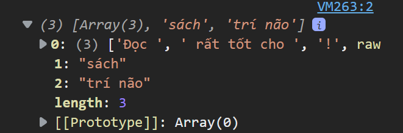

<link rel='stylesheet' href='../../main.css'>

<div class="title">
    <center><h1 class="bigtitle">Destructuring and Spreading</h1></center>
</div>

# Table of contents

- [Table of contents](#table-of-contents)
- [References](#references)
  - [Documents](#documents)
  - [Cheat Sheets](#cheat-sheets)
- [Destructuring](#destructuring)
  - [Destructuring Array](#destructuring-array)
  - [Destructuring Array during Iteration](#destructuring-array-during-iteration)
  - [Destructuring Object](#destructuring-object)
  - [Object Parameter with Destructuring](#object-parameter-with-destructuring)
  - [Destructuring Object during Iteration](#destructuring-object-during-iteration)
- [Spread and Rest Operators](#spread-and-rest-operators)
  - [Rest Elements of array](#rest-elements-of-array)
  - [Copy array](#copy-array)
  - [Copy object](#copy-object)
  - [Rest Operator with Arrow function](#rest-operator-with-arrow-function)
- [Tagged template Literals](#tagged-template-literals)

# References

## Documents

> [javascript.info - Destructuring](https://javascript.info/destructuring-assignment)

> [javascript.info - Spreading](https://javascript.info/rest-parameters-spread)

## Cheat Sheets

> [Mihai Serban](https://medium.com/@serbanmihai/javascript-es6-cheatsheet-destructuring-c64df173b30e)

# [Destructuring](https://developer.mozilla.org/en-US/docs/Web/JavaScript/Reference/Operators/Destructuring_assignment)

Destructuring là một cú pháp cho phép "phân rã" array hoặc object để gán cho các biến riêng biệt.

## [Destructuring Array](https://developer.mozilla.org/en-US/docs/Web/JavaScript/Reference/Operators/Destructuring_assignment#array_destructuring)

Chẳng hạn ta gán bộ ba biến bằng các phần tử có trong mảng:

```js
const numbers = [1, 2, 3];
let [numOne, numTwo, numThree, numFour] = numbers;

console.log(numOne, numTwo, numThree, numFour);
// => 1 2 3 undefined
```

Phần tử thứ tư trong mảng không có, nên `numFour = undefined`.

Có thể dùng giá trị mặc định nếu phần tử trong mảng undefined:

```js
const names = [undefined, "Brook", "David"];
let [
  firstPerson = "Asabeneh",
  secondPerson,
  thirdPerson,
  fourthPerson = "John",
] = names;

console.log(firstPerson, secondPerson, thirdPerson, fourthPerson);
// => Asabeneh Brook David John
```

Trích xuất từ mảng hai chiều:

```js
const fullStack = [
  ["HTML", "CSS", "JS", "React"],
  ["Node", "Express", "MongoDB"],
];
const [frontEnd, backEnd] = fullStack;

console.log(frontEnd);
// => ['HTML', 'CSS', 'JS', 'React'],
console.log(backEnd);
// => ['Node', 'Express', 'MongoDB']
```

Bỏ qua một phần tử bất kỳ sử dụng dấu phẩy (`,`):

```js
const scientificConstants = [2.72, 3.14, 9.81, 37, 100];
let [e, pi, , bodyTemp, boilingTemp] = scientificConstants;

console.log(e, pi, bodyTemp, boilingTemp);
// => 2.72, 3.14, 37, 100
```

**Lưu ý**: chúng ta không thể gán hết tất cả các phần tử trong mảng cho biến. Chỉ có thể gán vài phần tử đầu, các phần tử còn lại có thể dùng toán tử lan truyền (spreading) (`...`)

```js
const nums = [1, 2, 3, 4, 5, 6, 7, 8, 9, 10];
let [num1, num2, num3, ...others] = nums;

console.log(num1, num2, num3);
// => 1, 2, 3
console.log(others);
// => [4, 5, 6, 7, 8, 9, 10]
```

## Destructuring Array during Iteration

Có thể sử dụng Destructuring trong vòng lặp:

```js
const countries = [
  ["Finland", "Helsinki"],
  ["Sweden", "Stockholm"],
  ["Norway", "Oslo"],
];

for (const [country, city] of countries) {
  console.log(country, city);
}
```

## [Destructuring Object](https://developer.mozilla.org/en-US/docs/Web/JavaScript/Reference/Operators/Destructuring_assignment#object_destructuring)

Khi dùng Destructuring cho đối tượng, các biến cần được gán nên **có tên đúng chính xác** với key hoặc thuộc tính có trong đối tượng:

```js
const rectangle = {
  width: 20,
  height: 10,
  area: 200,
};
let { width, height, area, perimeter } = rectangle;

console.log(width, height, area, perimeter);

// => 20, 10, 200, undefined
```

Nếu key không tồn tại trong đối tượng thì biến được gán sẽ có giá trị `undefined`.

Có thể **đổi tên** trong lúc dùng Destructuring:

```js
const rectangle = {
  width: 20,
  height: 10,
  area: 200,
};
let { width: w, height: h, area: a, perimeter: p } = rectangle;

console.log(w, h, a, p);
```

Còn có thể gán giá trị mặc định trong lúc dùng Destructuring:

```js
const rectangle = {
  width: 20,
  height: 10,
  area: 200,
};
let { width, height, area, perimeter = 60 } = rectangle;

console.log(width, height, area, perimeter);
// => 20 10 200 60
```

Chỉ khi đối tượng không có giá trị thì giá trị mặc định mới được dùng.

Nếu trong object có một object khác, ta sử dụng như sau:

```js
const person = {
  name: "Quân",
  age: 20,
  skills: {
    fe: "ReactJS",
    be: "NodeJS",
  },
};

var {
  name,
  age,
  skills: { fe, be },
} = person;
console.log(fe); // => "ReactJS"
console.log(be); // => "NodeJS"
```

## Object Parameter with Destructuring

Do tính chất có thể gán được của các value có trong object, mà ta có thể sử dụng các object như là tham số.

Giá trị của đối số truyền vào sẽ dùng Destructuring và gán cho tham số.

Không dùng Destructuring:

```js
const rect = {
  width: 20,
  height: 10,
};
const calculatePerimeter = function (rectangle) {
  return 2 * (rectangle.width + rectangle.height);
};

console.log(calculatePerimeter(rect)); // => 60
```

Dùng Destructuring:

```js
const calculatePerimeter = function ({ width, height }) {
  return 2 * (width + height);
};

console.log(calculatePerimeter(rect)); // => 60
```

## Destructuring Object during Iteration

Cũng có thể trích xuất trong vòng lặp:

```js
const todoList = [
  {
    task: "Prepare JS Test",
    time: "4/1/2020 8:30",
    completed: true,
  },
  {
    task: "Give JS Test",
    time: "4/1/2020 10:00",
    completed: false,
  },
  {
    task: "Assess Test Result",
    time: "4/1/2020 1:00",
    completed: false,
  },
];

for (const { task, time, completed } of todoList) {
  console.log(task, time, completed);
}

// => Prepare JS Test 4/1/2020 8:30 true
//    Give JS Test 4/1/2020 10:00 false
//    Assess Test Result 4/1/2020 1:00 false
```

# [Spread and Rest Operators](https://anonystick.com/blog-developer/giai-thich-ve-destructuring-rest-parameters-va-spread-syntax-trong-javascript-2020051980035339)

Toán tử spread và rest đều giống nhau về cú pháp (có `...` ở đầu), tuy nhiên chức năng của chúng lại khác nhau.

**Toán tử spread** dùng để phân rã các phần tử của array hoặc thuộc tính của object thành một danh sách các giá trị.

Thường dùng toán tử spread trong việc destructuring một array hoặc object.

**Toán tử rest** dùng để gom nhóm danh sách các giá trị (phân biệt nhau bởi dấu phẩy) thành một mảng.

Thường dùng toán tử rest làm tham số của hàm (nhằm gom nhóm nhiều đối số lại thành một mảng duy nhất).

## [Rest Elements of array](https://developer.mozilla.org/en-US/docs/Web/JavaScript/Reference/Functions/rest_parameters)

Ta dùng spread operator để lấy các phần tử còn lại của mảng dưới dạng một mảng khác.

```js
const nums = [1, 2, 3, 4, 5, 6, 7, 8, 9, 10];
let [num1, num2, num3, ...others] = nums;

console.log(num1, num2, num3);
console.log(others);

// => 1, 2, 3
// => 4, 5, 6, 7, 8, 9, 10
```

## Copy array

Hoặc có thể dùng để sao chép một mảng.

```js
const evens = [0, 2, 4, 6, 8, 10];
const evenNumbers = [...evens];

const odds = [1, 3, 5, 7, 9];
const oddNumbers = [...odds];

const wholeNumbers = [...evens, ...odds];

console.log(evenNumbers);
console.log(oddNumbers);
console.log(wholeNumbers);

// => [0, 2, 4, 6, 8, 10]
//    [1, 3, 5, 7, 9]
//    [0, 2, 4, 6, 8, 10, 1, 3, 5, 7, 9]
```

> Đoạn code trên xuất hiện trong phần tìm union của hai set.

## Copy object

Tương tự, cũng có thể sao chép object bằng spread operator:

```js
const user = {
  name: "Asabeneh",
  title: "Programmer",
  country: "Finland",
  city: "Helsinki",
};

const copiedUser = {...user, title = "Student"};
console.log(copiedUser);
// => {name: "Asabeneh", title: "Programmer", country: "Finland", city: "Helsinki"}
```

Trong lúc copy, cũng có thể chỉnh sửa dữ liệu (chuyển title thành "Student").

Sao chép hai objects vào một object:

```js
const person = {
  name: "Quân",
  age: 20,
  school: "HCMUS",
};
const skills = {
  fe: "ReactJS",
  be: "NodeJS",
};
const dev = {
  ...person,
  ...skills,
};
```

Một trick để xóa đi một key trong object là sử dụng spread operator. Chẳng hạn ta cần xóa key status:

```js
const person = {
  name: "Quân",
  age: 20,
  school: "HCMUS",
  year: 2,
  status: "single",
};
var { status, ...newObject } = person;
console.log(newObject);
// => {name: 'Quân', age: 20, school: 'HCMUS', year: 2}
```

## Rest Operator with Arrow function

Ở bài functions đã đề cập đến việc hàm có số lượng tham số không biết trước. Ở đó ta sử dụng toán tử `...` kèm thên một mảng tham số bất kỳ:

```js
const sumAllNums = function (...args) {
  console.log(args);
};

sumAllNums(1, 2, 3, 4, 5);
// => 1, 2, 3, 4, 5
```

Việc dùng toán tử `...` làm tham số như vậy gọi là rest operator. Toán tử này sẽ gom nhóm danh sách đối số truyền vào (1,2,3,4,5) thành một mảng (args).

# [Tagged template Literals](https://www.freecodecamp.org/news/a-quick-introduction-to-tagged-template-literals-2a07fd54bc1d/)

Xét đoạn code sau:

```js
function hightlight(...rest) {
  console.log(rest);
}
var book = "sách";
var brain = "trí não";
hightlight`Đọc ${book} rất tốt cho ${brain}!`;
```

Đoạn code trên gọi hàm hightlight nhưng không dùng toán tử call `()` mà lại dùng dấu backtick ` `` ` để chứa một template string làm đối số.

Rest operator dùng để gom nhóm các đối số nhận vào thành một mảng. Đối số nhận vào lúc này có dạng:



Nói cách khác, các ký tự/chuỗi không phải là biến trong template string thì sẽ nằm trong một mảng, là phần tử đầu tiên trong mảng các đối số. Các biến template string sẽ là các phần tử còn lại.

Đoạn code trên tương đương:

```js
function hightlight([...strings], ...rest) {
  console.log(rest);
}
```

Với `...strings` là sử dụng spread operator và `...rest` là sử dụng rest operator.
