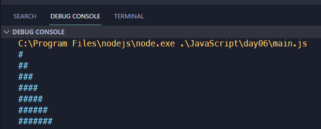

<link rel='stylesheet' href='../../main.css'>

<div class="title">
    <center><h1 class="bigtitle">Loops</h1></center>
</div>

# Table of contents

- [Table of contents](#table-of-contents)
- [Loops](#loops)
- [Problem](#problem)

# [Loops](https://developer.mozilla.org/en-US/docs/Web/JavaScript/Guide/Loops_and_iteration)

Vòng lặp `for`, `while` và `do while` trong JS tương tự C/C++.

Ngoài ra còn vòng lặp `for in` và `for of`.

`for in` lặp qua các **key** của đối tượng có thể lặp (object, array).\
`for of` lặp qua các **value** của đối tượng có thể lặp.

```js
let arr = ["el1", "el2", "el3"];

// elKey are the property keys
for (let key in arr) {
  console.log(key);
}
// => 0, 1, 2

// elValue are the property values
for (let value of arr) {
  console.log(value);
}
// => el1, el2, el3
```

# Problem

Có đoạn code cho bài toán xuất tam giác ký tự như sau:

```js
for (let i = 1; i <= 7; i++) {
  for (let j = 1; j <= i; j++) {
    console.log("#");
  }
}
```

Kết quả:

Nhận thấy rằng các dấu `#` liên tục được gom lại thành một dấu duy nhất xuất hiện 28 lần (số 28 phía trước).

Vì vậy ta dùng biến chuỗi để tạo tam giác:

```js
let str = "";
for (let i = 1; i <= 7; i++) {
  for (let j = 1; j <= i; j++) {
    str += "#";
  }
  str += "\n";
}

console.log(str);
```

Kết quả:

