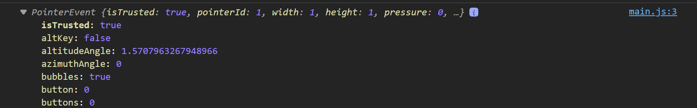
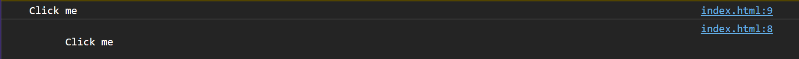

<link rel='stylesheet' href='../../main.css'>

<div class="title">
    <center><h1 class="bigtitle">DOM Events</h1></center>
</div>

# Table of contents

- [Table of contents](#table-of-contents)
- [References](#references)
  - [Cheat Sheets](#cheat-sheets)
- [🎮DOM Events](#dom-events)
  - [Attribute Events](#attribute-events)
  - [Assigning Events using Element Node](#assigning-events-using-element-node)
  - [onchange](#onchange)
  - [onkeyup/onkeydown/onkeypress](#onkeyuponkeydownonkeypress)
- [🎸Event Methods](#event-methods)
  - [preventDefault](#preventdefault)
  - [stopPropagation](#stoppropagation)
- [🎧Event Listeners](#event-listeners)

# References

## Cheat Sheets

> [Codecademy](https://www.codecademy.com/learn/build-interactive-websites/modules/dom-javascript-events/cheatsheet)

> [Tyler Caprioli](https://dev.to/tcaprioli/js-cheatsheet-dom-manipulation-event-listeners-3nm2)

# [🎮DOM Events](https://www.w3schools.com/jsref/dom_obj_event.asp)

Có hai cách để thao tác với sự kiện, cách đầu tiên là thông qua attribute của element. Tên của sự kiện thêm chữ "on" phía trước là trở thành thuộc tính, ví dụ `onclick` là thuộc tính của sự kiện click chuột.

## Attribute Events

Giả sử có đoạn code dưới đây:

```html
<!DOCTYPE html>
<html lang="en">
  <head>
    <title>Document</title>
  </head>

  <body>
    <div id="box" class="box" onclick="console.log(`Hello Wibu`)">Click me</div>
  </body>

  <script src="../main.js"></script>
</html>
```

Khi click chuột vào chữ "Click me" thì console sẽ xuất ra dòng chữ "Hello Wibu".

Thuộc tính sự kiện (`onclick`) có thể dùng từ khóa `this`. Từ khóa này chính là bản thân element, ta có thể gọi lấy thuộc tính hoặc phương thức vì nó là một đối tượng.

## Assigning Events using Element Node

Cách thứ hai sử dụng JS, chúng ta lấy ra đối tượng cần bắt sự kiện và gọi thuộc tính của sự kiện đó. Chẳng hạn ta gọi ra `onclick` và gán bằng một hàm.

```js
const divElement = document.querySelector("#box");
divElement.onclick = function (event) {
  console.log(event.target);
};
```

Kết quả


Hàm được gán chính là một callback, khi sự kiện click chuột được thực thi thì JS sẽ gọi lại hàm này và truyền vào đối số `event`. Đối số này là một đối tượng của sự kiện đã thực thi.



Đối tượng `event` này có một thuộc tính là `event.target`, chính là bản thân element. Thuộc tính này thay thế cho từ khóa `this` ở cách trên.

Muốn hủy bỏ lắng nghe thì chỉ cần gán thuộc tính `onclick` bằng một hàm rỗng không làm gì cả.

## onchange

Thuộc tính `onchange` bắt sự kiện khi có sự thay đổi về nội dung của thẻ `<input>` hoặc `<select>`. Để lấy giá trị nhập vào thông qua JS thì gọi thuộc tính `target.value` của đối tượng `event` truyền vào trong hàm callback ở trên.

Nếu muốn lấy từng ký tự thì dùng `oninput` thay vì `onchange`.

## onkeyup/onkeydown/onkeypress

Thuộc tính `onkeyup` bắt các sự kiện khi thả phím, `onkeydown` bắt sự kiện khi nhấn phím. Ngoài ra còn có `onkeypress` để bắt sự kiện user nhấn giữ.

Để lấy giá trị của phím được nhấn thì dùng thuộc tính `key` hoặc `code` thuộc đối tượng `event`.

# [🎸Event Methods](https://developer.mozilla.org/en-US/docs/Web/API/Event#methods)

## [preventDefault](https://developer.mozilla.org/en-US/docs/Web/API/Event/preventDefault)

Phương thức `preventDefault` thuộc về đối tượng `event` dùng để ngăn chặn sự kiện thực hiện một hành vi mặc định. Chẳng hặn khi có sự kiện click vào thẻ `<anchor>` (chứa link), hành vi mặc định chuyển trang của thẻ này sẽ bị ngăn chặn.

## [stopPropagation](https://developer.mozilla.org/en-US/docs/Web/API/Event/stopPropagation)

Xét đoạn code:

```html
<!DOCTYPE html>
<html lang="en">
  <head>
    <title>Document</title>
  </head>

  <body>
    <div id="box" class="box" onclick="console.log(this.textContent)">
      <span onclick="console.log(this.textContent)"> Click me </span>
    </div>
  </body>

  <script src="../main.js"></script>
</html>
```

Dòng chữ hiển thị trên trang web là nội dung của thẻ `<span>`, do đó khi ta nhấn vào dòng chữ đó thì nó sẽ xét xem thẻ `<span>` có thuộc tính sự kiện hay không. Nếu không có thì nó sẽ "nổi bọt" lên element cha của nó. Element cha của thẻ `<span>` là `<div>`, sự kiện được bắt và console sẽ in chuỗi "Click me".

Nếu như bản thân thẻ `<span>` có thuộc tính sự kiện, thì sẽ có hai lần in ra chuỗi "Click me".

```html
<!DOCTYPE html>
<html lang="en">
  <head>
    <title>Document</title>
  </head>

  <body>
    <div id="box" class="box" onclick="console.log(this.textContent)">
      <span onclick="console.log(this.textContent)"> Click me </span>
    </div>
  </body>

  <script src="../main.js"></script>
</html>
```

Kết quả:



Phương thức `preventDefault` thuộc về đối tượng `event` dùng để ngăn chặn sự kiện "nổi bọt" ra các element bên ngoài.

# 🎧Event Listeners

Event Listeners cung cấp một phương thức để đơn giản hóa việc xử lý sự kiện, đặc biệt là các sự kiện có nhiều tác vụ.

Chúng ta cần sử dụng phương thức [`addEventListener`](https://developer.mozilla.org/en-US/docs/Web/API/EventTarget/addEventListener) thuộc class `Element` (thuộc một element node). Phương thức này có cú pháp:

```js
element.addEventListener("event", function () {
  // Task goes here
});
```

Đối số đầu tiên là tên sự kiện không có chữ "on", đối số thứ hai là hàm callback được gọi khi sự kiện xảy ra. Với cách này, ta có thể lắng nghe sự kiện nhiều lần.

Để hủy bỏ lắng nghe thì ta cần sử dụng phương thức [`removeEventListener`](https://developer.mozilla.org/en-US/docs/Web/API/EventTarget/removeEventListener) theo một cách tương tự như tạo event listener. Tuy nhiên, hàm callback nên được tách ra để có thể truyền vào phương thức này:

```html
<!DOCTYPE html>
<html lang="en">
  <head>
    <title>Document</title>
  </head>

  <body>
    <div>
      <span> Click me </span>
    </div>
  </body>

  <script src="../main.js"></script>
</html>
```

```js
const spanElement = document.querySelector("span");

function task1() {
  console.log("This is task 1");
}

spanElement.addEventListener("click", task1);
spanElement.removeEventListener("click", task1);
```

> Khi chỉ muốn lắng nghe sự kiện và không muốn hủy lắng nghe thì sử dụng DOM Event. Còn nếu muốn hủy lắng nghe trong trường hợp cụ thể thì sử dụng Event Listeners. Hoặc nếu như có quá nhiều tác vụ cần làm khi sự kiện xảy ra thì cũng nên dùng Event Listeners.
