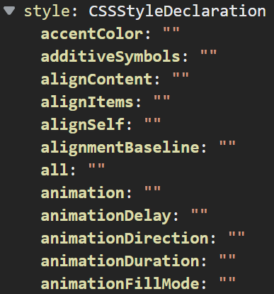

<link rel='stylesheet' href='../../main.css'>

    
<h1 class="bigtitle">DOM Properties</h1>

# Table of contents

- [Table of contents](#table-of-contents)
- [🧩DOM Node Properties](#dom-node-properties)
- [💄DOM CSS](#dom-css)
- [🃏classList Property](#classlist-property)

# 🧩DOM Node Properties

Ba loại node/đối tượng element, attribute và text đều có thuộc tính `nodeType`. Giá trị của `nodeType` đối với element node là 1, attribute note là 2 và text note là 3.

Có thể tận dụng thuộc tính này để kiểm tra một node có phải element, attribute và text hay không.

# 💄DOM CSS

Trong số các thuộc tính của element node thì có thuộc tính `style`. Thuộc tính này cũng là một object chứa rất nhiều thuộc tính khác thường dùng trong CSS.

Chú ý rằng thuộc tính `style` chỉ tác động đến CSS inline, không dùng để set hay get CSS external.

Tuy nhiên, tên các thuộc tính của đối tượng `style` này hơi khác so với các thuộc tính CSS thông thường vì nó tuân theo `camelCase` và không có dấu gạch ngang.

# [🃏classList Property](https://developer.mozilla.org/en-US/docs/Web/API/Element/classList)

Lớp đối tượng `Element` có thuộc tính `classList` giúp chúng ta quản lý được các class của element. Thuộc tính này là một đối tượng, có các phương thức thông dụng là: `add`, `contains`, `remove`, `toggle`.

1. Phương thức `add` dùng để thêm một class vào element thông qua đối tượng `classList`. Cú pháp là `add("className1", "className2", ...)`.

2. Phương thức `contains` dùng để kiểm tra một className có tồn tại trong element hay không. Cú pháp là `contains("className1", "className2", ...)`. Giá trị trả về là boolean.

3. Tương tự, phương thức `remove` nhận đối số là các className dùng để xóa các class ra khỏi element.

4. Phương thức `toggle` sẽ thêm class vào element nếu class đó chưa tồn tại trong element. Ngược lại, nếu đã tồn tại rồi thì nó sẽ xóa. Phương thức này cũng nhận đối số là các className. Một ứng dụng dễ thấy là toggle hiển thị và đóng menu.
