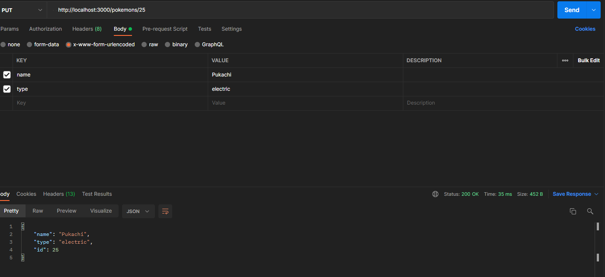

<link rel='stylesheet' href='../../main.css'>

<div class="title">
    <center><h1 class="bigtitle">Fetching API</h1></center>
</div>

- [Fetch API](#fetch-api)
- [JSON Server](#json-server)
- [CRUD & Postman](#crud--postman)

# Fetch API

Phương thức `fetch` có đối số là một URL của API. Phương thức này trả về một đối tượng thuộc class `Response` giống `Promise`.

```js
fetch(
  "https://api.apify.com/v2/key-value-stores/EaCBL1JNntjR3EakU/records/LATEST?disableRedirect=true"
)
  .then(function (response) {
    return response.json();
  })
  .then(function (data) {
    console.log(data);
  });
```

Sau khi có đối tượng trả về thì dùng phương thức `then` để trích xuất ra dữ liệu JSON thông qua phương thức `json()` gọi từ đối tượng `response`.

Phương thức `json()` cũng trả về một promise, và vì thế ta gọi phương thức `then` thứ hai để lấy giá trị trả về của promise này (là JS object(s)).

# JSON Server

JSON server là một thư viện để tạo ra một cái fake API (Mock API).

1. Trước tiên cần tạo file json (chẳng hạn db.json), lưu ý là các object phải có key `"id"` mang giá trị số nguyên.
2. Sau đó dùng lệnh `json-server --watch db.json` để tạo ra fake API.

# CRUD & Postman

Các hành động trên website liên quan đến dữ liệu đều thao tác thông qua API. Có bốn thao tác quan trọng, gọi là CRUD:

1. Create: tạo mới - dùng phương thức POST của HTTP.
2. Read: lấy dữ liệu - dùng phương thức GET.
3. Update: chỉnh sửa - dùng PUT/PATCH.
4. Delete: xóa - dùng DELETE.

Postman dùng để sử dụng bốn thao tác trên, thay thế cho trình duyệt chỉ dùng được GET. Giao diện của Postman có một thanh URL và một drop list để chọn các phương thức.


Đối với phương thức POST thì chọn phần **Body** rồi chọn **x-www-form-urlencoded** và thêm các cặp key - value cần thêm.


Sau khi thêm thành công thì Postman sẽ trả về đối tượng vừa thêm, đồng thời data base cũng được cập nhật.

Để xóa đối tượng thì sử dụng phương thức DELETE, URL lúc này thêm một dấu `/`, liền sau đó là `"id"` của đối tượng cần xóa.


Cuối cùng, để sửa dữ liệu của đối tượng thì chọn phương thức PUT/PATCH. URL cũng cần phải xác định `"id"` nhằm cho biết cần sửa đối tượng nào. Sau đó điền các thông tin mới và gọi API.



Sự khác biệt giữa PUT và PATCH:

- PUT ghi đè lên toàn bộ thuộc tính của object. Nói cách khác, nó xóa object cũ và thêm object mới cùng id.
- PATCH chỉ cập nhật một hoặc vài thuộc tính của object và không ghi đè.

Hai phương thức này đều có thể thêm thuộc tính nếu object chưa có, nếu có rồi thì ghi đè hoặc cập nhật.
