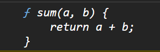
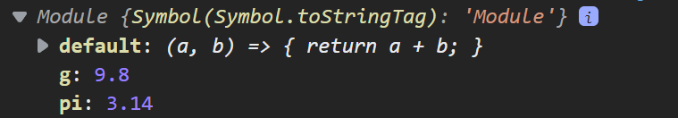
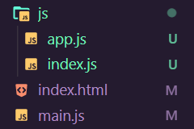
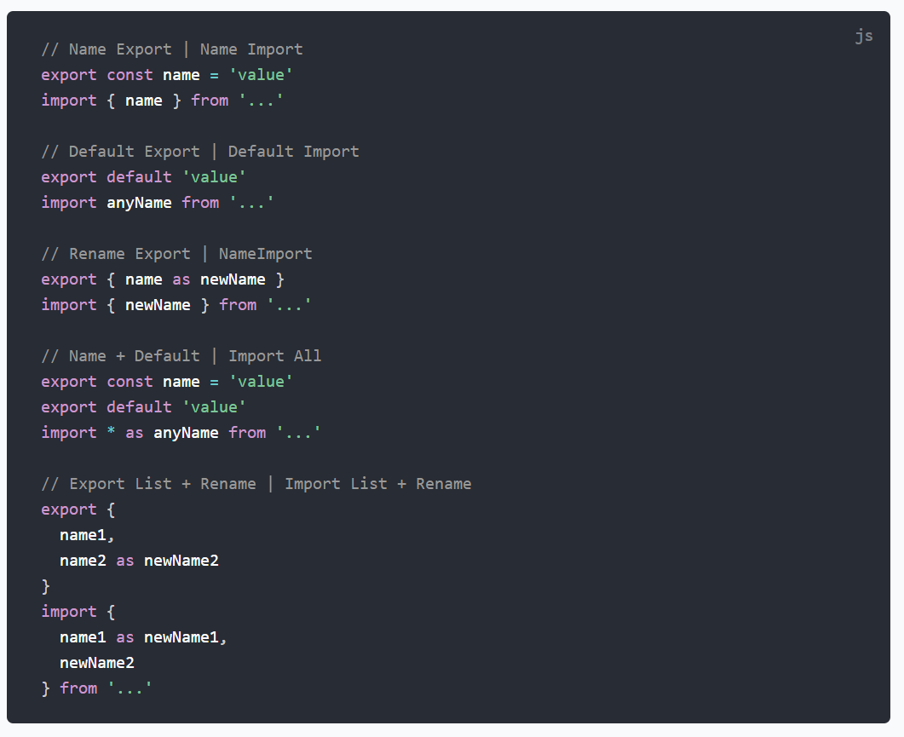

<link rel='stylesheet' href='../../main.css'>

<div class="title">
    <center><h1 class="bigtitle">Modules</h1></center>
</div>

# Table of contents

- [Table of contents](#table-of-contents)
- [References](#references)
  - [Documents](#documents)
  - [Cheat sheets](#cheat-sheets)
- [Modules](#modules)
  - [Import with Destructuring](#import-with-destructuring)
  - [Export from other Module](#export-from-other-module)
- [Module Cheat Sheet](#module-cheat-sheet)

# References

## Documents

> [Mozilla](https://developer.mozilla.org/en-US/docs/Web/JavaScript/Guide/Modules)

## Cheat sheets

> [Dev.to](https://dev.to/samanthaming/javascript-module-cheatsheet-5b4o)

> [30secondsofcode](https://www.30secondsofcode.org/articles/s/javascript-module-cheatsheet)

# Modules

Module là một file JS mà có thể export code. Module export code nhằm giúp cho các file JS khác có thể sử dụng đoạn code đó.

Ví dụ ta có file **app.js** có hàm tổng hai số:

```js
const sum = (a, b) => a + b;
```

Ta có một file khác có tên là **main.js**, và chúng ta muốn sử dụng hàm `sum` có ở bên file **app.js**. Để có thể sử dụng, ta cần:

- Module hóa file **main.js** bằng cách thêm attribute `type = "module"` vào dòng `<script src="main.js"></script>`.
- Export hàm `sum` ở file **app.js**.
- Import hàm `sum` ở file **main.js**.

Giả sử **app.js** và **main.js** cùng cấp trong cây thư mục:

```js
// app.js
const sum = (a, b) => a + b;
export default sum;
// main.js
import sum from "./app.js";
```

Có thể đổi tên hàm `sum` bằng từ khóa `as`:

```js
// app.js
const sum = (a,b) => a + b;
export default sum;
// main.js
import sum as sumOfNumbers from "./app.js";
```

Khi log import này ra console, ta sẽ được đoạn code của hàm `sum`:



> Lưu ý là một module (một file JS) chỉ có duy nhất một default export. Dù vậy, một export có thể bao gồm nhiều biến hoặc hàm, được đóng gói trong dấu ngoặc kép như một object.

## Import with Destructuring

Giả sử ta export nhiều biến từ file **app.js**:

```js
export const pi = 3.14;
export const g = 9.8;
```

Khi import vào file **main.js**, có thể sử dụng destructuring:

```js
import { pi, g } from "./app.js";
```

Để có thể import tất cả trong một object, ta sử dụng toán tử `*`:

```js
import * as math from "./app.js";
```

Bằng cách này, ta có thể lấy tất cả các export cho vào `math`. Biến `math` này là một object thuộc lớp đối tượng `Module`.



## Export from other Module

Ta đã export hàm `sum` từ file **app.js**. Giờ ta có thêm một file khác là **index.js** nằm cùng cấp với file **app.js** trong một thư mục:



Module **index.js** có thể export hàm sum:

```js
export { default } from "./app.js";
```

Đoạn code tương đương:

```js
import sum from "./app.js";
export default sum;
```

Module **main.js** import vào default của **app.js** thông qua **index.js** làm trung gian:

```js
import sum from "./js/index.js";
```

Nếu muốn **index.js** không export default, ta có thể dùng từ khóa `as` kèm theo tên mới:

```js
export { default as sum2 } from "./app.js";
```

Code ở **main.js** trở thành:

```js
import { sum2 } from "./js/index.js";
```

# Module Cheat Sheet


