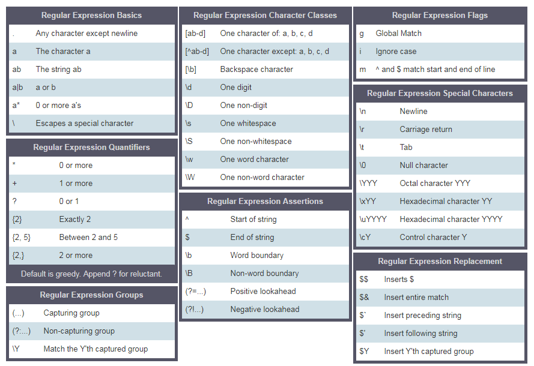

<link rel='stylesheet' href='../../main.css'>

<div class="title">
    <center><h1 class="bigtitle">Regular Expressions</h1></center>
</div>

- [Regular Expressions](#regular-expressions)
  - [RegExp parameters](#regexp-parameters)
    - [Pattern](#pattern)
    - [Flag](#flag)
  - [Creating RegExp using Constructor](#creating-regexp-using-constructor)
  - [Creating RegExp without using Constructor](#creating-regexp-without-using-constructor)
- [RegExp Methods](#regexp-methods)
  - [test](#test)
  - [match](#match)
  - [search](#search)
  - [replace](#replace)
- [RegExp Meta Characters](#regexp-meta-characters)
  - [Square Bracket](#square-bracket)
  - [Escape Characters (\)](#escape-characters-)
  - [Quantifiers Characters](#quantifiers-characters)
    - [One or more times (+)](#one-or-more-times-)
    - [Zero or more times (\*)](#zero-or-more-times-)
    - [Zero or one times (?)](#zero-or-one-times-)
  - [Period (.)](#period-)
  - [Cart](#cart)
    - [Start with](#start-with)
    - [Negation](#negation)
  - [Summarize](#summarize)

# Regular Expressions

**Regular Expressions** (biểu thức chính quy) là một ngôn ngữ lập trình nhỏ để so khớp các khuôn mẫu (pattern) với dữ liệu.

RegExp thường được khởi tạo trong JS bằng Regular Expressions Constructor hoặc thông qua hai dấu `/` kèm một cái cờ (flag) nào đó. Các flag có thể là `g, i, m, s, u, y`.

## RegExp parameters

Một biểu thức thức chính quy nhận vào hai tham số. Hai tham số đó là pattern cần tìm kiếm và optional flag.

### Pattern

Một pattern có thể là ký tự hay bất kỳ dạng pattern nào có một vài sự tương đồng mà ta cần tìm kiếm.

### Flag

Flag là một tham số optional để quy định cách tìm kiếm dữ liệu, có một vài flag thông dụng:

- g: là một global flag, quy định việc tìm kiếm cho cả đoạn ký tự.
- i: case sensitive flag, nó tìm kiếm cho cả in hoa và in thường.
- m: multiline.

## Creating RegExp using Constructor

Có thể tạo ra các biểu thức chính quy bằng contructor `RegExp`:

```js
let pattern = "love";
let flag = "gi";
let regEx = new RegExp(pattern, flag);
```

Hoặc ngắn gọn hơn:

```js
let regEx = new RegExp("love", "gi");
```

## Creating RegExp without using Constructor

Hoặc sử dụng hai dấu `/` chứa pattern bên trong và flag ở bên ngoài:

```js
let regEx = /love/gi;
```

Đoạn code này tương đương với

```js
let regEx = new RegExp("love", "gi");
```

# RegExp Methods

## test

**Chức năng**: kiểm tra xem có chuỗi con nào giống với pattern hay không. Ta gọi chuỗi con này là **match**.

**Cú pháp**:`pattern.test(string)`

**Trả về**: `true` hoặc `false`.

**Ví dụ**:

```js
const str = "I love JavaScript";
const pattern = /love/;
const result = pattern.test(str);
console.log(result); // => true
```

## match

**Chức năng**: tìm kiếm tất cả các matches.

**Cú pháp**: `str.match(pattern)`

**Trả về**: nếu không sử dụng global flag `g`, `match` trả về mảng gồm: pattern, index, input và group. Null nếu như không có match.

**Ví dụ**:

```js
const str = "I love JavaScript";
const pattern = /love/;
const result = str.match(pattern);
console.log(result);
// => ["love", index: 2, input: "I love JavaScript", groups: undefined]
```

```js
const str = "I love JavaScript";
const pattern = /love/g;
const result = str.match(pattern);
console.log(result);
// => ["love"]
```

## search

**Chức năng**: tìm kiếm vị trí của match đầu tiên trong chuỗi.

**Cú pháp**: `str.search(pattern)`

**Trả về**: index của match đầu tiên có trong chuỗi hoặc `-1` nếu không tìm thấy.

**Ví dụ**:

```js
const str = "I love JavaScript";
const pattern = /love/g;
const result = str.search(pattern);
console.log(result);
```

## replace

**Chức năng**: tìm kiếm match trong chuỗi và thay thế bằng chuỗi mới.

**Cú pháp**: `str.replace(pattern, newString)`

**Ví dụ**:

```js
const txt =
  "%I a%m te%%a%%che%r% a%n%d %% I l%o%ve te%ach%ing.\
T%he%re i%s n%o%th%ing as m%ore r%ewarding a%s e%duc%at%i%ng a%n%d e%m%p%ow%er%ing \
p%e%o%ple.\
I fo%und te%a%ching m%ore i%n%t%er%%es%ting t%h%an any other %jobs.\
D%o%es thi%s m%ot%iv%a%te %y%o%u to b%e a t%e%a%cher.";

matches = txt.replace(/%/g, "");
console.log(matches);
// => "I am teacher and I love teaching.There is nothing as more rewarding as educating and empowering people.I found teaching more interesting than any other jobs.Does this motivate you to be a teacher."
```

# RegExp Meta Characters

Pattern có thể có nhiều cách viết chứ không đơn thuần là một chuỗi ký tự. Nó có thể bao gồm nhiều ký tự đặc biệt hỗ trợ rất nhiều cho việc tìm kiếm và so khớp.

## Square Bracket

`[abc]`: so khớp với chữ cái a hoặc b hoặc c.\
`[ab-d]`: một chữ cái từ a đến d.\
`[a-z]`: một chữ cái từ a đến z.\
`[A-Z]`: một chữ cái từ A đến Z\
`[0-9]`: một số từ 0 đến 9.

**Ví dụ**: sử dụng `[]` và ký tự `|`. Ký tự `|` tương tự như toán tử `or`, tức là sẽ so khớp `[Aa]pple` hoặc `[Bb]anana`.

```js
const pattern = /[Aa]pple | [Bb]anana/g; // this square bracket mean either A or a
const txt =
  "Apple and banana are fruits. An old cliche says an apple a day a doctor way has been replaced by a banana a day keeps the doctor far far away. ";
const matches = txt.match(pattern);

console.log(matches);

// => ["Apple", "banana", "apple", "banana", "Banana"]
```

## Escape Characters (\)

`\d`: một chữ số (digit).\
`\D`: một ký tự không phải số (non-digit).\
`\s`: một khoảng trắng (space).\
`\S`: một ký tự không phải khoảng trắng (non-space).

**Ví dụ**:

```js
// d is a special character which means digits
const pattern = /\d/g;
const txt = "This regular expression example was made in January 12,  2020.";
const matches = txt.match(pattern);

console.log(matches);
// => ["1", "2", "2", "0", "2", "0"]
```

## Quantifiers Characters

Các ký tự số lượng này quy định số lượng pattern cần so khớp.\
`{2}`: chính xác 2.\
`{2,5}`: giữa 2 và 5.\
`{2,}`: 2 hoặc hơn.\
`+`: 1 hoặc hơn, viết ngắn gọn của {1,}.\
`*`: 0 hoặc hơn, viết ngắn gọn của {0,}.\
`?`: 0 hoặc 1, viết ngắn gọn cho {0,1}.

### One or more times (+)

Pattern có thể xảy ra một lần hoặc nhiều hơn.

**Ví dụ**:

```js
const pattern = /\d+/g;
const txt = "This regular expression example was made in January 12,  2020.";
const matches = txt.match(pattern);
console.log(matches);
// => ["12", "2020"]
```

### Zero or more times (\*)

Pattern có thể không xảy ra lần nào hoặc xảy ra nhiều lần.

**Ví dụ**:

```js
const pattern = /[a].*/g;
//. any character, * any character zero or more times
// * apply for . so remain characters in string is matched.
const txt = "Apple and banana are fruits";
const matches = txt.match(pattern);

console.log(matches);
// => ['and banana are fruits']
```

### Zero or one times (?)

Chỉ xuất hiện 0 hoặc 1 lần.

**Ví dụ**:

```js
const txt =
  "I am not sure if there is a convention how to write the word e-mail.\
Some people write it email others may write it as Email or E-mail.";
const pattern = /[Ee]-?mail/g; // ? means optional
matches = txt.match(pattern);

console.log(matches);
// => ["e-mail", "email", "Email", "E-mail"]
```

## Period (.)

So khớp với bất kỳ ký tự đơn nào ngoại trừ `\`.

**Ví dụ**:

```js
const pattern = /[a]./g;
// this square bracket means "a" and "." means any character except new line ("\")
const txt = "Apple and banana are fruits";
const matches = txt.match(pattern);

console.log(matches);
// => ["an", "an", "an", "a ", "ar"]
```

## Cart

Dấu mũ, có hai chức năng là **start with** (bắt đầu với) và **negation** (phủ định).

### Start with

Tìm match bắt đầu với pattern cho trước.

```js
const txt = "This regular expression example was made in December 6,  2019.";
const pattern = /^This/; // ^ means starts with
const matches = txt.match(pattern);
console.log(matches);
// => ['This']
```

Ngoài ra còn có `$` để so khớp các match kết thúc với pattern.

### Negation

Dùng trong tập ký tự để phủ định tập ký tự đó. Tức là tìm các match mà không thuộc tập ký tự có trong pattern.

```js
const txt = "This regular expression example was made in January 27,  2022.";
const pattern = /[^A-Za-z,. ]+/g;
// [A-Za-z,.] means A-Z or a-z or , or . or space
// ^ in set character means negation, not A to Z, not a to z, no comma, no space and no period
const matches = txt.match(pattern);
console.log(matches);
// => ["6", "2019"]
```

## Summarize


