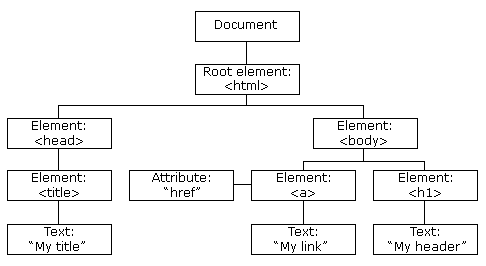

<link rel='stylesheet' href='../main.css'>

<div class="title">
    <center><h1 class="bigtitle">DOM</h1></center>
</div>

# Definition

**DOM** là viết tắt của Document Object Model, là một tiêu chuẩn của W3C đưa ra. DOM biểu diễn văn bản HTML thành dạng cấu trúc cây. Cách biểu diễn này nhằm giúp trình duyệt hiển thị nội dung trang Web cho người dùng.

Cấu trúc cây của DOM gồm ba thành phần: element, attribute và text. Mỗi phần tử trong cấu trúc này ta gọi là một node, mỗi node này là một đối tượng.



JS sử dụng một giao diện lập trình DOM (DOM API) để có thể **truy cập và chỉnh sửa** các element, attribute và text của văn bản HTML một cách linh động. Lưu ý là DOM không thuộc JS.

# Document Object

Để truy cập và chỉnh sửa các đối tượng element, attribute và text thì cần thông qua đối tượng có tên là `document`. Đối tượng này đại diện cho toàn bộ website.

Phương thức đầu tiên là `document.write('text')`. Khi gọi phương thức, trang web sẽ hiển thị text.

# DOM Element

## Get DOM Element

Có thể lấy ra các node là element có trong DOM, chúng ta sẽ lấy thông qua: **ID, class, tag, CSS selector, HTML collection**.

### By Id

Giả sử có đoạn code HTML dưới:

```html
<!DOCTYPE html>
<html lang="en">
  <head>
    <title>Document</title>
  </head>

  <body>
    <h1 id="header">HTML Document</h1>
  </body>
</html>
```

Chúng ta cần lấy ra thẻ `<h1>` có id là `"header"`. Thì sử dụng phương thức `getElementById("id")` với id cần lấy truyền vào làm đối số:

```js
const elementId = document.getElementById("header");
console.log(elementId);
// => h1#header (object)
```

Chú ý rằng, `elementNode` là một đối tượng thuộc lớp đối tượng `Element`. Đối tượng này có nhiều thuộc tính và phương thức, id chỉ là một trong số đó.

### By Class Name

Để lấy theo class thì dùng phương thức `getElementsByClassName(className)` với đối số là class cần lấy.

```html
<!DOCTYPE html>
<html lang="en">
  <head>
    <title>Document</title>
  </head>

  <body>
    <h1 class="heading">HTML Document</h1>
    <h1 class="heading">HTML Document</h1>
    <h1 class="heading">HTML Document</h1>
    <h1 class="heading">HTML Document</h1>
  </body>
</html>
```

```js
const elementsClass = document.getElementsByClassName("heading");
console.log(elementsClass);
// => HTMLCollection(5) [h1.heading, h1.heading, h1.heading, h1.heading, h1.heading] (Array of Objects)
```

**HTMLCollection** bản chất là một mảng, chỉ là không có các phương thức như `map`, `filter`,...

### By Tag Name

Cũng theo cách tương tự, để lấy element theo tên tag thì sử dụng phương thức `document.getElementsByTagName("tagName")`:

```js
const elementsTag = document.getElementsByClassName("h1");
console.log(elementsTag);
// => HTMLCollection(5) [h1.heading, h1.heading, h1.heading, h1.heading, h1.heading] (Array of Objects)
```

### By CSS Selector

Sử dụng `document.querySelector("selector")` để lấy element theo CSS selector. Phương thức này chỉ chọn một element và chỉ element đầu tiên nếu có nhiều element match.

Để chọn nhiều element dựa vào CSS selector thì sử dụng `document.querySelectorAll("selector")`.

### By HTML Selection

Giả sử cho đoạn code HTML có các tag `<form>`.

```html
<!DOCTYPE html>
<html lang="en">
  <head>
    <title>Document</title>
  </head>

  <body>
    <form id="form-1">HTML Document</form>
    <form id="form-2">HTML Document</form>
    <form id="form-3">HTML Document</form>
  </body>

  <script src="../main.js"></script>
</html>
```

Các tag đặc biệt như `<form>` hoặc `<anchor>` thuộc về HTML Selection, không cần truy cập thông qua id, class hay tag mà có thể truy cập bằng:

`document.forms`

```js
console.log(document.forms);
// => HTMLCollection(3) [form#form-1, form#form-2, form#form-3, form-1: form#form-1, form-2: form#form-2, form-3: form#form-3] (Array of Objects)
```

Thuộc tính này sẽ trả về mảng `forms` chứa các tag form có trong HTML. Nếu các tag này có id, có thể xem các id đó là key và truy cập thông qua key:

```js
console.log(document.forms["form-1"]);
// => form#form-1
```

Nếu id có thể đặt cho tên biến, thì không cần sử dụng ngoặc vuông:

```html
<form id="formOne">HTML Document</form>
```

```js
console.log(document.forms.formOne);
// => form#formOne
```

### Element Methods

Các giá trị trả về của phương thức `getElementById` và `querySelector` là các đối tượng thuộc lớp đối tượng `Element`. Do đó mà ta có thể gọi tiếp các phương thức trên để lấy ra các element bên trong chúng.

Chẳng hạn có đoạn code HTML:

```html
<!DOCTYPE html>
<html lang="en">
  <head>
    <title>Document</title>
  </head>

  <body>
    <ul id="hello">
      <li>Hello World</li>
      <li>Hello Human</li>
    </ul>

    <ul id="goodbye">
      <li>Goodbye World</li>
      <li>Goodbye Human</li>
    </ul>
  </body>

  <script src="../main.js"></script>
</html>
```

Ta lấy ra thẻ ul có id là `"hello"`:

```js
const listHello = document.getElementById("hello");
console.log(listHello);
// => ul#hello
```

Do bản thân `listHello` là một đối tượng, ta có thể gọi tiếp năm loại phương thức trên để lấy các element bên trong nó:

```js
const worldHello = listHello.querySelector("li:first-child");
console.log(worldHello);
// => li (object)
console.log(worldHello.textContent);
// => Hello World (string)
```

> Chú ý là các phương thức lấy bằng class, tag, selectorAll hay HTML selection không trả về một đối tượng mà trả về danh sách nhiều đối tượng.

## Set DOM Element

Giả sử có đoạn code HTML:

```html
<!DOCTYPE html>
<html lang="en">
  <head>
    <title>Document</title>
  </head>

  <body>
    <div id="box" class="box"></div>
  </body>

  <script src="../main.js"></script>
</html>
```

Sử dụng hai thuộc tính `innerHTML` để thêm element vào trong element khác:

```js
const boxElement = document.querySelector("#box");
boxElement.innerHTML = "<p>This is a paragraph</p>";
```

Đoạn code HTML trở thành:

```html
<!DOCTYPE html>
<html lang="en">
  <head>
    <title>Document</title>
  </head>

  <body>
    <div id="box" class="box">
      <p>This is a paragraph</p>
    </div>
  </body>

  <script src="../main.js"></script>
</html>
```

Cũng có thể thêm element kèm theo attribute:

```js
boxElement.innerHTML = "<p title = "firstParagraph">This is a paragraph</p>";
```

# DOM Attribute

Giả sử có đoạn code HTML:

```html
<!DOCTYPE html>
<html lang="en">
  <head>
    <title>Document</title>
  </head>

  <body>
    <h1 id="heading" class="heading">This is a heading</h1>
  </body>

  <script src="../main.js"></script>
</html>
```

Để có thể truy cập và chỉnh sửa các attributes của element, trước tiên ta cần lấy được element.

```js
const headingElement = document.querySelector("#heading");
```

Ta đã biết `headingElement` là một đối tượng, và các attributes là MỘT thuộc tính của đối tượng này. Bản thân `attributes` cũng là một đối tượng gồm nhiều thuộc tính.


## Set Attribute

Để có thể chỉnh sửa/thêm các attributes là thuộc tính của class `Element` (chẳng hạn `title`) thì chúng ta làm đơn giản như khi chỉnh sửa/thêm thuộc tính của một đối tượng:

```js
headingElement.title = "Heading";
```

Cách này là sử dụng `setter` của đối tượng `headingElement`.

Lưu ý là thuộc tính mà ta muốn chỉnh sửa/thêm phải hợp lệ đối với element mà ta đang thao tác.

Do là một đối tượng, ta cũng có thể sử dụng phương thức sẵn có với cú pháp `setAttribute("attributeName","stringValue")`. Ví dụ:

```js
headingElement.setAttribute("title", "Heading");
```

Cách này có thể set attribute cho các element mà không quan tâm tính hợp lệ.

Ngoài ra ta có thể thông qua thuộc tính `attributes` mà chỉnh sửa.

## Get Attribute

Tương tự set attribute, ta cũng có thể lấy ra attribute từ đối tượng element dùng phương thức `getAttribute(attributeName)`. Ví dụ:

```js
console.log(headingElement.getAttribute("class"));
// => heading (value of class attribute)
```

Có thể lấy cả những attribute do JS thêm vào.

# DOM Text

Giả sử cho đoạn code HTML:

```html
<!DOCTYPE html>
<html lang="en">
  <head>
    <title>Document</title>
  </head>

  <body>
    <h1 id="heading" class="heading">This is a heading</h1>
  </body>

  <script src="../main.js"></script>
</html>
```

Để lấy ra nội dung của element thì dùng thuộc tính `innerText` và `textContent` thông qua đối tượng element.

```js
const headingElement = document.getElementById("heading");
console.log(headingElement.innerText);
// => This is a heading
console.log(headingElement.textContent);
// => This is a heading
```

Cũng có thể chỉnh sửa sử dụng setter:

```js
headingElement.innerText = "Heading";
console.log(headingElement.innerText);
// => Heading
```

Sự khác biệt giữa `innerText` và `textContent` là `innerText` lấy ra toàn bộ nội dung của các tag con có trong element mà không quan tâm đến khoảng cách.

Nói cách khác, `innerText` trả về đúng như những gì nhìn thấy trên web, còn `textContent` trả về nội dung như là text node trong mô hình DOM. Nếu nội dung của text node bị ẩn trên web, `textContent` cũng hiển thị ra được.

```HTML
<!DOCTYPE html>
<html lang="en">
  <head>
    <title>Document</title>
  </head>

  <body>
    <h1 id="heading" class="heading">
      <span>This is a</span>
      <span>heading</span>
    </h1>
  </body>

  <script src="../main.js"></script>
</html>
```

```js
const headingElement = document.getElementById("heading");
console.log(headingElement.innerText);
// =>  This is a heading
console.log(headingElement.textContent);
// =>
//     This is a
//     heading
```

Thậm chí nội dung của thẻ `<style>` hoặc `<script>` vẫn được `textContent` hiển thị:

```html
<!DOCTYPE html>
<html lang="en">
  <head>
    <title>Document</title>
  </head>

  <body>
    <h1 id="heading" class="heading">
      <span>This is a</span>
      <span>heading</span>
      <style>
        .box {
          width: 200px;
          height: 30px;
        }
      </style>
    </h1>
  </body>

  <script src="../main.js"></script>
</html>
```

```js
console.log(headingElement.innerText);
// => This is a heading
console.log(headingElement.textContent);
// =>
//        .box {
//          width: 200px;
//          height: 30px;
//       }
```

Ngoài ra, `innerText` là một thuộc tính thuộc về lớp đối tượng `Element`. Còn `textContent` vừa là thuộc tính của lớp đối tượng `Element` vừa là thuộc tính của lớp đối tượng của text node.

Nếu dùng Template String, `innerText` sẽ chuyển những khoảng trắng xuống dòng thành thẻ `<br>`. Còn `textContent` chỉ đơn giản là khoảng trắng.

