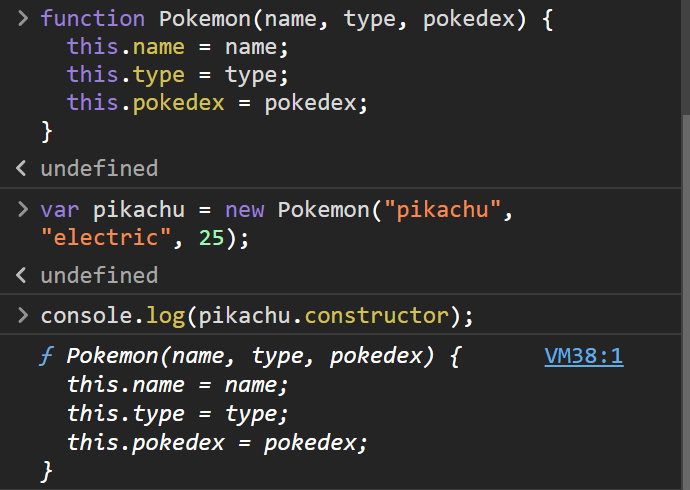

<link rel='stylesheet' href='../../main.css'>

<div class="title">
    <center><h1 class="bigtitle">Scopes and Objects</h1></center>
</div>

- [Object](#object)
  - [Creating](#creating)
  - [Accessing](#accessing)
  - [Methods](#methods)
  - [Modifying](#modifying)
- [Built-in Object Methods](#built-in-object-methods)
    - [Object.assign, sao chép đối tượng mà không thay đổi đối tượng gốc](#objectassign-sao-chép-đối-tượng-mà-không-thay-đổi-đối-tượng-gốc)
    - [Object.keys, lấy mọi tên thuộc tính hoặc khóa có trong đối tượng.](#objectkeys-lấy-mọi-tên-thuộc-tính-hoặc-khóa-có-trong-đối-tượng)
    - [Object.values, lấy giá trị của đối tượng và cho vào mảng.](#objectvalues-lấy-giá-trị-của-đối-tượng-và-cho-vào-mảng)
    - [Object.entries, lấy các cặp key - value và cho vào mảng.](#objectentries-lấy-các-cặp-key---value-và-cho-vào-mảng)
    - [hasOwnProperty(key), kiểm tra thuộc tính `key` có tồn tại trong đối tượng hay không.](#hasownpropertykey-kiểm-tra-thuộc-tính-key-có-tồn-tại-trong-đối-tượng-hay-không)
- [Object Constructor](#object-constructor)
- [Object Prototype](#object-prototype)

# Object

Mọi thứ có thể là đối tượng, và đối tượng có nhiều thuộc tính hoặc phương thức. Các thuộc tính không được bảo toàn thứ tự.

## Creating

Để tạo ra một object rỗng:

```js
const person = {};
```

## Accessing

Thuộc tính trong object xem như một biến, và ta không cần dùng `var`, `let` hay `const` để khai báo chúng. Giá trị của một thuộc tính theo sau dấu `:`.

```js
const person = {
  firstName: "Quân",
  lastName: "Lê Minh",
  age: 20,
  country: "Viet Nam",
  city: "HCM",
  skills: [
    "HTML",
    "CSS",
    "JavaScript",
    "React",
    "Node",
    "MongoDB",
    "Python",
    "D3.js",
  ],
  isMarried: false,

  getFullName: function () {
    return `${this.firstName}${this.lastName}`;
  },
};
```

Thuộc tính có thể là chuỗi, số, mảng, boolean, thậm chí là một cặp key - value như map hoặc dictionary. `this` là một từ khóa dùng để chỉ chính bản thân object (tương tự như C++, con trỏ `this` dùng để trỏ đến đối tượng gọi phương thức).

Để truy cập vào các thuộc tính của object, ta sử dụng toán tử dấu chấm `.` hoặc dùng dấu `[]` kèm theo tên của thuộc tính tương tự như map hoặc dictionary.

```js
console.log(person.firstName); // "Quân"
console.log(person["firstName"]); // "Quân
```

## Methods

Phương thức trong object cũng có một tên và dấu `:`, theo sau đó là từ khóa `function`.

```js
console.log(person.getFullName()); // "Quân Lê Minh"
```

Phương thức không thể là arrow function vì keyword `this` sẽ trỏ đến cửa sổ bên trong arrow function thay vì trỏ vào bản thân object.

## Modifying

> Object là một mutable data type, do đó ta có thể thay đổi giá trị của các thuộc tính bằng reassign.

Ngoài ra, ta có thể khai báo một thuộc tính hoặc phương thức chưa có trong object và gán giá trị cho nó. Thuộc tính mới này sẽ được thêm vào hàm.

```js
const person = {
  firstName: "Quân",
  lastName: "Lê Minh",
  age: 20,
};
person.hair = "curly";
person.getAge = function () {
  return this.age;
};

console.log(person.getAge()); // 20
console.log(person.hair); // curly
```

# Built-in Object Methods

Cho đối tượng dưới đây

```js
const person = {
  firstName: "Quân",
  age: 250,
  country: "Viet Nam",
  city: "HCM",
  skills: ["HTML", "CSS", "JS"],
  title: "student",
  address: {
    street: "22",
    ward: "Linh Đông",
    city: "HCM",
  },
  getPersonInfo: function () {
    return `I am ${this.firstName} and I live in ${this.city}, ${this.country}. I am ${this.age}.`;
  },
};
```

Tồn tại các method của đối tượng `Object` dựng sẵn:

### Object.assign, sao chép đối tượng mà không thay đổi đối tượng gốc

```js
const copyPerson = Object.assign({}, person);
//{firstName: 'Quân', age: 250, country: 'Viet Nam', city: 'HCM', skills: Array(3), …}
```

### Object.keys, lấy mọi tên thuộc tính hoặc khóa có trong đối tượng.

```js
const keys = Object.keys(copyPerson);
// ['firstName', 'age', 'country', 'city', 'skills', 'title', 'address', 'getPersonInfo']
const address = Object.address(copyPerson.address);
// ['street', 'ward', 'city']
```

### Object.values, lấy giá trị của đối tượng và cho vào mảng.

### Object.entries, lấy các cặp key - value và cho vào mảng.

### hasOwnProperty(key), kiểm tra thuộc tính `key` có tồn tại trong đối tượng hay không.

# Object Constructor

Do tính chất trùng tên của lớp đối tượng và constructor, ta có thể triển khai một constructor và đặt tên là lớp đối tượng bất kỳ.

```js
function Pokemon(name, type, pokedex) {
  this.name = name;
  this.type = type;
  this.pokedex = pokedex;
  this.getName = function () {
    return `${name}`;
  };
}
```

Với `this` là đối tượng được tạo ra bằng constructor. Sử dụng tương tự constructor thông thường.

```js
const pikachu = new Pokemon("pikachu", "electric", 25);
console.log(pikachu.getName()); // => "pikachu"
```

Phương thức `constructor` gọi từ đối tượng sẽ trả về constructor của lớp đối tượng:

```js
console.log(pikachu.constructor);
```



# Object Prototype

Để thêm một thuộc tính hoặc phương thức vào LỚP ĐỐI TƯỢNG thì ta sử dụng thêm từ khóa `prototype`.

```js
Pokemon.prototype.catchRate = 10;
// (defaultValue)
Pokemon.prototype.getType() = function{
  return this.type;
}
```

Cần phân biệt với việc thêm thuộc tính hoặc phương thức vào ĐỐI TƯỢNG, khi đó chúng ta chỉ cần sử dụng toán tử `.`.
