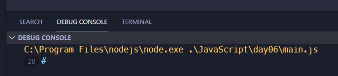

<link rel='stylesheet' href='../../main.css'>

<div class="title">
    <center><h1 class="bigtitle">Loops</h1></center>
</div>

- [Loops](#loops)
  - [Problems](#problems)

# Loops

Vòng lặp `for`, `while` và `do while` trong JS tương tự C/C++.
Ngoài ra, vòng lặp `for each` trong C++ (để lặp qua các phần tử trong mảng nếu ta không quan tâm đến index) ở bên JS sẽ là vòng lặp `for of`.

```js
const array = [1, 2, 3, 4, 5];
for (const num of array) {
  console.log(num);
}
// 1,2,3,4,5
```

## Problems

Có đoạn code cho bài toán xuất tam giác ký tự như sau:

```js
for (let i = 1; i <= 7; i++) {
  for (let j = 1; j <= i; j++) {
    console.log("#");
  }
}
```

Kết quả:

Nhận thấy rằng các dấu `#` liên tục được gom lại thành một dấu duy nhất xuất hiện 28 lần (số 28 phía trước).

Vì vậy ta dùng biến chuỗi để tạo tam giác:

```js
let str = "";
for (let i = 1; i <= 7; i++) {
  for (let j = 1; j <= i; j++) {
    str += "#";
  }
  str += "\n";
}

console.log(str);
```

Kết quả:

