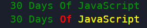
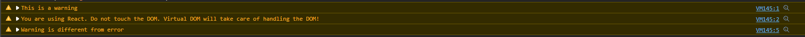
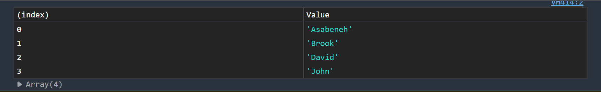
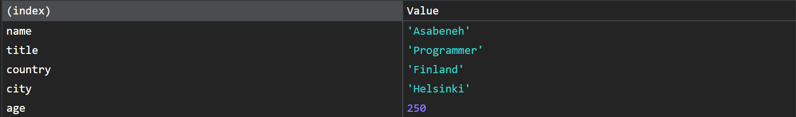
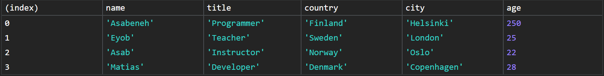

<link rel='stylesheet' href='../main.css'>

# Console Object Methods

Đối tượng console cung cấp nhiều phương thức, một trong số đó rất nổi tiếng là `console.log`.

## console.log()

Có thể format chuỗi đầu ra tương tự như C:

```js
console.log("%d %s of JavaScript", 30, "Days");
// => 30 Days of JavaScript
```

Thậm chí cũng có thể format style dùng CSS chuỗi đầu ra bằng `%c`.

```js
console.log("%c30 Days Of JavaScript", "color:green"); // log output is green
console.log(
  "%c30 Days%c %cOf%c %cJavaScript%c",
  "color:green",
  "",
  "color:red",
  "",
  "color:yellow",
  ""
); // log output green red and yellow text
```

Kết quả:


## console.warn()

Dùng để cảnh báo, thường cảnh báo khi phiên bản của package đã cũ hoặc các đoạn code nhập vào không clean.

```js
console.warn("This is a warning");
console.warn(
  "You are using React. Do not touch the DOM. Virtual DOM will take care of handling the DOM!"
);
console.warn("Warning is different from error");
```

Các cảnh báo có dạng:



## console.error()

Để thông báo lỗi.

## console.table()

Dùng để xuất dữ liệu dưới dạng bảng. Đối số truyền vào cần phải là một mảng hoặc đối tượng. Ngoài ra còn một đối số optional là số lượng cột.

### Array

```js
const names = ["Asabeneh", "Brook", "David", "John"];
console.table(names);
```

Kết quả:



### Object

```js
const user = {
  name: "Asabeneh",
  title: "Programmer",
  country: "Finland",
  city: "Helsinki",
  age: 250,
};
console.table(user);
```

Kết quả:



### Multidimensional Array

```js
const countries = [
  ["Finland", "Helsinki"],
  ["Sweden", "Stockholm"],
  ["Norway", "Oslo"],
];
console.table(countries);
```

Kết quả:


### Array of Objects

```js
const users = [
  {
    name: "Asabeneh",
    title: "Programmer",
    country: "Finland",
    city: "Helsinki",
    age: 250,
  },
  {
    name: "Eyob",
    title: "Teacher",
    country: "Sweden",
    city: "London",
    age: 25,
  },
  {
    name: "Asab",
    title: "Instructor",
    country: "Norway",
    city: "Oslo",
    age: 22,
  },
  {
    name: "Matias",
    title: "Developer",
    country: "Denmark",
    city: "Copenhagen",
    age: 28,
  },
];
```

Kết quả:



Như vậy, các key/index sẽ làm title cho hàng và cột.

## console.time()

Dùng để tính thời gian thực thi của một thao tác bất kỳ. Truyền vào tên của timer, chẳng hạn `timer`. Khi gọi phương thức và truyền vào tên của timer đó `console.timeEnd(timer)` thì browser sẽ xuất ra thời gian thực thi có đơn vị là milliseconds.

```js
const countries = [
  ["Finland", "Helsinki"],
  ["Sweden", "Stockholm"],
  ["Norway", "Oslo"],
];

console.time("Regular for loop");
for (let i = 0; i < countries.length; i++) {
  console.log(countries[i][0], countries[i][1]);
}
console.timeEnd("Regular for loop");

// =>  Regular for loop: 0.13818359375 ms
```

## console.info()

Xuất ra thông tin trên console của browser.

## console.assert()

Phương thức `assert` xuất ra một thông báo lỗi cho console nếu biểu thức xác nhận truyền vào là sai. Nếu biểu thức là đúng, sẽ không có gì xảy ra.

Có hai tham số, tham số đầu tiên là biểu thức xác nhận (assertion expression). Tham số thứ hai là message để thông báo khi biểu thức trả về giá trị `false`.

```js
console.assert(4 > 3, "4 is greater than 3");
// no result
console.assert(3 > 4, "3 is not greater than 4");
// => Assertion failed: 3 is not greater than 4
```

## console.group()

Phương thức này giúp nhóm các dòng hiển thị console của phương thức `console.log()` lại thành một cụm. Cụ thể hơn, nó giúp đặt tiêu đề trước các dòng `console.log()`.

Bắt đầu bằng `console.group(nameOfGroup)`. Sau dòng lệnh này, có thể gọi các câu lệnh `console.log()`. Sau khi kết thúc một cụm các câu lệnh log, gọi lệnh `console.groupEnd(nameOfGroup)`.

**Ví dụ**:

```js
const names = ["Asabeneh", "Brook", "David", "John"];
const countries = [
  ["Finland", "Helsinki"],
  ["Sweden", "Stockholm"],
  ["Norway", "Oslo"],
];
const user = {
  name: "Asabeneh",
  title: "Programmer",
  country: "Finland",
  city: "Helsinki",
  age: 250,
};
const users = [
  {
    name: "Asabeneh",
    title: "Programmer",
    country: "Finland",
    city: "Helsinki",
    age: 250,
  },
  {
    name: "Eyob",
    title: "Teacher",
    country: "Sweden",
    city: "London",
    age: 25,
  },
  {
    name: "Asab",
    title: "Instructor",
    country: "Norway",
    city: "Oslo",
    age: 22,
  },
  {
    name: "Matias",
    title: "Developer",
    country: "Denmark",
    city: "Copenhagen",
    age: 28,
  },
];

console.group("Names");
console.log(names);
console.groupEnd();

console.group("Countries");
console.log(countries);
console.groupEnd();

console.group("Users");
console.log(user);
console.groupEnd();

// => Names
//      (4) ['Asabeneh', 'Brook', 'David', 'John']

// =>  Countries
//      (3) [Array(2), Array(2), Array(2)]

// =>  Users
//      {name: 'Asabeneh', title: 'Programmer', country: 'Finland', city: 'Helsinki', age: 250}
```

## console.count()

In ra số lần gọi thực hiện phương thức này.

```js
const func = () => {
  console.count("Function has been called");
};
func();
// => Function has been called: 1
func();
// => Function has been called: 2
func();
// => Function has been called: 3
```

## console.clear()

Dùng để dọn sạch console của browser, tương tự như lệnh `clear` của powershell.
