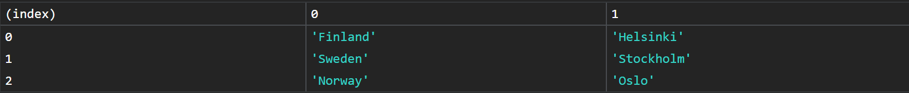

<link rel='stylesheet' href='../main.css'>

# Console Object Methods

Đối tượng console cung cấp nhiều phương thức, một trong số đó rất nổi tiếng là `console.log`.

## console.log()

Có thể format chuỗi đầu ra tương tự như C:

```js
console.log("%d %s of JavaScript", 30, "Days");
// => 30 Days of JavaScript
```

Thậm chí cũng có thể format style chuỗi đầu ra bằng `%c`.

```js
console.log("%c30 Days Of JavaScript", "color:green"); // log output is green
console.log(
  "%c30 Days%c %cOf%c %cJavaScript%c",
  "color:green",
  "",
  "color:red",
  "",
  "color:yellow",
  ""
); // log output green red and yellow text
```

## console.warn()

Dùng để cảnh báo, thường cảnh báo khi phiên bản của package đã cũ hoặc các đoạn code nhập vào không clean.

```js
console.warn("This is a warning");
console.warn(
  "You are using React. Do not touch the DOM. Virtual DOM will take care of handling the DOM!"
);
console.warn("Warning is different from error");
```

Các cảnh báo có dạng:


## console.error()

Để thông báo lỗi

## console.table()

Dùng để xuất dữ liệu dưới dạng bảng. Đối số truyền vào cần phải là một mảng hoặc đối tượng. Ngoài ra còn một đối số optional là số lượng cột.

```js
const names = ["Asabeneh", "Brook", "David", "John"];
console.table(names);
```

Kết quả:


```js
const user = {
  name: "Asabeneh",
  title: "Programmer",
  country: "Finland",
  city: "Helsinki",
  age: 250,
};
console.table(user);
```

Kết quả:


```js
const countries = [
  ["Finland", "Helsinki"],
  ["Sweden", "Stockholm"],
  ["Norway", "Oslo"],
];
console.table(countries);
```

Kết quả:



```js
const users = [
  {
    name: "Asabeneh",
    title: "Programmer",
    country: "Finland",
    city: "Helsinki",
    age: 250,
  },
  {
    name: "Eyob",
    title: "Teacher",
    country: "Sweden",
    city: "London",
    age: 25,
  },
  {
    name: "Asab",
    title: "Instructor",
    country: "Norway",
    city: "Oslo",
    age: 22,
  },
  {
    name: "Matias",
    title: "Developer",
    country: "Denmark",
    city: "Copenhagen",
    age: 28,
  },
];
```

Kết quả:


Như vậy, các key/index sẽ làm title cho hàng và cột.
