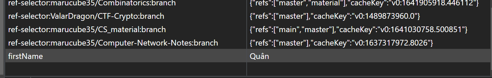
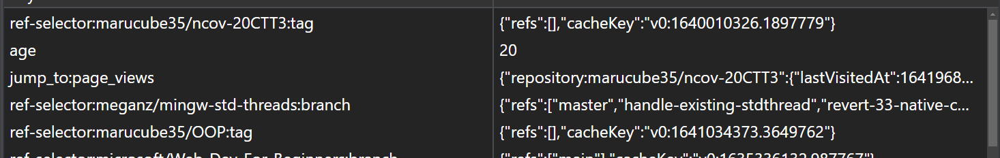
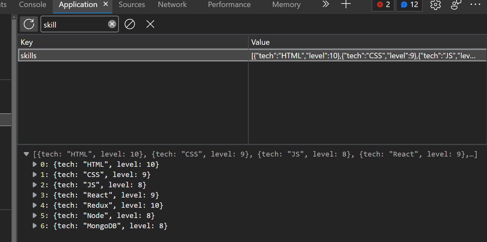
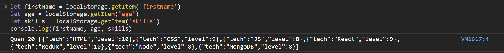
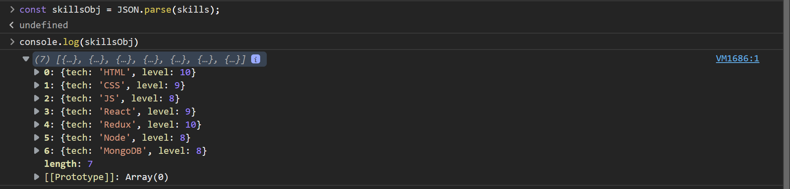

<link rel='stylesheet' href='../main.css'>

# Web Storage

**Web Storage** (Lưu trữ web) là một tính năng mới của HTML5 nhằm hỗ trợ cookie trong việc lưu dữ liệu.

**Khuyết điểm của Cookie**

- File cookie có thể chỉnh sửa bởi người dùng.
- Trước khi có HTML5, cookie lưu dữ liệu người dùng và gửi nó cho server, có thể gây tốn băng thông.
- Cookie có giới hạn dung lượng là 4KB.

**Tính năng của Web Storage**

- User không thể tìm ra file như cookie để chỉnh sửa, tuy nhiên vẫn có thể chỉnh sửa bằng dev tools.
- Lưu trữ local, không gửi cho server nên không tốn băng thông.
- Dung lượng lớn hơn, tối thiểu 5MB.
- Chỉ được lưu trữ trên một trình duyệt nên không thể truy xuất bằng trình duyệt khác.
- Lưu giữ dưới dạng chuỗi JSON.

> Lưu ý là không lưu các thông tin nhạy cảm như mật khẩu trong Web Storage.

**Ứng dụng của Web Storage**

- Lưu giữ các sản phẩm mà người dùng cho vào giỏ hàng.
- Trao đổi dữ liệu giữa các page requets hoặc các tab.
- Dùng cho phương thức user authentication.
- Tăng tốc độ thực thi cho trang web khi các dữ liệu tĩnh có thể được lưu ở phía người dùng.
- Có thể sử dụng offline với localStorage.

Có hai loại Web Storage là:

- `localStorage`: lưu giữ vĩnh viễn, chỉ mất khi xóa lịch sử về web đó.
- `sessionStorage`: lưu trữ trong phiên làm việc của trang web (từ lúc mở tab đến lúc đóng tab), sẽ mất khi user đóng tab.

> Lưu ý là localStorage và sessionStorage đối với mỗi trang web là khác nhau. Nói cách khác, mỗi trang web có một localStorage và một sessionStorage riêng.

Dữ liệu được lưu dưới dạng localStorage hay sessionStorage tùy thuộc vào browser và protocol. Dung lượng lưu trữ cũng phụ thuộc vào browser và protocol.

**Các trường hợp đặc thù sử dụng sessionStorage**

- Muốn loại bỏ dữ liệu ngay khi đóng tab.
- Muốn ứng dụng không can thiệp vào chính ứng dụng đó ở bên cửa số khác.

# HTML Web Storage Objects

Trang web HTML cung cấp hai đối tượng để lưu trữ thông tin bên phía client.

`window.localStorage` - lưu dữ liệu không có thời hạn (no expiration date).

`window.sessionStorage` - lưu dữ liệu cho một phiên làm việc.

Các phương thức của localStorage và sessionStorage là tương tự nhau. Các phương thức thường dùng là: `setItem(), getItem(), removeItem(), clear(), key()`.

## setItem

**Chức năng**: lưu dữ liệu trong local/sessionStorage. Đối số là một cặp key và value nằm trong dấu ngoặc kép (vì dữ liệu được lưu dưới dạng chuỗi JSON). Lưu dữ liệu cùng key sẽ được ghi đè value của lần thực hiện phương thức cuối cùng.

**Cú pháp**: `localStorage.setItem('key', 'value')`

**Lưu ý**: nếu muốn lưu mảng hoặc object, cần chuyển sang dạng chuỗi dùng phương thức `stringify`. Nếu không chuyển thì có thể mất cấu trúc của dữ liệu khi lưu vào localStorage.s

**Lưu chuỗi**

```js
localStorage.setItem("firstName", "Quân");
// since the value is string we do not stringify it
console.log(localStorage);
// => Storage {firstName: 'Quân', length: 1}
```

Kết quả:



**Lưu số**

```js
localStorage.setItem("age", 20);
console.log(localStorage);
// =>  Storage {age: '20', firstName: 'Quân', length: 2}
```

Kết quả:



**Mảng hoặc đối tượng**

```js
const skills = ["HTML", "CSS", "JS", "React"];
//Skills array has to be stringified first to keep the format.
const skillsJSON = JSON.stringify(skills, undefined, 4);
localStorage.setItem("skills", skillsJSON);
console.log(localStorage);
```

Kết quả:


**Mảng các đối tượng**

```js
let skillsArray = [
  { tech: "HTML", level: 10 },
  { tech: "CSS", level: 9 },
  { tech: "JS", level: 8 },
  { tech: "React", level: 9 },
  { tech: "Redux", level: 10 },
  { tech: "Node", level: 8 },
  { tech: "MongoDB", level: 8 },
];

let skillJSON = JSON.stringify(skillsArray);
localStorage.setItem("skills", skillJSON);
```

Kết quả:



## getItem

**Chức năng**: lấy dữ liệu từ local/sessionStorage dựa vào key.

**Cú pháp**: `localStorage.getItem('key').

**Ví dụ**:

```js
let firstName = localStorage.getItem("firstName");
let age = localStorage.getItem("age");
let skills = localStorage.getItem("skills");
console.log(firstName, age, skills);
```

Kết quả:



Như đã thấy, giá trị của `skills` là một mảng các object, có thể dùng phương thức `parse` để tách thành object

```js
const skillsObj = JSON.parse(skills);
console.log(skillsObj);
```

Kết quả:



## clear

**Chức năng**: dọn sạch dữ liệu lưu trong local/sessionStorage.

**Cú pháp**: `localStorage.clear()`
